## 2.4. Big Picture EventStorming

El Big Picture EventStorming de Nexa representa el recorrido general del dominio desde el contacto comercial y el registro de una organización hasta la entrega, la asociación de documentos comerciales referenciales y el registro del estado de pago referencial. Su propósito es hacer visibles los hechos relevantes, los actores y las tensiones del negocio antes de profundizar en decisiones de diseño.

El modelado mantiene los tres segmentos del proyecto: Segmento 1 — Commercial Coordination, Segmento 2 — Operations / Account Owner y Segmento 3 — B2B Buyer Portal. Account Owner / administración del tenant/workspace forma parte del alcance administrativo del Segmento 2. La lectura se concentra en el dominio y no adelanta comandos, políticas, read models, aggregates ni bounded contexts del Design-Level EventStorming.

La evidencia final se organiza en tres pasos propios de Big Picture: exploración no estructurada de eventos, ordenamiento temporal e identificación de pain points. Estos pasos sintetizan la revisión colaborativa del dominio realizada por el equipo.

### 2.4.1. Proceso de construcción del modelado

El Step 1 reúne eventos sin imponer todavía una secuencia. Esta exploración permite registrar hechos relevantes del negocio y ampliar el vocabulario compartido antes de organizar el flujo.

*Big Picture EventStorming — Step 1: exploración no estructurada del dominio, parte 1.*

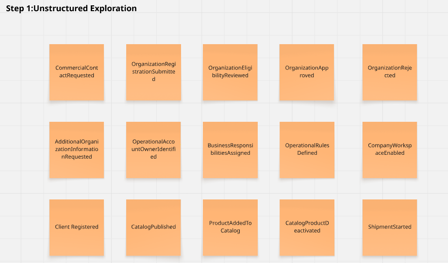

> *Nota*: La captura muestra la primera parte de la exploración no estructurada de eventos del dominio, utilizada para identificar hechos relevantes antes de ordenarlos temporalmente. Elaboración propia.

*Big Picture EventStorming — Step 1: exploración no estructurada del dominio, parte 2.*

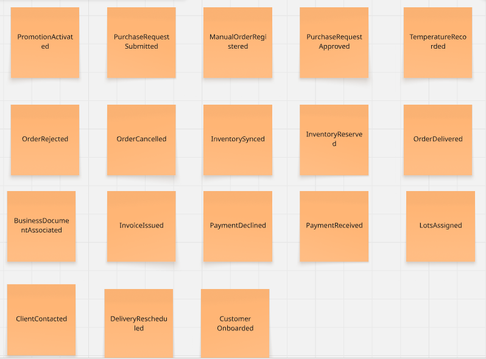

> *Nota*: La captura complementa la exploración inicial con eventos comerciales, operativos, documentales y de seguimiento. Elaboración propia.

El Step 2 ordena temporalmente los eventos y permite reconocer la continuidad entre registro organizacional, catálogo, inventario, solicitud de compra, logística y cierre documental.

*Big Picture EventStorming — Step 2: registro organizacional y habilitación del workspace.*

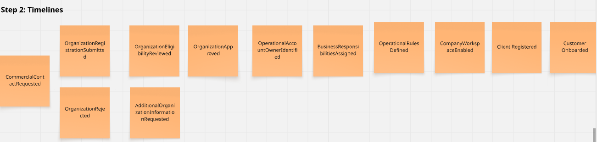

> *Nota*: La captura organiza los eventos vinculados con contacto comercial, evaluación de la organización, responsabilidades y habilitación del tenant/workspace. Elaboración propia.

*Big Picture EventStorming — Step 2: catálogo y clientes.*

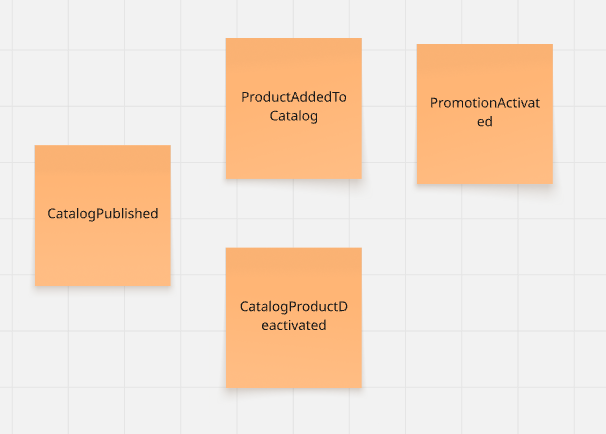

> *Nota*: La captura presenta la secuencia relacionada con clientes, publicación del catálogo, productos y promociones. Elaboración propia.

*Big Picture EventStorming — Step 2: inventario y asignación de lotes.*

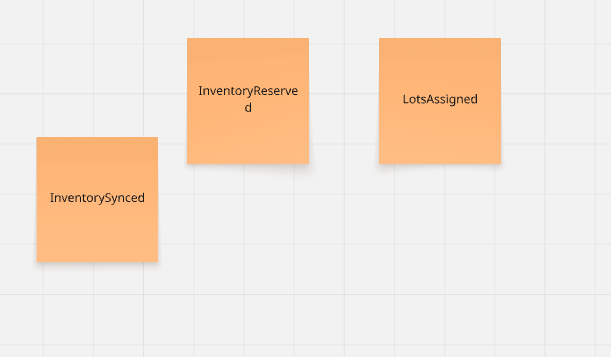

> *Nota*: La captura muestra los eventos de sincronización de inventario, reserva de disponibilidad y asignación de lotes. Elaboración propia.

*Big Picture EventStorming — Step 2: solicitud de compra y validación comercial.*

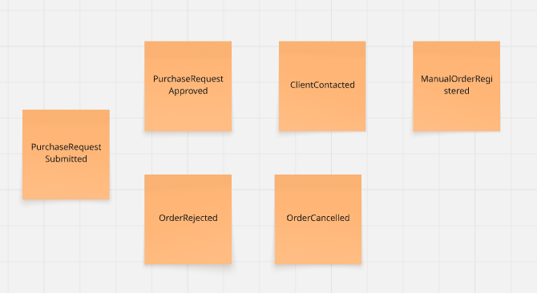

> *Nota*: La captura ordena los eventos de solicitud, aprobación, rechazo, cancelación, contacto con el cliente y registro manual. Elaboración propia.

*Big Picture EventStorming — Step 2: logística y entrega.*

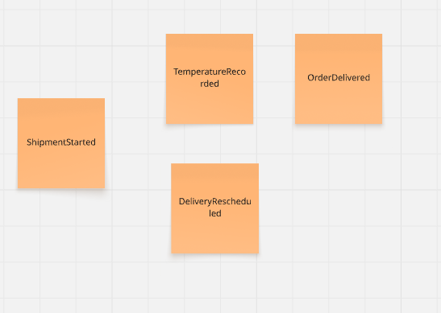

> *Nota*: La captura presenta la secuencia de inicio de despacho, registro de condiciones, reprogramación y entrega. Elaboración propia.

*Big Picture EventStorming — Step 2: documentos comerciales y pagos referenciales.*

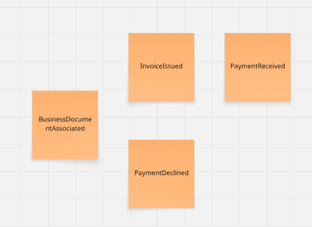

> *Nota*: La captura muestra la asociación de documentos comerciales referenciales y el registro de estados de pago referenciales dentro del cierre del flujo. Elaboración propia.

El Step 3 incorpora los pain points sobre la línea temporal. Su función es señalar dónde el flujo depende de información fragmentada o coordinación manual y dónde pueden producirse demoras o retrabajo.

*Big Picture EventStorming — Step 3: registro organizacional fragmentado.*

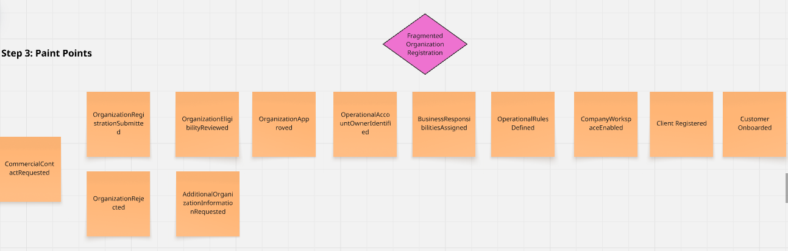

> *Nota*: La captura identifica Fragmented Organization Registration como tensión del proceso de incorporación de organizaciones. Elaboración propia.

*Big Picture EventStorming — Step 3: cuello de botella por validación manual.*

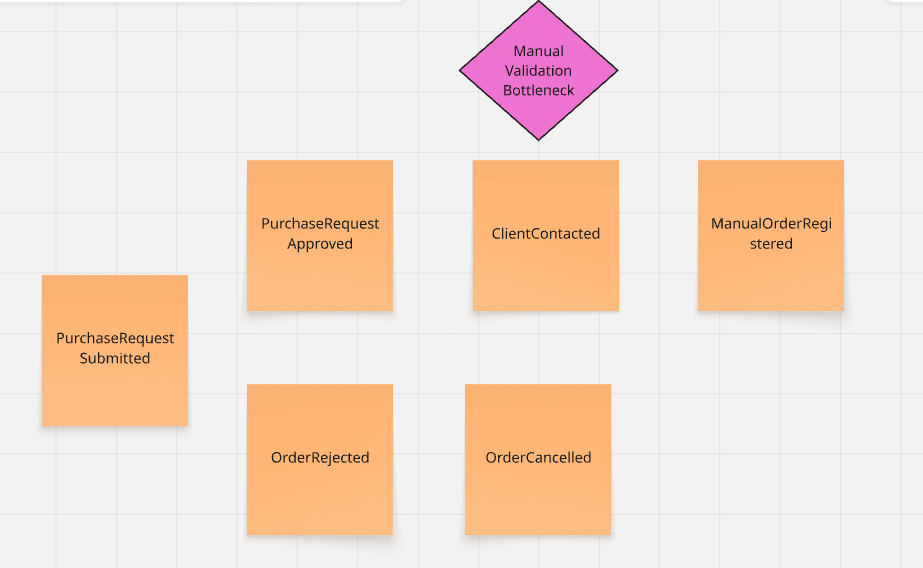

> *Nota*: La captura identifica Manual Validation Bottleneck dentro de la revisión y continuidad de solicitudes comerciales. Elaboración propia.

*Big Picture EventStorming — Step 3: conciliación manual de pagos.*

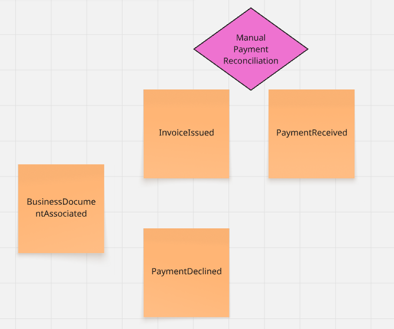

> *Nota*: La captura identifica Manual Payment Reconciliation como tensión vinculada con el seguimiento de pagos referenciales. Elaboración propia.

*Proceso de construcción del Big Picture EventStorming.*

| Step | Propósito | Resultado para la revisión del dominio |
|---|---|---|
| Step 1 — Exploration | Identificar eventos sin imponer una estructura previa. | Inventario compartido de hechos comerciales, organizacionales, operativos y documentales. |
| Step 2 — Timeline | Ordenar los eventos según su secuencia en el negocio. | Lectura continua desde el registro organizacional hasta entrega, documentos y pagos referenciales. |
| Step 3 — Pain Points | Ubicar tensiones sobre la línea temporal. | Visibilidad de registro fragmentado, validación manual y conciliación manual. |

> *Nota*: La tabla resume los tres pasos de Big Picture utilizados para construir la evidencia final de la sección. Elaboración propia.

### 2.4.2. Actores del dominio

*Actores observados en el Big Picture EventStorming.*

| Actor / rol operativo | Segmento asociado | Responsabilidad principal en el flujo |
|---|---|---|
| Comprador comercial B2B | Segmento 3 — B2B Buyer Portal | Consulta el catálogo, envía solicitudes y revisa el avance de órdenes, entrega y documentos visibles. |
| Coordinación comercial | Segmento 1 — Commercial Coordination | Ordena la información comercial, revisa solicitudes y mantiene la coordinación con el comprador. |
| Responsable comercial autorizado | Segmento 1 — Commercial Coordination | Aprueba, observa o rechaza solicitudes según las condiciones comerciales disponibles. |
| Operación / almacén | Segmento 2 — Operations / Account Owner | Sincroniza inventario, reserva disponibilidad, asigna lotes y prepara la continuidad operativa. |
| Responsable de despacho | Segmento 2 — Operations / Account Owner | Inicia el despacho, registra condiciones relevantes, incidencias y entrega. |
| Account Owner / administración del tenant/workspace | Segmento 2 — Operations / Account Owner | Administra el alcance organizacional, las responsabilidades, reglas y habilitación del workspace. |
| Reparto / transportista | Segmento 2 — Operations / Account Owner | Ejecuta el traslado, comunica incidencias y participa en el cierre de la entrega. |

> *Nota*: La tabla vincula los actores del dominio con los tres segmentos formales de Nexa; Account Owner se mantiene dentro del alcance administrativo del Segmento 2. Elaboración propia.

### 2.4.3. Eventos del dominio y puntos de tensión principales

*Eventos principales observados en el Big Picture EventStorming.*

| Bloque del dominio | Eventos observados | Interpretación del flujo |
|---|---|---|
| Contacto y registro | `CommercialContactRequested`, `OrganizationRegistrationSubmitted` | Una organización expresa interés y remite información para iniciar su evaluación. |
| Evaluación organizacional | `OrganizationEligibilityReviewed`, `OrganizationApproved`, `OrganizationRejected`, `AdditionalOrganizationInformationRequested` | La organización es revisada y puede ser aprobada, rechazada o requerida para ampliar información. |
| Responsabilidades y workspace | `OperationalAccountOwnerIdentified`, `BusinessResponsibilitiesAssigned`, `OperationalRulesDefined`, `CompanyWorkspaceEnabled` | Se identifica la responsabilidad administrativa y se habilita el espacio organizacional con reglas operativas. |
| Cliente | `ClientRegistered`, `CustomerOnboarded` | El cliente queda registrado e incorporado al flujo comercial B2B. |
| Catálogo | `CatalogPublished`, `ProductAddedToCatalog`, `CatalogProductDeactivated`, `PromotionActivated` | La oferta visible cambia mediante publicación, incorporación, desactivación y promociones. |
| Inventario | `InventorySynced`, `InventoryReserved`, `LotsAssigned` | La disponibilidad se actualiza, se reserva y se vincula con lotes para sostener la preparación. |
| Solicitud de compra | `PurchaseRequestSubmitted`, `PurchaseRequestApproved`, `OrderRejected`, `OrderCancelled` | La solicitud puede aprobarse o terminar en rechazo o cancelación según la revisión comercial. |
| Coordinación alternativa | `ClientContacted`, `ManualOrderRegistered` | La coordinación humana interviene cuando se requiere aclaración o registro asistido. |
| Despacho | `ShipmentStarted`, `TemperatureRecorded`, `DeliveryRescheduled`, `OrderDelivered` | La operación inicia el traslado, registra condiciones relevantes, reprograma si corresponde y cierra la entrega. |
| Documentos comerciales | `BusinessDocumentAssociated`, `InvoiceIssued` | Se vinculan documentos comerciales referenciales como evidencia de seguimiento del pedido. |
| Estado de pago | `PaymentReceived`, `PaymentDeclined` | Se registra el resultado referencial del pago para mantener visibilidad del cierre administrativo. |

> *Nota*: La tabla conserva los nombres de eventos usados por el equipo y ofrece una interpretación en español sin adelantar artefactos de diseño técnico. Elaboración propia.

Los eventos documentales y de pago expresan estados observados en el dominio. En esta sección no se presentan como procesamiento fiscal externo ni como procesamiento externo de pagos, sino como documentos comerciales referenciales y pagos referenciales vinculados con el seguimiento del pedido.

### 2.4.4. Pain points y restricciones operativas identificadas

*Pain points y restricciones observados sobre la línea temporal.*

| Pain point o tensión | Dónde aparece | Efecto sobre el flujo |
|---|---|---|
| Fragmented Organization Registration | Registro y evaluación de la organización | La información distribuida dificulta revisar elegibilidad y solicitar aclaraciones de forma consistente. |
| Manual Validation Bottleneck | Revisión comercial de la solicitud | La dependencia de validación humana puede retrasar la aprobación y aumentar el retrabajo. |
| Manual Payment Reconciliation | Cierre administrativo del pedido | La conciliación manual reduce la visibilidad compartida sobre el estado de pago referencial. |
| Visibilidad fragmentada | Entre comercial, operación y comprador | Los actores pueden perder contexto sobre decisiones, cambios y estados del pedido. |
| Dependencia de coordinación humana | Solicitud, incidencias y reprogramación | Las aclaraciones y excepciones dependen de comunicación oportuna entre responsables. |
| Riesgo de retraso en la comunicación | Validación, despacho y entrega | Una actualización tardía afecta la coordinación entre comercial, operación y comprador. |

> *Nota*: La tabla reúne los pain points visibles en Step 3 y tensiones operativas justificadas por la secuencia del Big Picture. Elaboración propia.

### 2.4.5. Lectura del flujo para el diseño posterior

*Lectura del flujo para el diseño posterior.*

| Bloque del flujo | Eventos observados | Implicancia para el diseño posterior |
|---|---|---|
| Registro organizacional y tenant/workspace | `OrganizationRegistrationSubmitted`, `OrganizationEligibilityReviewed`, `OrganizationApproved`, `CompanyWorkspaceEnabled` | El producto requiere separar información y operación por tenant/workspace, manteniendo Account Owner dentro del Segmento 2. |
| Catálogo y cliente | `CatalogPublished`, `ProductAddedToCatalog`, `ClientRegistered`, `CustomerOnboarded` | El comprador necesita visibilidad de catálogo y condiciones comerciales antes de solicitar productos. |
| Solicitud y validación comercial | `PurchaseRequestSubmitted`, `PurchaseRequestApproved`, `OrderRejected`, `ClientContacted`, `ManualOrderRegistered` | La validación manual aparece como punto crítico y debe quedar trazable para reducir retrabajo. |
| Inventario y lotes | `InventorySynced`, `InventoryReserved`, `LotsAssigned` | La disponibilidad y asignación de lotes condicionan la confirmación y preparación del pedido. |
| Despacho y entrega | `ShipmentStarted`, `TemperatureRecorded`, `DeliveryRescheduled`, `OrderDelivered` | La operación necesita visibilidad del despacho y registro de incidencias o condiciones de entrega. |
| Documentos y pagos referenciales | `BusinessDocumentAssociated`, `InvoiceIssued`, `PaymentReceived`, `PaymentDeclined` | El cierre requiere documentos comerciales y pagos referenciales vinculados al pedido, sin atribuirles alcance tributario. |

> *Nota*: La tabla resume cómo los eventos del Big Picture orientan el diseño posterior sin adelantar los artefactos de Design-Level EventStorming. Elaboración propia.

Los comandos, políticas, read models, aggregates y bounded contexts se desarrollan en la sección 4.6.1, donde corresponde profundizar el Design-Level EventStorming. En 2.4 se conserva únicamente la lectura general del dominio.

### 2.4.6. Evidencia de colaboración del modelado

*Sesión colaborativa de modelado de EventStorming.*

> *Nota*: La captura documenta una sesión colaborativa del equipo KING durante la construcción del modelado. La evidencia visual final del Big Picture corresponde a Step 1, Step 2 y Step 3 incorporados en esta sección. Elaboración propia.

### 2.4.7. Flujo resumido del dominio

1. Se solicita contacto comercial o registro organizacional.
2. Se revisa la elegibilidad de la organización y se solicita información adicional si corresponde.
3. Se aprueba o rechaza la organización.
4. Se identifica el Account Owner operativo y se habilita el workspace de la empresa.
5. Se registran clientes y se publica el catálogo.
6. El comprador o coordinación comercial registra la solicitud de compra.
7. La solicitud se aprueba, rechaza, cancela o deriva a contacto con el cliente o registro manual.
8. Operación sincroniza inventario, reserva disponibilidad y asigna lotes.
9. Se inicia el despacho, se registran condiciones relevantes como temperatura y se reprograma si corresponde.
10. Se entrega el pedido y se asocian documentos comerciales referenciales.
11. Se registra el estado de pago referencial cuando corresponde.

El flujo resumido evidencia que el valor de Nexa depende de conservar continuidad entre registro organizacional, coordinación comercial, disponibilidad, despacho y cierre. Los pain points identificados orientan el diseño posterior, mientras que las decisiones detalladas se reservan para el Design-Level EventStorming.
