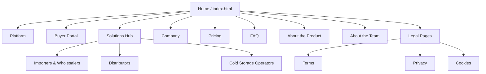
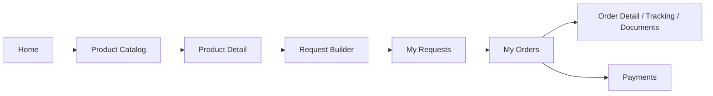

## 4.2. Information Architecture

La arquitectura de información de Nexa organiza el contenido y los flujos de interacción alrededor de tres superficies complementarias: la **Landing Page pública**, la **Web Application interna u Ops Portal** y el **Buyer Portal**. Esta organización responde al modelo SaaS B2B del producto y mantiene una continuidad clara entre descubrimiento, registro, operación interna y autoservicio del comprador.

La WebApp incluye además un flujo público de Tenant Management para registrar una organización y comunicar el estado de su solicitud mediante `/tenant-management/register-organization` y `/tenant-management/registration-pending/:id`. Una vez autenticados, los usuarios acceden a la superficie correspondiente a su rol y tenant/workspace.

La taxonomía mantiene tres segmentos formales: **Segmento 1 — Commercial Coordination**, **Segmento 2 — Operations / Account Owner** y **Segmento 3 — B2B Buyer Portal**. Company Owner representa el subalcance administrativo y de account ownership de S2; no constituye un cuarto segmento.

*Flujo conceptual entre segmentos de Nexa*

```mermaid
flowchart LR
    Visitor["Interested Organization / Visitor"] -->|"solicita registro desde Landing Page"| Tenant["Tenant Management"]
    Tenant -->|"revisa solicitud y habilita workspace"| Owner["S2 — Company Owner"]
    Owner -->|"configura workspace, usuarios, reglas y preferencias"| Sales["S1 — Sales"]
    Owner -->|"habilita operación interna"| Logistics["S2 — Logistics"]
    Buyer["S3 — B2B Buyer"] -->|"envía solicitud de compra"| Sales
    Sales -->|"valida y convierte solicitud en orden"| Logistics
    Logistics -->|"prepara inventario, despacho, POD y documentos visibles"| Buyer
    Buyer -->|"consulta estado, tracking y documentos visibles desde el portal"| BuyerPortal["Buyer Portal"]
```

> *Nota:* El diagrama representa la relación conceptual entre captación, configuración y operación de los segmentos de Nexa. Elaboración propia.

La administración del tenant/workspace pertenece al account ownership de S2 y se distingue de las tareas logísticas de inventario, despacho y evidencia. Ambas responsabilidades comparten la misma consola interna con navegación filtrada por rol.

### 4.2.1. Organization Systems

La arquitectura de información combina sistemas jerárquicos, secuenciales, matriciales, cronológicos y por audiencia. La Landing Page comunica valor mediante una jerarquía pública; el Ops Portal presenta información densa y filtrable; y el Buyer Portal sigue el flujo catálogo → solicitud → orden → seguimiento.

*Sistemas de organización aplicados en Nexa*

| Sistema de organización | Uso en Nexa | Superficie |
|---|---|---|
| Jerárquico | Home, páginas troncales, Solutions y páginas legales | Landing Page |
| Secuencial | Catálogo, detalle, Request Builder, solicitud, orden y seguimiento | Buyer Portal |
| Matricial | Filtros por estado, cliente, fecha, lote, documento o responsable | Ops Portal |
| Por audiencia | S1, S2 y S3 según responsabilidad de negocio | Todas |
| Por tópicos | Platform, Buyer Portal, Solutions, Company, Pricing y FAQ | Landing Page |
| Cronológico | Solicitudes, órdenes, despachos y documentos por fecha | Ops Portal / Buyer Portal |
| Alfabético | Clientes, productos y documentos cuando corresponde | Ops Portal / Buyer Portal |

> *Nota:* La tabla resume los sistemas de organización utilizados para estructurar el ecosistema. Elaboración propia.

#### Landing Page — Organización jerárquica con apoyo matricial

El sitio público usa una jerarquía de dos niveles. Home conecta con **Platform**, **Buyer Portal**, **Solutions**, **Company**, **Pricing**, **FAQ**, **About the Product**, **About the Team** y las páginas legales. Solutions agrupa páginas comerciales por tipo de operador; estas páginas no sustituyen la segmentación formal S1, S2 y S3.

*Arquitectura jerárquica de la Landing Page*

> *Nota:* El diagrama representa el sitemap público real y su profundidad de navegación. Elaboración propia.

Los CTAs principales enlazan **Register workspace / Registrar workspace** con la ruta funcional `/tenant-management/register-organization` y **Login / Ingresar** con `/auth/login`. El Website adapta estos enlaces hacia la WebApp; los hashes usados por esa adaptación no forman parte de la ruta canónica documentada.

#### Web Application interna — Organización funcional por capacidades de negocio

El Ops Portal utiliza un sidebar persistente filtrado por rol. Commercial, Logistics y Owner comparten el tenant/workspace, pero visualizan módulos alineados con su responsabilidad.

*Organización funcional de la Web Application interna*

| Segmento / subalcance | Grupo funcional | Módulos principales | Propósito |
|---|---|---|---|
| Segmento 1 — Commercial Coordination | Sales | Sales Dashboard, Product Catalog, Purchase Requests, Purchase Orders, Manual Order Entry, B2B Clients, Promotions, Business Documents, My Profile | Revisar solicitudes, formalizar órdenes y consultar campañas vinculadas con la oferta visible |
| Segmento 2 — Operations | Operations | Operations Dashboard, Inventory Control, Inventory Lots, Dispatch Orders, Proof of Delivery, Operational Analytics, Business Documents, My Profile | Controlar inventario, despacho, evidencia y documentos operativos |
| Segmento 2 — Account Ownership | Company / Administration | Promotions; Company Administration: Overview, Workspaces, Teammates, Company rules, Custom fields, Billing y Preferences; My Profile | Visualizar campañas y administrar el alcance organizacional del tenant/workspace cuando el perfil dispone de permisos |

> *Nota:* Company Owner es un subalcance de S2. Las opciones administrativas visibles no implican persistencia completa cuando el flujo no ha sido validado de extremo a extremo. Elaboración propia.

Promotions se documenta como capacidad comercial compartida: S1 la utiliza para revisar campañas y oferta visible, mientras que S2 Account Ownership puede visualizarla como parte del gobierno administrativo del workspace cuando el perfil tiene alcance suficiente.

No se incluyen como módulos principales las capacidades que no cuentan con una ruta activa visible en el router final.

#### Buyer Portal — Organización transaccional orientada al comprador

El Buyer Portal prioriza un recorrido de autoservicio. Los documentos comerciales y el seguimiento se consultan dentro de My Orders y Order Detail, no como un módulo documental independiente.

*Organización transaccional del Buyer Portal*

| Etapa | Módulos reales | Propósito para Segmento 3 |
|---|---|---|
| Inicio y descubrimiento | Home, Product Catalog, Product Detail, Premium | Consultar oferta y detalle visible |
| Solicitud | Request Builder, My Requests | Preparar y revisar solicitudes enviadas |
| Orden y seguimiento | My Orders, Order Detail | Consultar órdenes, estados y documentos visibles |
| Cuenta y soporte | Payments, Profile, Legal Terms / Privacy, Support | Revisar información administrativa, legal y de cuenta |

> *Nota:* Payments presenta crédito, saldos y métodos referenciales según el alcance del producto. Elaboración propia.

#### Route Architecture and Navigation Storytelling

Las rutas se agrupan por autenticación, Tenant Management público, Ops Portal y Buyer Portal. La tabla documenta rutas canónicas del router final.

*Arquitectura de rutas y navegación*

| Superficie | Rutas canónicas | Segmento / propósito |
|---|---|---|
| Auth | `/auth/login`, `/auth/recover`, `/auth/blocked`, `/auth/forbidden` | Acceso, recuperación y estados de autorización para S1, S2 y S3 |
| Tenant Management público | `/tenant-management/register-organization`, `/tenant-management/registration-pending/:id` | Registro y estado de organización interesada |
| Ops / S1 | `/ops/commercial/dashboard`, `/ops/product-catalog` | Sales Dashboard y Product Catalog |
| Ops / S1 | `/ops/commercial/purchase-requests`, `/ops/commercial/purchase-requests/:id` | Bandeja y validación de solicitudes |
| Ops / S1 | `/ops/commercial/purchase-orders`, `/ops/commercial/purchase-orders/:id` | Órdenes y detalle comercial |
| Ops / S1 | `/ops/commercial/manual-order-entry` | Registro manual de orden |
| Ops / S1 | `/ops/commercial/client-accounts`, `/ops/commercial/client-accounts/:id` | Clientes B2B y perfil de cliente |
| Ops / S1 | `/ops/commercial/business-documents`, `/ops/commercial/business-documents/orders/:orderId` | Centro y detalle documental comercial |
| Ops / S1-S2 | `/ops/profile` | My Profile del usuario interno |
| Ops / S2 Operations | `/ops/operations/dashboard` | Operations Dashboard |
| Ops / S2 Operations | `/ops/operations/inventory-control`, `/ops/operations/inventory-lots` | Inventario y lotes |
| Ops / S2 Operations | `/ops/operations/dispatch-orders`, `/ops/operations/dispatch-orders/:id` | Despachos y detalle |
| Ops / S2 Operations | `/ops/operations/proof-of-delivery`, `/ops/operations/operational-analytics` | POD y analítica operativa |
| Ops / S2 Operations | `/ops/operations/business-documents`, `/ops/operations/business-documents/orders/:orderId` | Documentos operativos |
| Ops / S1 y S2 Account Ownership | `/ops/commercial/promotions` | Promotions como capacidad comercial compartida, sujeta al alcance del perfil |
| Ops / S2 Account Ownership | `/ops/operations/company-administration` | Company Administration |
| Ops / S2 Account Ownership | `/ops/operations/company-administration?section=overview`, `/ops/operations/company-administration?section=workspaces` | Overview y Workspaces |
| Ops / S2 Account Ownership | `/ops/operations/company-administration?section=teammates`, `/ops/operations/company-administration?section=rules` | Teammates y Company rules |
| Ops / S2 Account Ownership | `/ops/operations/company-administration?section=custom-fields`, `/ops/operations/company-administration?section=billing`, `/ops/operations/company-administration?section=preferences` | Custom fields, Billing y Preferences |
| Buyer Portal / S3 | `/portal/home`, `/portal/product-catalog`, `/portal/product-catalog/:id` | Inicio, catálogo y producto |
| Buyer Portal / S3 | `/portal/request-builder` | Constructor de solicitud |
| Buyer Portal / S3 | `/portal/purchase-requests`, `/portal/purchase-requests/:id` | My Requests y detalle |
| Buyer Portal / S3 | `/portal/purchase-orders`, `/portal/purchase-orders/success`, `/portal/purchase-orders/:id` | My Orders, confirmación y detalle/tracking |
| Buyer Portal / S3 | `/portal/payment-methods`, `/portal/premium`, `/portal/profile` | Payments, Premium y Profile |
| Buyer Portal / S3 | `/portal/legal/terms`, `/portal/legal/privacy`, `/portal/support` | Legal y soporte |

> *Nota:* Los documentos visibles del comprador se consultan desde My Orders / Order Detail. Elaboración propia.

#### Aliases y Redirecciones del Router (Legacy Redirects)

Solo se mantienen redirecciones presentes en los route files finales:

- **Ops / S1:** `/ops/commercial/requests` y `/:id` → Purchase Requests; `/ops/commercial/manual-order` y `/ops/orders/new` → Manual Order Entry; `/ops/orders` y `/:id` → Purchase Orders; `/ops/clients` → Client Accounts; `/ops/catalog` → Product Catalog; `/ops/commercial/documents` → Business Documents.
- **Ops / S2:** `/ops/operations/promotions` → `/ops/commercial/promotions`; `/ops/settings` y `/ops/company-administration` → Company Administration; `/ops/operations/workspace-setup` → Company Administration / Workspaces; `/ops/inventory` → Inventory Control; `/ops/dispatch` y `/ops/dispatch/:id` → Dispatch Orders; `/ops/evidence` → Proof of Delivery; `/ops/reports` → Operational Analytics.
- **Buyer Portal / S3:** `/portal/catalog` y `/:id` → Product Catalog; `/portal/requests` y `/:id` → Purchase Requests; `/portal/orders`, `/portal/orders/success` y `/portal/orders/:id` → Purchase Orders; `/portal/business-documents` y `/portal/documents` → `/portal/purchase-orders`.

Estas rutas de compatibilidad no se presentan como módulos adicionales.

### 4.2.2. Labeling Systems

La interfaz final usa inglés por defecto y ofrece soporte en español. Por ello, la arquitectura documenta los labels visibles en inglés y explica su propósito en español.

*Etiquetas reales por superficie*

| Superficie | Labels principales | Función |
|---|---|---|
| Landing | Platform, Buyer Portal, Solutions, Company, Pricing, FAQ, Register workspace, Login | Descubrimiento, conversión y acceso |
| S1 | Sales Dashboard, Product Catalog, Purchase Requests, Purchase Orders, Manual Order Entry, B2B Clients, Promotions, Business Documents | Coordinación, validación comercial y revisión de campañas |
| S2 Operations | Operations Dashboard, Inventory Control, Dispatch Orders, Proof of Delivery, Operational Analytics, Business Documents | Operación de almacén y despacho |
| S2 Account Ownership | Promotions, Company Administration, Overview, Workspaces, Teammates, Company rules, Custom fields, Billing, Preferences | Gobierno y visibilidad administrativa según permisos |
| S3 | Product Catalog, Request Builder, My Requests, My Orders, Payments, Premium, Profile | Compra, seguimiento y cuenta del comprador |

> *Nota:* Los labels mantienen terminología consistente entre navegación, títulos y acciones. Elaboración propia.

Los estados deben describirse con texto además de color. En Buyer Portal, “Request” identifica una solicitud sujeta a validación comercial y “Order” una orden ya formalizada. “Tracking” se refiere al seguimiento de estados registrados.

### 4.2.3. SEO Tags and Meta Tags

La metadata distingue el Website indexable de la WebApp autenticada. Las páginas públicas usan `title`, `description`, canonical y metadata social según su contenido.

*Metadata pública de la Landing Page*

| Página | Title | Meta description | Keywords | Author |
|---|---|---|---|---|
| Home | Nexa — Tu operacion de charcuteria y lacteos, por fin visible | Un solo lugar para gestionar pedidos, inventario, temperatura y entregas. | Nexa, cold chain, pedidos B2B | Nexa / Team King |
| Platform | Nexa — What the Platform Does | Sistema para catálogo, inventario, órdenes, temperatura y entrega. | plataforma, inventario, órdenes | Nexa / Team King |
| Buyer Portal | Nexa — Buyer Portal para tus clientes B2B | Portal para consultar catálogo, enviar solicitudes y seguir despachos. | Buyer Portal, catálogo, solicitudes | Nexa / Team King |
| Solutions Hub | Nexa Solutions — Built for the Nodes That Matter Most | Soluciones para importadores, distribuidores y operadores de frío. | soluciones, distribución, cold chain | Nexa / Team King |
| Importers & Wholesalers | Nexa Solutions — Importers & Wholesalers | Capacidades para importación, integridad térmica e inventario mayorista. | importadores, mayoristas, inventario | Nexa / Team King |
| Distributors | Nexa Solutions — Charcuterie & Dairy Distribution | Distribución con FEFO, despacho y portal B2B. | distribuidores, FEFO, despacho | Nexa / Team King |
| Cold Storage Operators | Nexa Solutions — Cold Storage Operators | Operación de cámaras frías y capacidades claramente identificadas. | cámaras frías, cold storage, operación | Nexa / Team King |
| Company | Nexa — Who We Are | Equipo y contexto del proyecto Nexa. | Nexa, empresa, equipo | Nexa / Team King |
| Pricing | Nexa - Pricing | Planes y capacidades visibles de Nexa. | pricing, planes, capacidades | Nexa / Team King |
| FAQ | Nexa FAQ — Everything You Need to Know Before You Decide | Respuestas sobre implementación, seguridad, integraciones y precios. | FAQ, seguridad, precios | Nexa / Team King |
| About the Product | Nexa - About the Product | Alcance y propuesta del producto para operaciones B2B refrigeradas. | producto, SaaS B2B, cold chain | Nexa / Team King |
| About the Team | Nexa - About the Team | Equipo que desarrolla la propuesta de Nexa. | equipo, Team King, Nexa | Nexa / Team King |
| Terms | Nexa - Terms & Conditions | Condiciones de uso y alcance académico de Nexa. | términos, condiciones, uso | Nexa / Team King |
| Privacy | Nexa - Privacy & Policy | Política de privacidad y tratamiento de datos de la experiencia. | privacidad, datos, política | Nexa / Team King |
| Cookies | Nexa - Cookies | Aviso sobre estado local y preferencias de interfaz. | cookies, preferencias, navegador | Nexa / Team King |

> *Nota:* La tabla refleja títulos y enfoques metadata presentes en las páginas públicas. Elaboración propia.

La WebApp comparte metadata privada (`Nexa`) y utiliza `noindex, nofollow`; no se inventan estrategias SEO por ruta interna. Esta política cubre Ops Portal y Buyer Portal autenticados.

### 4.2.4. Searching Systems

La búsqueda es contextual por módulo y respeta el scope del usuario.

*Sistemas de búsqueda por superficie*

| Superficie | Búsquedas y filtros reales | Resultado esperado |
|---|---|---|
| Landing | Navegación directa, FAQ por temas y dropdown de Solutions | Página, sección o respuesta relacionada |
| S1 | Solicitudes, órdenes, cliente, documentos y catálogo; filtros por estado y datos comerciales | Tablas, cards, detalles y estados vacíos |
| S2 Operations | Producto, lote, FEFO, stock, despacho, POD, documento y estado operativo | Inventario, lotes, tablero y detalle operativo |
| S2 Account Ownership | Usuarios/roles, workspace, reglas, campos personalizados, Billing y Preferences | Configuración visible del workspace; no implica persistencia completa |
| S3 | Producto/SKU/categoría/marca, cold type, disponibilidad/ofertas, solicitudes, órdenes, tracking y pagos referenciales | Cards, listas, timeline y datos de cuenta |

> *Nota:* Cuando no existen resultados, la interfaz debe explicar el estado vacío y ofrecer una acción viable, como limpiar filtros o volver al catálogo. Elaboración propia.

### 4.2.5. Navigation Systems

#### Landing — navegación global + contextual

La Landing Page combina navbar global, dropdown de **Solutions**, CTAs hacia registro/login y footer con páginas legales. La navegación móvil conserva la misma jerarquía mediante menú colapsado. Los CTAs se adaptan a la base configurada de la WebApp, mientras la documentación mantiene rutas canónicas sin hash.

#### Web Application interna — navegación por segmento y responsabilidad

El Ops Portal usa sidebar filtrado por rol y topbar contextual:

| Rol / subalcance | Navegación principal |
|---|---|
| `commercial` / S1 | Sales Dashboard, Product Catalog, Purchase Requests, Purchase Orders, Manual Order Entry, B2B Clients, Promotions cuando el perfil tiene alcance, Business Documents, My Profile |
| `logistics` / S2 Operations | Operations Dashboard, Inventory Control, Dispatch Orders, Proof of Delivery, Operational Analytics, Business Documents, My Profile |
| `owner` / S2 Account Ownership | Promotions como capacidad compartida, Company Administration y sus secciones, My Profile |

El topbar mantiene workspace, idioma, notificaciones y cuenta. El router dirige `/ops/dashboard` a la experiencia correspondiente al `roleKey` autenticado.

#### Buyer Portal — navegación lineal de compra y seguimiento

La navegación superior sigue: **Product Catalog → Request Builder → My Requests → My Orders → Payments / Premium / Profile**. Terms, Privacy y Support permanecen como enlaces de soporte.

> *Nota:* Los documentos y el seguimiento se consultan dentro de My Orders / Order Detail; los redirects documentales conducen a Purchase Orders. Elaboración propia.

Esta navegación expresa el flujo transversal: S3 solicita, S1 valida y convierte, S2 ejecuta inventario, despacho y evidencia, y S3 consulta el estado y los documentos disponibles. El account ownership de S2 sostiene el contexto del tenant/workspace.
