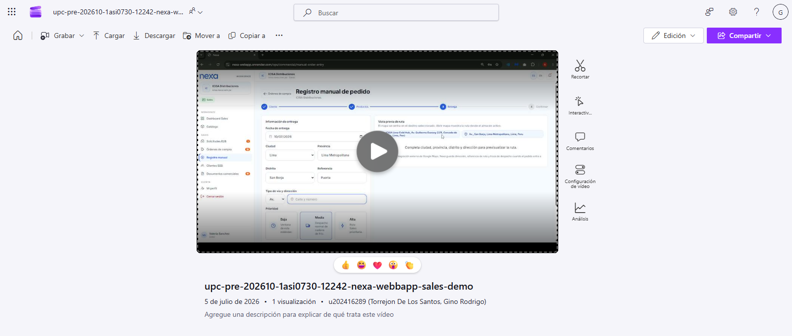
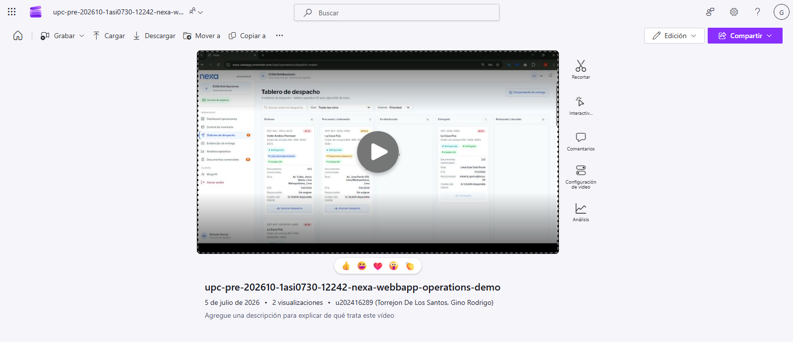
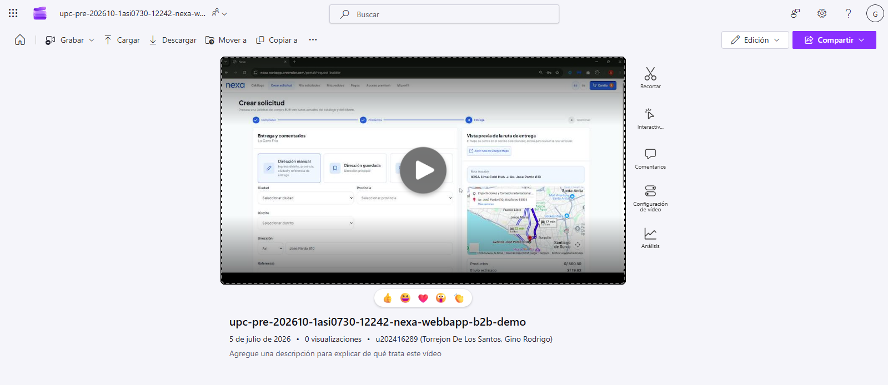
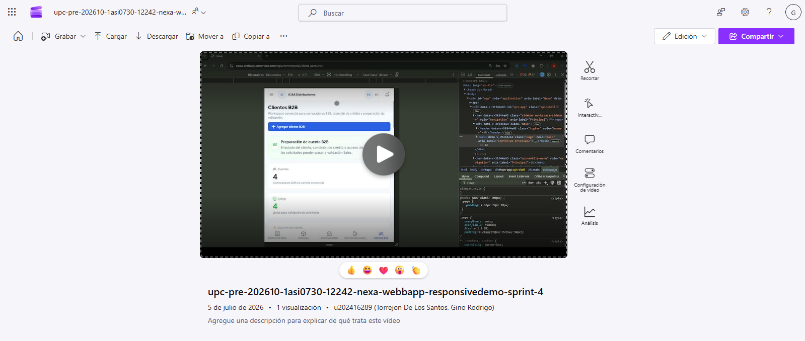

## 4.5. Web Applications Prototyping

El prototipado de las aplicaciones web de Nexa permite revisar navegación, interacción, continuidad visual y coherencia de flujo antes de analizar implementación, despliegue o ejecución técnica. Esta sección documenta la cobertura actualizada de la **Web Application interna u Ops Portal** para el **Segmento 1 — Valeria Sánchez — Commercial Coordination** y el **Segmento 2 — Roberto García — Operations / Account Owner**, además del **Buyer Portal** para el **Segmento 3 — Elena Litano — B2B Buyer Portal**.

Las tres experiencias comparten el sistema visual definido en 4.1 y la arquitectura de información documentada en 4.2. Sin embargo, cada superficie responde a una responsabilidad distinta dentro del ecosistema Nexa. El Ops Portal prioriza tareas internas de validación comercial, operación logística y gobierno del workspace. El Buyer Portal prioriza autoservicio B2B para consulta de catálogo, preparación de solicitudes, seguimiento de órdenes, revisión de documentos visibles y consulta referencial de pagos.

El tenant/workspace proporciona el contexto de operación. Por ello, la navegación del prototipo se interpreta como **role-aware**: el usuario autenticado visualiza módulos de acuerdo con su segmento, rol y alcance autorizado. En el caso de Roberto García, **Account Ownership** se mantiene como subalcance administrativo del Segmento 2 y no como un cuarto segmento. Esta rama permite representar Company Administration, Workspaces, Teammates, Company rules, Custom fields, Billing y Preferences como opciones visibles de configuración del workspace.

La evidencia de esta sección corresponde a **diseño interactivo y prototipado**. Las evidencias de ejecución, despliegue, servicios, repositorios y validación técnica se documentan en el Capítulo V. Por tanto, las capturas y videos incluidos aquí no se usan para afirmar persistencia completa, integración backend o cobertura de módulos no observables; se usan para demostrar navegación, continuidad de experiencia y relación con los user flows de 4.4.

*Criterios aplicados para las decisiones de interacción del prototipo*

| Criterio | Aplicación en Nexa | Relación con la arquitectura de información |
|---|---|---|
| Navegación por responsabilidad | Segmento 1, Segmento 2 y Segmento 3 acceden a módulos distintos según rol, alcance operativo y account ownership | Refuerza la separación entre Ops Portal y Buyer Portal definida en 4.2 |
| Continuidad de flujo | Los recorridos conectan login, dashboard, entidades de negocio, detalle, decisión y confirmación | Evita que las pantallas funcionen como vistas aisladas |
| Progressive disclosure | Los detalles se presentan mediante vistas de detalle, modales, drawers, pasos guiados o estados contextuales | Reduce carga cognitiva y mantiene el contexto de operación |
| Feedback de estado | Badges, mensajes, confirmaciones y estados textuales comunican avance de solicitudes, órdenes, inventario, despacho y pagos referenciales | Aporta trazabilidad sin depender únicamente del color |
| Densidad adaptada | Segmento 1 y Segmento 2 priorizan desktop/tablet; Segmento 3 prioriza claridad, autoservicio y adaptación responsive | Responde a diferencias de uso entre usuarios internos y compradores B2B |
| Consistencia visual | Se mantienen colores, tipografía, botones, cards, tablas, badges y patrones de navegación definidos en 4.1 | Asegura continuidad entre diseño visual, wireframes, mockups y prototipo interactivo |

> *Nota:* La tabla resume los criterios aplicados para validar navegación, interacción y continuidad visual en el prototipo de Nexa. Elaboración propia.

*Cobertura actualizada de prototipado por flujo y segmento*

| Flujo | Segmento / subalcance | Cobertura en prototipo | Evidencia visual / audiovisual |
|---|---|---|---|
| Validación comercial y atención de pedidos | Segmento 1 — Valeria Sánchez — Commercial Coordination | Sales Dashboard, Purchase Requests, Request Detail, Purchase Orders, Order Detail, Manual Order Entry, Product Catalog, B2B Clients y Business Documents | `upc-pre-202610-1asi0730-12242-nexa-webbapp-coordination.png` |
| Operación logística y account ownership | Segmento 2 — Roberto García — Operations / Account Owner | Rama operativa: Operations Dashboard, Inventory Control, Inventory Lots, Dispatch Orders, Dispatch Detail, Proof of Delivery, Operational Analytics y Business Documents. Rama administrativa: Company Administration, Workspaces, Teammates, Company rules, Custom fields, Billing y Preferences | `upc-pre-202610-1asi0730-12242-nexa-webbapp-operations.png` |
| Catálogo, solicitud, pedido y seguimiento | Segmento 3 — Elena Litano — B2B Buyer Portal | Portal Home, Product Catalog, Product Detail, Request Builder, My Requests, Request Detail, My Orders, Order Detail con tracking y documentos visibles, Payments, Premium y Profile | `upc-pre-202610-1asi0730-12242-nexa-webbapp-b2b-demo.png` |
| Adaptación responsive del recorrido | Segmento 1, Segmento 2 y Segmento 3 según alcance de cada superficie | Revisión de navegación compacta, lectura vertical, cards apiladas, tablas adaptadas y acciones visibles en pantallas pequeñas | `upc-pre-202610-1asi0730-12242-nexa-webbapp-responsive-demo-sprint-4.png` |

> *Nota:* La tabla presenta el nivel de cobertura del prototipado interactivo para cada segmento y la evidencia visual que debe ubicarse en `report/assets/images/chapter-4/webapp/prototyping`. Elaboración propia.

### 4.5.1. Sistema de navegación aplicado al prototipo

El prototipo aplica un sistema de navegación diferenciado por superficie y responsabilidad de negocio. El **Ops Portal** utiliza navegación lateral, topbar, tablas operativas, vistas de detalle y acciones contextuales para que los usuarios internos trabajen sin perder el contexto del workspace. El **Buyer Portal** utiliza una navegación más directa, orientada a catálogo, solicitudes, órdenes, pagos referenciales, beneficios y perfil del comprador.

*Navegación aplicada en el prototipo por segmento*

| Superficie | Segmento / subalcance | Navegación principal | Propósito |
|---|---|---|---|
| Ops Portal | Segmento 1 — Commercial Coordination | Sales Dashboard, Product Catalog, Purchase Requests, Purchase Orders, Manual Order Entry, B2B Clients, Business Documents y My Profile | Validar solicitudes, formalizar órdenes, registrar pedidos asistidos y consultar información comercial |
| Ops Portal | Segmento 2 — Operations | Operations Dashboard, Inventory Control, Inventory Lots, Dispatch Orders, Dispatch Detail, Proof of Delivery, Operational Analytics, Business Documents y My Profile | Controlar inventario, lotes, despacho, evidencia de entrega y analítica operativa |
| Ops Portal | Segmento 2 — Account Ownership | Company Administration, Workspaces, Teammates, Company rules, Custom fields, Billing, Preferences y My Profile | Visualizar opciones administrativas y configuración del workspace dentro del mismo Segmento 2 |
| Buyer Portal | Segmento 3 — B2B Buyer Portal | Portal Home, Product Catalog, Product Detail, Request Builder, My Requests, My Orders, Order Detail con tracking y documentos visibles, Payments, Premium y Profile | Permitir autoservicio para preparar solicitudes, revisar órdenes y consultar información referencial de pago |

> *Nota:* La tabla presenta los componentes del sistema de navegación aplicados en el prototipo interactivo para cada segmento. Elaboración propia.

La navegación es **role-aware**: Segmento 1 y Segmento 2 comparten la Web Application interna, mientras que Segmento 3 utiliza una superficie separada para evitar exposición innecesaria de información interna. Account Ownership permanece como rama administrativa de Segmento 2 y se interpreta junto con el tenant/workspace activo.

### 4.5.2. Interacciones principales del prototipo

El prototipo utiliza patrones de interacción consistentes con los user goals de 4.4. Las interacciones responden a decisiones del negocio: validar solicitudes, formalizar órdenes, revisar inventario, preparar despachos, registrar evidencia, configurar el workspace o consultar el avance de una compra B2B.

*Interacciones principales del prototipo*

| Patrón de interacción | Uso en el prototipo | Segmento / subalcance |
|---|---|---|
| Login y navegación role-aware | Dirigen al usuario hacia la experiencia y módulos autorizados | Segmento 1, Segmento 2 y Segmento 3 |
| Dashboard inicial por experiencia | Resume actividad relevante y accesos frecuentes según responsabilidad | Segmento 1, Segmento 2 y Segmento 3 |
| Tablas con filtros | Permiten revisar solicitudes, órdenes, inventario, lotes, despachos y documentos | Segmento 1 y Segmento 2 |
| Vistas de detalle | Presentan solicitudes, órdenes, despachos y tracking con contexto suficiente | Segmento 1, Segmento 2 y Segmento 3 |
| Flujos guiados | Estructuran Manual Order Entry y Request Builder antes de confirmar | Segmento 1 y Segmento 3 |
| Estados visuales y badges | Comunican estados de solicitudes, órdenes, inventario, despacho y pagos referenciales | Segmento 1, Segmento 2 y Segmento 3 |
| Confirmaciones | Reducen errores antes de acciones relevantes del recorrido | Segmento 1, Segmento 2 y Segmento 3 |
| Company Administration | Presenta opciones administrativas visibles y configuración del workspace | Segmento 2 — Account Ownership |
| Tracking y documentos visibles | Integra seguimiento, estado y documentos dentro de Order Detail | Segmento 3 |
| Payments | Presenta métodos, crédito, saldo o estado referencial según alcance, sin representar procesamiento directo de pagos | Segmento 3 |
| Responsive behavior | Reorganiza navegación, cards, tablas y acciones para lectura y consulta en pantallas pequeñas | Segmento 1, Segmento 2 y Segmento 3 |

> *Nota:* La tabla clasifica las interacciones y patrones UX probados en el prototipo navegable. Elaboración propia.

### 4.5.3. Paths de prototipo por user goal

Los paths del prototipo siguen los user flows definidos en 4.4. Cada recorrido cubre un objetivo de usuario y una secuencia esperada de interacción. En esta sección se mantiene la misma lógica de lectura: primero la experiencia comercial interna, luego la experiencia operativa y administrativa, y finalmente el autoservicio del comprador B2B.

*Paths de prototipo por user goal*

| Segmento / subalcance | User goal | Path de prototipo | Cobertura documentada |
|---|---|---|---|
| Segmento 1 — Valeria Sánchez | Validar solicitudes, formalizar órdenes y atender pedidos comerciales | Login → Sales Dashboard → Purchase Requests → Request Detail → decisión: approve / observe / reject → Purchase Orders → Order Detail → Manual Order Entry → Product Catalog → B2B Clients → Business Documents | Recorrido de Segmento 1 alineado con el user flow de 4.4 |
| Segmento 2 — Roberto García | Supervisar la operación logística y el gobierno del workspace | Login → Operations Dashboard → Inventory Control → Inventory Lots → Dispatch Orders → Dispatch Detail → Proof of Delivery → Operational Analytics → Business Documents → Company Administration → Workspaces / Teammates / Company rules / Custom fields / Billing / Preferences | Un único segmento con rama operativa y rama administrativa |
| Segmento 3 — Elena Litano | Preparar una solicitud y consultar el avance de su atención | Login → Portal Home → Product Catalog → Product Detail → Request Builder → Submit Request → My Requests → Request Detail → My Orders → Order Detail / Tracking / visible documents → Payments → Premium → Profile | Recorrido del Buyer Portal alineado con el user flow de 4.4 |
| Responsive review | Comprobar adaptación visual y continuidad en pantallas pequeñas | Login / navegación compacta → cards y tablas adaptadas → detalle o acción principal → confirmación / consulta | Evidencia transversal de adaptación responsive del prototipo |

> *Nota:* La tabla describe la secuencia de pantallas recorridas en el prototipo interactivo para cada objetivo de usuario. Elaboración propia.

En Segmento 2, Company Administration y sus secciones forman una rama administrativa del mismo path del segmento. No constituyen un segmento ni una experiencia independiente.

### 4.5.4. Evidencia audiovisual del prototipo por aplicación

La evidencia audiovisual se organiza en el mismo orden de lectura del documento: primero el recorrido de Commercial Coordination, luego Operations / Account Owner, después B2B Buyer Portal y finalmente la revisión responsive de Sprint 4. Cada evidencia utiliza una captura ubicada en `report/assets/images/chapter-4/webapp/prototyping` y deja un espacio reservado para insertar el enlace final de Microsoft Stream / SharePoint.

*Detalle audiovisual actualizado del prototipo de la Web Application*

| Orden | Evidencia | Segmento / superficie | Archivo visual ubicado en prototyping | URL Microsoft Stream / SharePoint |
|---|---|---|---|---|
| 1 | WebApp Coordination demo | Segmento 1 — Commercial Coordination / Ops Portal | `upc-pre-202610-1asi0730-12242-nexa-webbapp-coordination.png` | https://cutt.ly/0t65UEXh |
| 2 | WebApp Operations demo | Segmento 2 — Operations / Account Owner / Ops Portal | `upc-pre-202610-1asi0730-12242-nexa-webbapp-operations.png` | https://cutt.ly/mt65YMXb |
| 3 | WebApp B2B demo | Segmento 3 — B2B Buyer Portal | `upc-pre-202610-1asi0730-12242-nexa-webbapp-b2b-demo.png` | https://cutt.ly/it65UdrH |
| 4 | WebApp responsive demo Sprint 4 | Cobertura responsive de Web Application y Buyer Portal | `upc-pre-202610-1asi0730-12242-nexa-webbapp-responsive-demo-sprint-4.png` | https://cutt.ly/kt65InxO |

> *Nota:* La tabla resume la evidencia audiovisual actualizada del prototipo navegable de Nexa. Los enlaces deben reemplazarse por las URL finales publicadas en Microsoft Stream / SharePoint. Elaboración propia.

#### Evidencia 1 — Prototipo de Coordination para Segmento 1

La evidencia de Coordination muestra el recorrido de la Web Application interna para el Segmento 1. Su función es respaldar la navegación comercial del Ops Portal: dashboard, revisión de solicitudes, lectura de detalle, formalización de órdenes, pedido asistido, consulta de catálogo, clientes y documentos de negocio.

*Captura del video de prototipado de WebApp Coordination*

> *Nota:* La captura muestra la evidencia audiovisual del recorrido de Coordination para el Segmento 1 — Commercial Coordination. Elaboración propia.

**URL Microsoft Stream / SharePoint:** https://cutt.ly/0t65UEXh

#### Evidencia 2 — Prototipo de Operations para Segmento 2

La evidencia de Operations muestra el recorrido de la Web Application interna para el Segmento 2. Su función es respaldar la navegación operativa del Ops Portal: dashboard logístico, inventario, lotes, despacho, detalle de despacho, Proof of Delivery, analítica operativa, documentos y rama administrativa de account ownership cuando corresponda.

*Captura del video de prototipado de WebApp Operations*

> *Nota:* La captura muestra la evidencia audiovisual del recorrido de Operations para el Segmento 2 — Operations / Account Owner. Elaboración propia.

**URL Microsoft Stream / SharePoint:** https://cutt.ly/mt65YMXb

#### Evidencia 3 — Prototipo de B2B Buyer Portal para Segmento 3

La evidencia de B2B Buyer Portal muestra el recorrido del comprador B2B en el autoservicio de Nexa. Su función es respaldar la navegación desde Portal Home hacia catálogo, detalle de producto, Request Builder, My Requests, My Orders, Order Detail con tracking y documentos visibles, Payments, Premium y Profile.

*Captura del video de prototipado de WebApp B2B Buyer Portal*

> *Nota:* La captura muestra la evidencia audiovisual del recorrido del Segmento 3 — B2B Buyer Portal. Elaboración propia.

**URL Microsoft Stream / SharePoint:** https://cutt.ly/it65UdrH

#### Evidencia 4 — Prototipo responsive Sprint 4

La evidencia responsive de Sprint 4 complementa los mockups mobile de 4.4 y permite observar la adaptación del prototipo en pantallas pequeñas. Su objetivo es documentar lectura vertical, navegación compacta, reorganización de cards, visibilidad de acciones principales y continuidad visual entre desktop y mobile.

*Captura del video responsive de prototipado de WebApp Sprint 4*

> *Nota:* La captura muestra la evidencia audiovisual de adaptación responsive del prototipo en Sprint 4. Elaboración propia.

**URL Microsoft Stream / SharePoint:** https://cutt.ly/kt65InxO

### 4.5.5. Relación entre prototipo, user flows e implementación

El prototipo se usa como puente entre diseño e implementación. Su función es demostrar que rutas, módulos, estados, decisiones y patrones de interacción son coherentes con los user goals definidos para cada segmento. No reemplaza la validación con usuarios ni la evidencia de ejecución técnica.

*Relación entre prototipo, user flows e implementación*

| Relación | Aplicación en Nexa |
|---|---|
| Design System → Prototyping | Los componentes, colores, tipografía, estados y espaciado siguen los lineamientos de 4.1 |
| Information Architecture → Prototyping | Las rutas canónicas y la navegación por Segmento 1, Segmento 2 y Segmento 3 siguen la organización definida en 4.2; Account Ownership permanece dentro de Segmento 2 |
| Wireframes / Mockups → Prototyping | Los wireframes documentan estructura; los mockups consolidan fidelidad visual; el prototipo demuestra continuidad de recorrido |
| User Flow → Prototyping | Los recorridos interactivos siguen los flujos finales documentados en 4.4 |
| Prototyping → Implementation | El prototipo orienta navegación, estados, componentes y tareas; la implementación, ejecución y despliegue se evidencian en el Capítulo V |
| Prototyping → Validation | Los recorridos permiten preparar evaluaciones de claridad e interacción, sin sustituir evidencia real de validación con usuarios |

> *Nota:* La tabla detalla la correspondencia conceptual y metodológica entre las fases de diseño y desarrollo en Nexa. Elaboración propia.

La evidencia visual y audiovisual actualizada mantiene trazabilidad con la cobertura final de 4.4. Segmento 1 y Segmento 2 comparten el Ops Portal; Account Ownership permanece como rama administrativa de Segmento 2; y Segmento 3 utiliza el Buyer Portal como superficie separada para compradores B2B. La evidencia responsive complementa los mockups mobile y refuerza la continuidad visual del prototipo sin presentarse como evidencia de despliegue o integración técnica.
