## 4.6. Domain-Driven Software Architecture

Esta sección presenta la arquitectura de software dirigida por el dominio de Nexa. La arquitectura final documentada para TB2 alinea el dominio de negocio, los bounded contexts y las vistas del C4 Model con la evidencia técnica disponible para Website, WebApp, RESTful API, PostgreSQL y servicios externos evidenciados. La combinación de DDD y C4 permite explicar los límites de negocio, los actores, los contenedores y los componentes principales antes de abordar el diseño orientado a objetos y el diseño de base de datos.

Nexa soporta un proceso de distribución B2B de productos gourmet refrigerados. Por ello, el dominio no se modeló como un sistema genérico de pedidos. En su lugar, se dividió en límites de negocio que separan autenticación y acceso, tenant/workspace, catálogo, gestión comercial, almacén, logística y documentos o pagos referenciales.

La arquitectura documentada en esta sección representa la línea base técnica final de Nexa para el cierre del proyecto y su despliegue académico. La evidencia de implementación, ejecución, despliegue y documentación de servicios se presenta en el Capítulo V. En consecuencia, esta sección se concentra en la coherencia entre Domain-Driven Design, C4 Model, diseño orientado a objetos y el diseño de la base de datos PostgreSQL.

Los bounded contexts finales reconocidos para Nexa son:

*Bounded contexts de la arquitectura de Nexa.*

| Bounded Context | Responsabilidad principal |
|---|---|
| Identity and Access Management | Gestiona autenticación, autorización, usuarios, credenciales, sesiones y control de acceso basado en roles. |
| Tenant Management | Gestiona tenant, workspace, registro de organizaciones y el alcance administrativo de account ownership. |
| Catalog Management | Gestiona productos, categorías, códigos internos de producto, visibilidad comercial, condiciones de conservación y promociones. |
| Sales | Gestiona clientes B2B, solicitudes de compra, validación comercial, órdenes de venta, ítems de orden, alertas de crédito y observaciones comerciales. |
| Warehouse | Gestiona almacenes, lotes de inventario, disponibilidad de stock, reservas de stock, movimientos de stock y criterios de reserva basados en FEFO. |
| Logistics | Gestiona órdenes de despacho, eventos de trazabilidad, incidencias de entrega, controles de temperatura, ventanas de entrega y evidencia de entrega. |
| Invoicing | Gestiona documentos comerciales referenciales, resúmenes de cobro, pagos referenciales, estado de pago y visibilidad documental para el comprador. |

> *Nota*: La tabla resume los límites de responsabilidad reconocidos en el backend y su relación con el dominio de Nexa. Elaboración propia.

Catalog Management, Sales, Warehouse, Logistics e Invoicing concentran el flujo operativo principal. Identity and Access Management y Tenant Management soportan autenticación, autorización, workspace, tenant y account ownership. Company Owner pertenece al alcance administrativo de **S2 — Operations / Account Owner** y no constituye un cuarto segmento. Reporting y analytics se representan como read models derivados de los contextos operativos.

### 4.6.1. Design-Level EventStorming

El Design-Level EventStorming profundiza el modelo del dominio presentado en 2.4. El Big Picture documentó Step 1, Step 2 y Step 3 para explorar eventos, ordenarlos temporalmente e identificar pain points; esta sección desarrolla Step 4, Step 5, Step 6, Step 7, Step 9 y Step 10 mediante pivotal points, commands, policies, read models, aggregates y bounded contexts finales.

El material final recibido no contiene un Step 8. Por ello, la secuencia conserva la numeración del workshop sin incorporar un paso no evidenciado. La lectura se mantiene alineada con el modelo multi-tenant SaaS, el tenant/workspace y los flujos de registro organizacional, catálogo, ventas, almacén, logística, documentos comerciales referenciales, pagos referenciales e identidad y acceso.

#### Step 4: Pivotal Points

Los pivotal points marcan decisiones o tensiones donde el flujo cambia de responsabilidad, requiere validación o puede derivar en una ruta alternativa. El modelado final hace visibles Fragmented Organization Registration, Manual Validation Bottleneck y Manual Payment Reconciliation, además de la separación entre registro organizacional, catálogo, solicitud, inventario, despacho y cierre documental.

*Design-Level EventStorming — Step 4: registro organizacional fragmentado.*

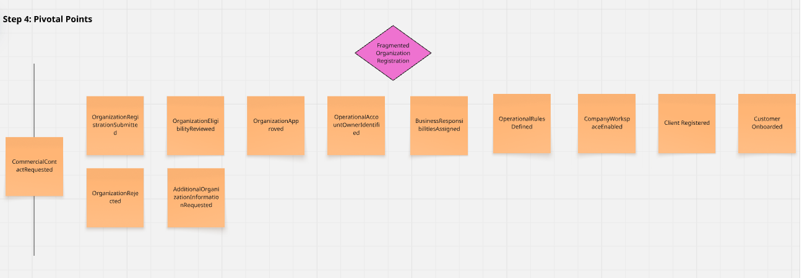

> *Nota*: La captura muestra el pivotal point asociado al registro organizacional fragmentado dentro del flujo de incorporación del tenant/workspace. Elaboración propia.

*Design-Level EventStorming — Step 4: catálogo y validación comercial.*

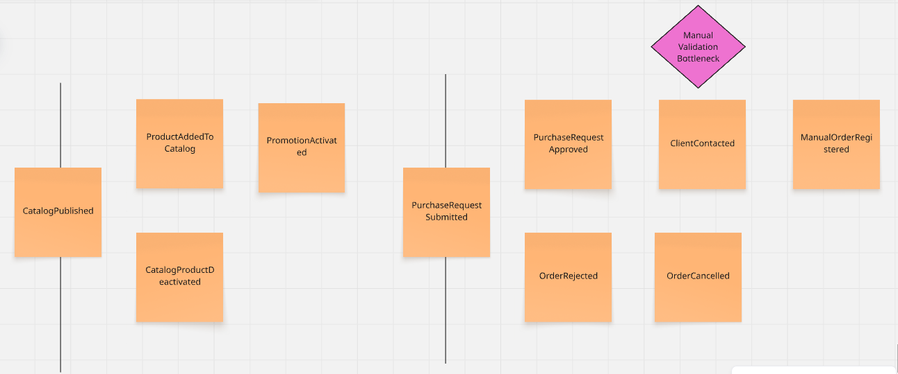

> *Nota*: La captura muestra los puntos de decisión entre publicación del catálogo, solicitud de compra y validación comercial. Elaboración propia.

*Design-Level EventStorming — Step 4: inventario y logística.*

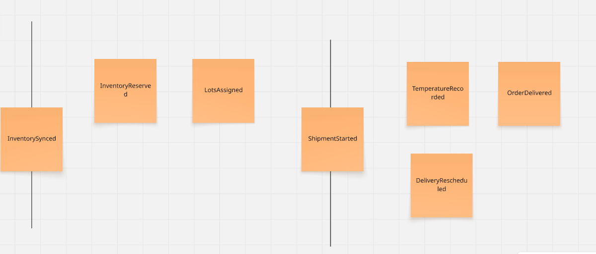

> *Nota*: La captura representa las tensiones entre asignación de inventario, preparación de despacho y continuidad logística. Elaboración propia.

*Design-Level EventStorming — Step 4: conciliación manual de pagos.*

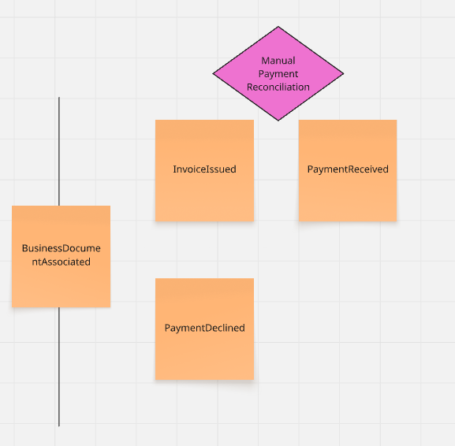

> *Nota*: La captura muestra el pivotal point asociado con la conciliación manual y la visibilidad de pagos referenciales. Elaboración propia.

*Pivotal points identificados en el Design-Level EventStorming.*

| Pivotal point | Zona del flujo | Implicancia de diseño |
|---|---|---|
| Fragmented Organization Registration | Registro organizacional y habilitación del workspace | Requiere separar tenant, workspace, account ownership y registro de organización dentro de Tenant Management. |
| Manual Validation Bottleneck | Solicitud de compra y validación comercial | Requiere modelar la aprobación, rechazo, contacto con cliente y registro manual dentro del flujo de Sales. |
| Inventory Allocation | Validación comercial e inventario | Requiere coordinar la solicitud aprobada con reserva de inventario y asignación de lotes en Warehouse. |
| Shipping Preparation | Inventario reservado y despacho | Requiere enlazar disponibilidad, preparación de despacho y seguimiento logístico en Logistics. |
| Manual Payment Reconciliation | Documentos comerciales y pagos referenciales | Requiere visibilidad de documentos comerciales y estados de pago referenciales en Invoicing. |

> *Nota*: La tabla resume los puntos de decisión y tensión que orientan el modelado posterior de commands, policies, aggregates y bounded contexts. Elaboración propia.

#### Step 5: Commands

Los commands representan intenciones de actores o roles operativos que solicitan un cambio en el dominio. El modelado final relaciona estas intenciones con eventos posteriores y con el bounded context responsable de mantener su consistencia.

*Design-Level EventStorming — Step 5: command RegisterOrganization.*

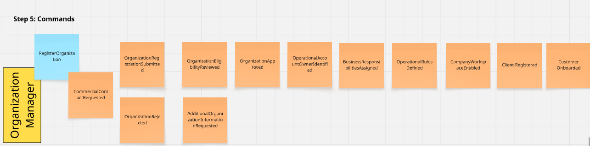

> *Nota*: La captura muestra el command `RegisterOrganization` y los eventos asociados con evaluación y habilitación del tenant/workspace. Elaboración propia.

*Design-Level EventStorming — Step 5: command ReserveInventory.*

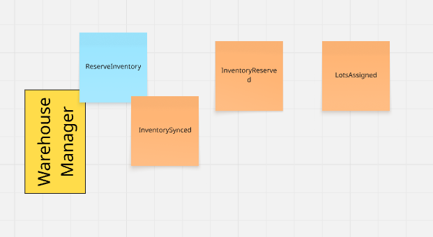

> *Nota*: La captura muestra el command `ReserveInventory` dentro del flujo de disponibilidad, reserva y asignación de lotes. Elaboración propia.

*Design-Level EventStorming — Step 5: command IssueInvoice.*

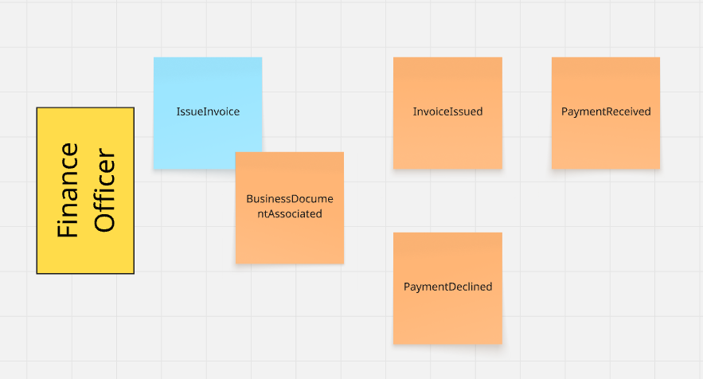

> *Nota*: La captura muestra `IssueInvoice` como intención de emisión o registro de un documento comercial referencial dentro del modelo académico. Elaboración propia.

*Design-Level EventStorming — Step 5: command PublishCatalog.*

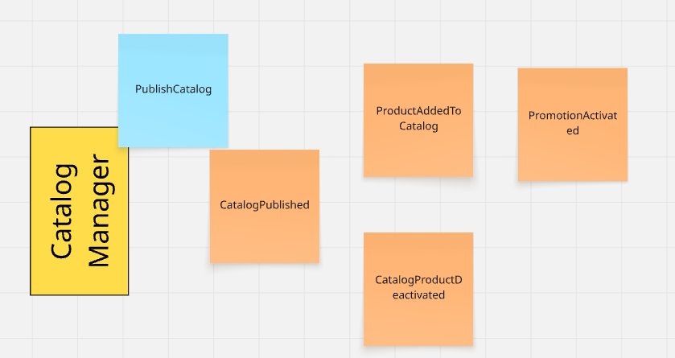

> *Nota*: La captura muestra el command `PublishCatalog` y su relación con publicación, productos y promociones. Elaboración propia.

*Design-Level EventStorming — Step 5: command StartShipment.*

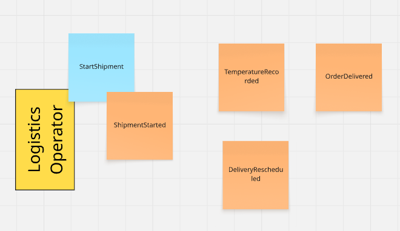

> *Nota*: La captura muestra el command `StartShipment` dentro del flujo de despacho, condiciones de traslado y entrega. Elaboración propia.

*Design-Level EventStorming — Step 5: command SubmitPurchaseRequest.*

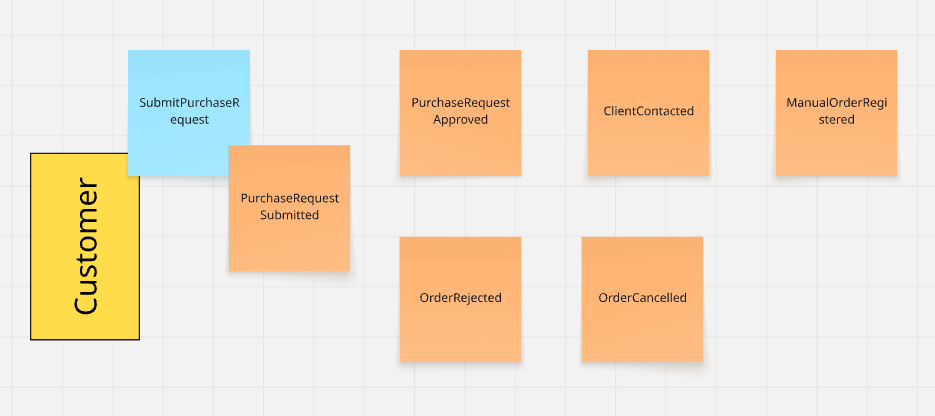

> *Nota*: La captura muestra el command `SubmitPurchaseRequest` y los resultados posibles de la validación comercial. Elaboración propia.

*Commands principales por actor y contexto.*

| Actor / rol operativo | Command observado | Bounded context relacionado | Eventos resultantes principales |
|---|---|---|---|
| Organization Manager / Account Owner | `RegisterOrganization` | Tenant Management | `OrganizationRegistrationSubmitted`, `OrganizationEligibilityReviewed`, `OrganizationApproved`, `OrganizationRejected`, `AdditionalOrganizationInformationRequested`, `CompanyWorkspaceEnabled` |
| Catalog Manager | `PublishCatalog` | Catalog Management | `CatalogPublished`, `ProductAddedToCatalog`, `CatalogProductDeactivated`, `PromotionActivated` |
| Customer / comprador B2B | `SubmitPurchaseRequest` | Sales | `PurchaseRequestSubmitted`, `PurchaseRequestApproved`, `OrderRejected`, `OrderCancelled`, `ClientContacted`, `ManualOrderRegistered` |
| Warehouse Manager | `ReserveInventory` | Warehouse | `InventorySynced`, `InventoryReserved`, `LotsAssigned` |
| Logistics Operator | `StartShipment` | Logistics | `ShipmentStarted`, `TemperatureRecorded`, `DeliveryRescheduled`, `OrderDelivered` |
| Finance Officer | `IssueInvoice` | Invoicing | `BusinessDocumentAssociated`, `InvoiceIssued`, `PaymentReceived`, `PaymentDeclined` |
| User / IAM actor | `RegisterUser`, `AuthenticateUser` | Identity and Access Management | `UserRegistered`, `UserIdentityVerified`, `UserIdentityRejected`, `RoleAssigned`, `UserLoggedIn`, `PasswordChanged`, `LoginFailed`, `UserLoggedOut` |

> *Nota*: La tabla conserva los commands observados en el EventStorming final y los relaciona con los bounded contexts finales de Nexa. Elaboración propia.

#### Step 6: Policies

Las policies reaccionan ante eventos del dominio y activan commands posteriores. En el flujo final coordinan responsabilidades entre Sales, Warehouse, Logistics e Invoicing sin mezclar la consistencia interna de cada contexto.

*Design-Level EventStorming — Step 6: policies del flujo operativo.*

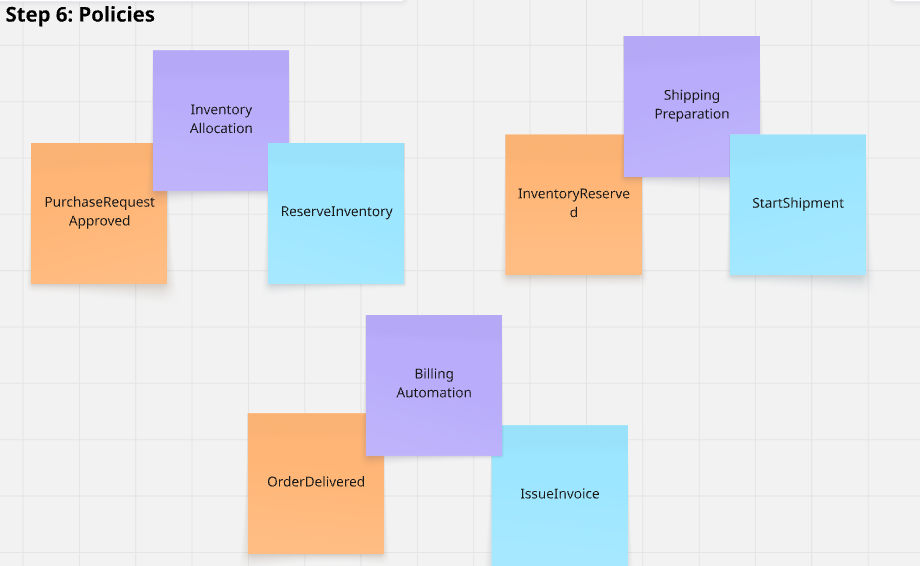

> *Nota*: La captura muestra policies que conectan eventos y commands, como asignación de inventario, preparación de despacho y generación de documentos comerciales referenciales. Elaboración propia.

*Policies identificadas en el flujo de dominio.*

| Policy | Evento disparador | Command resultante | Contextos involucrados | Interpretación |
|---|---|---|---|---|
| Inventory Allocation | `PurchaseRequestApproved` | `ReserveInventory` | Sales / Warehouse | Una solicitud aprobada debe derivar en revisión y reserva de disponibilidad antes de preparar la operación. |
| Shipping Preparation | `InventoryReserved` | `StartShipment` | Warehouse / Logistics | La reserva de inventario habilita la preparación e inicio del despacho. |
| Billing Automation | `OrderDelivered` | `IssueInvoice` | Logistics / Invoicing | La entrega permite registrar o emitir documentos comerciales referenciales y actualizar visibilidad administrativa. |

> *Nota*: La tabla presenta las policies como reglas de coordinación entre contextos; no implica automatización tributaria ni procesamiento externo de pagos. Elaboración propia.

#### Step 7: Read Models

Los read models representan vistas de información que los actores utilizan para revisar estados y tomar decisiones. Cada vista reúne información relevante para una tarea sin alterar directamente el estado del dominio.

*Design-Level EventStorming — Step 7: Organization Registration Dashboard.*

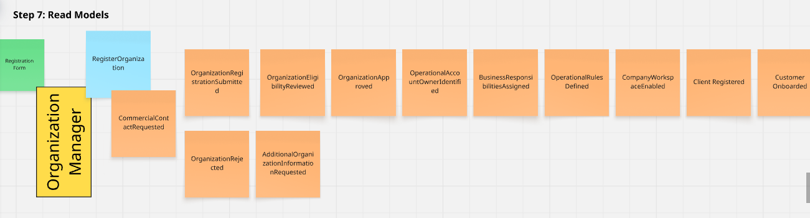

> *Nota*: La captura muestra el read model destinado a revisar registro, elegibilidad y habilitación organizacional. Elaboración propia.

*Design-Level EventStorming — Step 7: Order Details & Stock Status.*

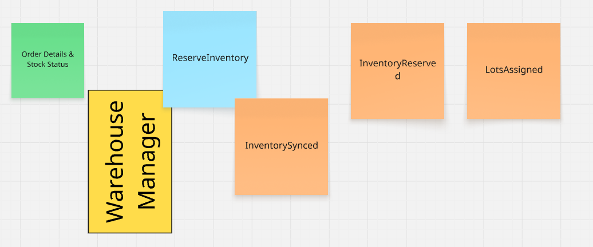

> *Nota*: La captura muestra la vista que relaciona el detalle de la solicitud con el estado de disponibilidad. Elaboración propia.

*Design-Level EventStorming — Step 7: Order Fulfillment Report.*

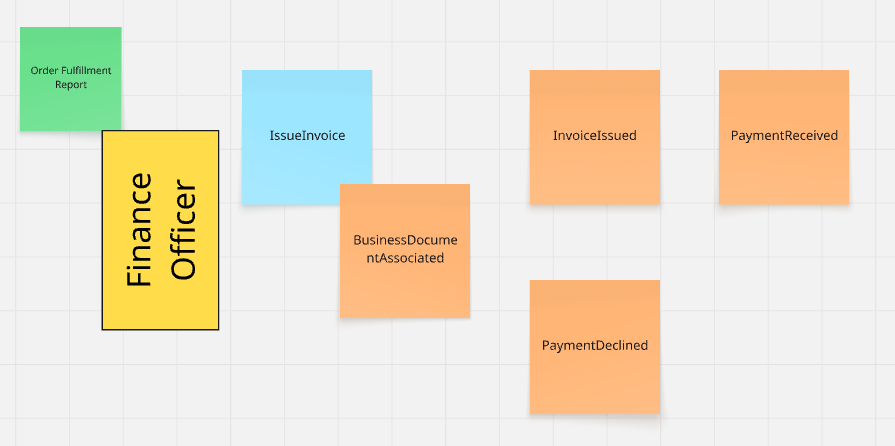

> *Nota*: La captura muestra la vista de cumplimiento, entrega y cierre documental referencial del pedido. Elaboración propia.

*Design-Level EventStorming — Step 7: Inventory & Pricing Dashboard.*

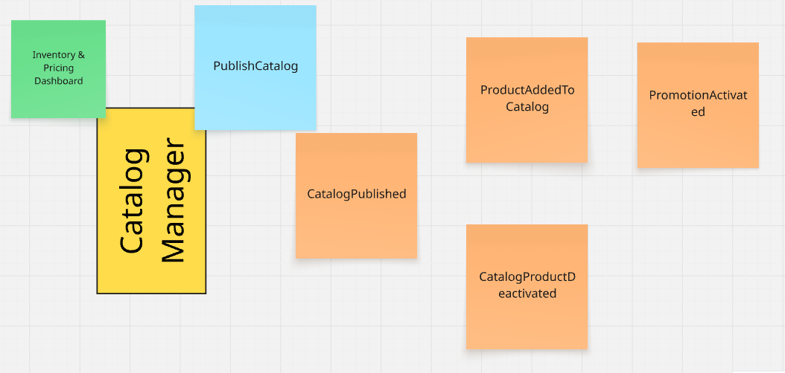

> *Nota*: La captura muestra la vista conjunta de disponibilidad y condiciones vinculadas con el catálogo. Elaboración propia.

*Design-Level EventStorming — Step 7: Product Catalog View.*

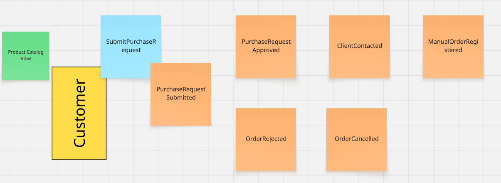

> *Nota*: La captura muestra el read model utilizado por el comprador para consultar productos y condiciones visibles. Elaboración propia.

*Design-Level EventStorming — Step 7: Pending Shipments List.*

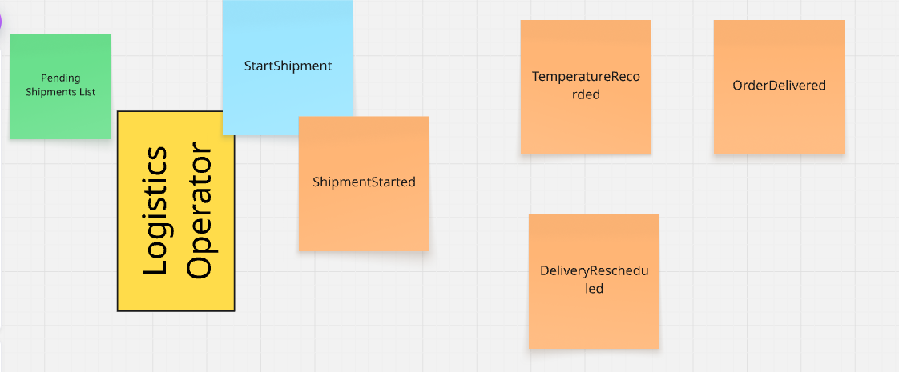

> *Nota*: La captura muestra la lista de despachos pendientes utilizada para priorizar la continuidad operativa. Elaboración propia.

*Read models principales identificados.*

| Read model | Actor que lo utiliza | Contexto fuente | Uso en Nexa |
|---|---|---|---|
| `Organization Registration Dashboard` | Account Owner / administración del tenant | Tenant Management | Permite revisar el estado de registro, elegibilidad y habilitación del workspace. |
| `Product Catalog View` | Comprador B2B | Catalog Management | Permite consultar catálogo, productos visibles y condiciones comerciales disponibles. |
| `Inventory & Pricing Dashboard` | Catalog Manager / operación comercial | Catalog Management / Warehouse | Permite observar disponibilidad y condiciones asociadas al catálogo. |
| `Order Details & Stock Status` | Warehouse Manager / operación | Sales / Warehouse | Permite revisar detalle de solicitud y disponibilidad antes de reservar inventario. |
| `Pending Shipments List` | Logistics Operator | Logistics | Permite revisar despachos pendientes y priorizar continuidad operativa. |
| `Order Fulfillment Report` | Finance Officer / coordinación administrativa | Sales / Logistics / Invoicing | Permite revisar cumplimiento de pedido, entrega y cierre documental referencial. |

> *Nota*: La tabla resume los read models visibles en el Design-Level EventStorming y los relaciona con decisiones de usuario. Elaboración propia.

#### Step 9: Consolidated Flow by Context

Step 9 agrupa events y commands alrededor de aggregates que mantienen reglas de consistencia dentro de cada área del dominio. La vista consolidada incorpora Tenant, Catalog, Order, Warehouse, Invoice, Shipment y User.

*Design-Level EventStorming — Step 9: aggregate Tenant.*

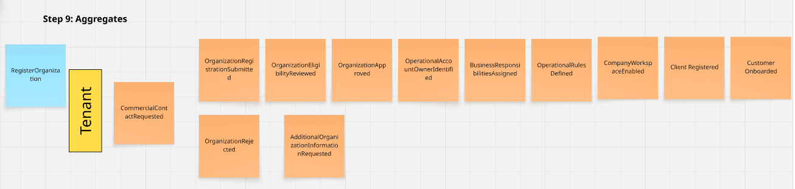

> *Nota*: La captura muestra el aggregate `Tenant` y los elementos vinculados con registro organizacional, elegibilidad y workspace. Elaboración propia.

*Design-Level EventStorming — Step 9: aggregate Catalog.*

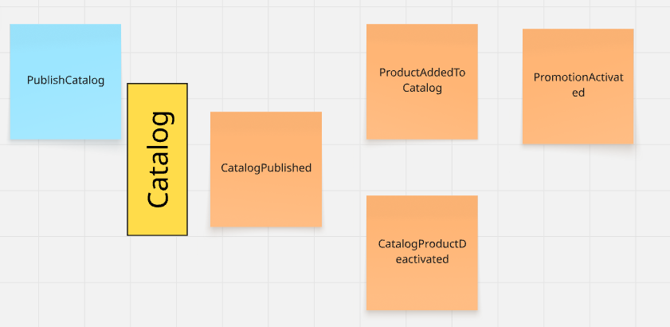

> *Nota*: La captura muestra el aggregate `Catalog` y su responsabilidad sobre publicación, productos y promociones. Elaboración propia.

*Design-Level EventStorming — Step 9: aggregate Order.*

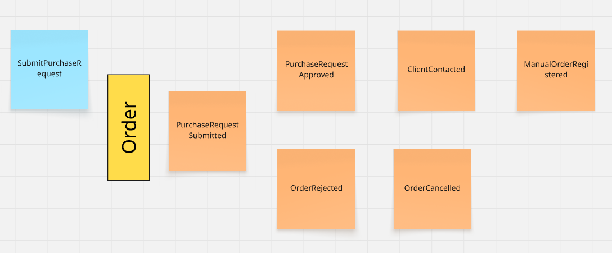

> *Nota*: La captura muestra el aggregate `Order` dentro del flujo de solicitud y validación comercial. Elaboración propia.

*Design-Level EventStorming — Step 9: aggregate Warehouse.*

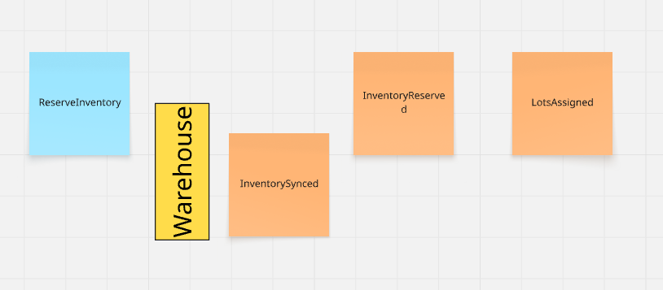

> *Nota*: La captura muestra el aggregate `Warehouse` para sincronización, reserva y asignación de lotes. Elaboración propia.

*Design-Level EventStorming — Step 9: aggregate Invoice.*

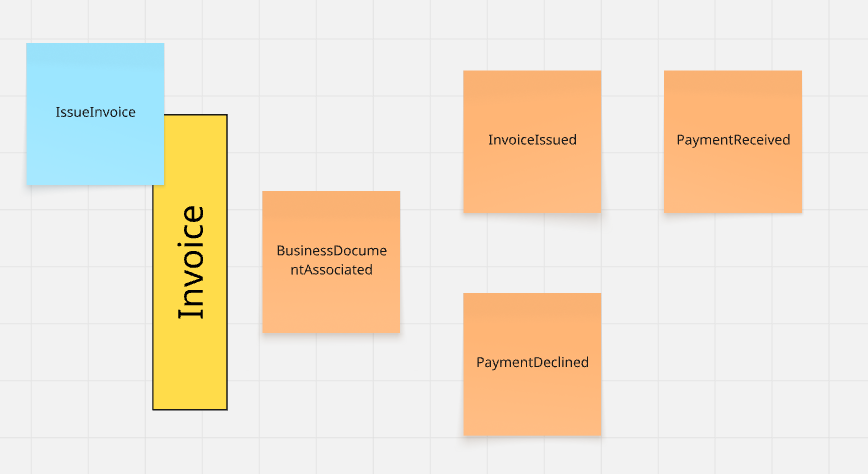

> *Nota*: La captura muestra el aggregate `Invoice` asociado con documentos comerciales y estados de pago referenciales. Elaboración propia.

*Design-Level EventStorming — Step 9: aggregate Shipment.*

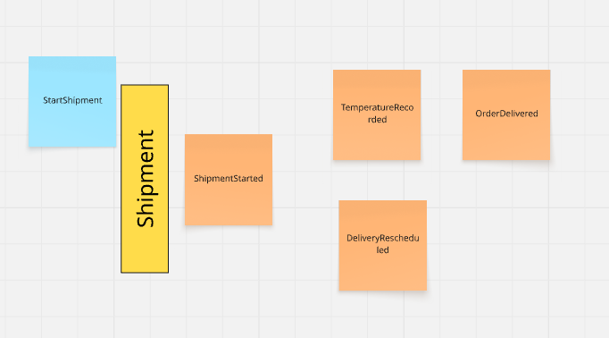

> *Nota*: La captura muestra el aggregate `Shipment` y los eventos de despacho, condiciones de traslado y entrega. Elaboración propia.

*Design-Level EventStorming — Step 9: aggregate User.*

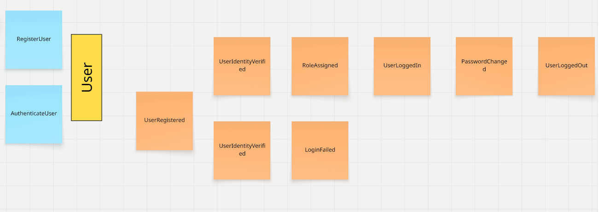

> *Nota*: La captura muestra el aggregate `User` para identidad, roles, acceso y sesiones. Elaboración propia.

*Aggregates principales identificados en el Design-Level EventStorming.*

| Aggregate | Bounded context relacionado | Responsabilidad de consistencia |
|---|---|---|
| `Tenant` | Tenant Management | Mantener el estado de registro organizacional, elegibilidad, workspace y account ownership. |
| `Catalog` | Catalog Management | Mantener productos, publicación de catálogo, promociones y visibilidad comercial. |
| `Order` | Sales | Mantener solicitud de compra, aprobación, rechazo, cancelación, contacto con cliente y registro manual. |
| `Warehouse` | Warehouse | Mantener sincronización de inventario, reserva de disponibilidad y asignación de lotes. |
| `Shipment` | Logistics | Mantener inicio de despacho, registro de temperatura, reprogramación y entrega. |
| `Invoice` | Invoicing | Mantener documentos comerciales referenciales, emisión documental y estado de pago referencial. |
| `User` | Identity and Access Management | Mantener registro, autenticación, verificación de identidad, roles y sesiones de usuario. |

> *Nota*: La tabla resume los aggregates principales observados en el flujo consolidado. Elaboración propia.

#### Step 10: Bounded Contexts

El EventStorming final reconoce siete bounded contexts explícitos: Tenant Management, Catalog Management, Sales, Warehouse, Logistics, Invoicing e Identity and Access Management. Cada uno delimita un conjunto coherente de events, commands, aggregates y read models; Shared Kernel permanece como soporte transversal y no como flujo principal de negocio.

*Design-Level EventStorming — Step 10: Tenant Management.*

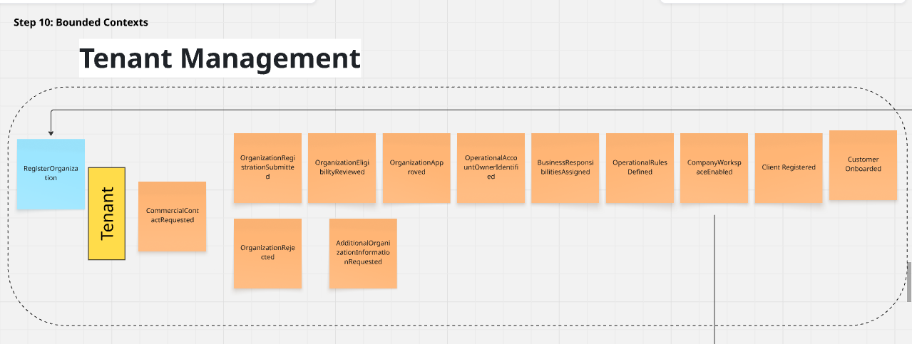

> *Nota*: La captura muestra el bounded context Tenant Management para registro organizacional, elegibilidad, account ownership y habilitación del workspace. Elaboración propia.

*Design-Level EventStorming — Step 10: Catalog Management.*

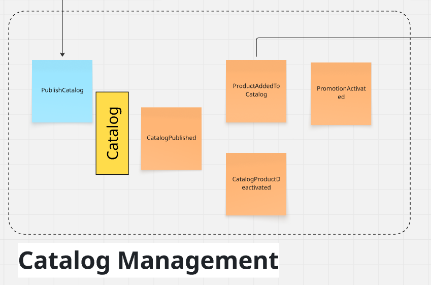

> *Nota*: La captura muestra el bounded context Catalog Management para catálogo, productos y promociones. Elaboración propia.

*Design-Level EventStorming — Step 10: Warehouse.*

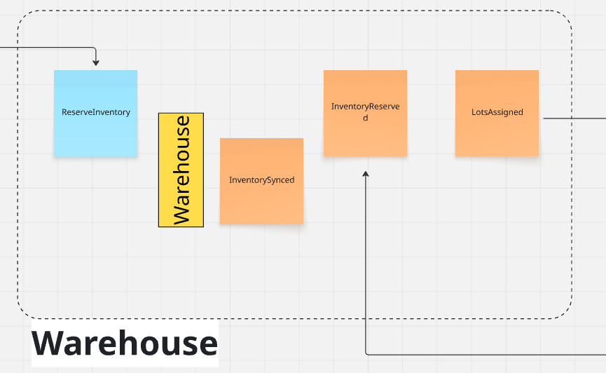

> *Nota*: La captura muestra el bounded context Warehouse para inventario, reservas y asignación de lotes. Elaboración propia.

*Design-Level EventStorming — Step 10: Logistics.*

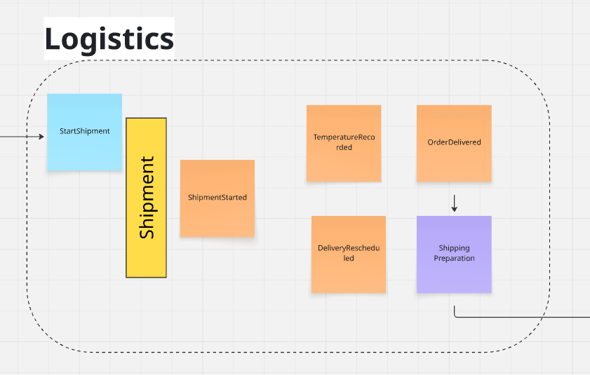

> *Nota*: La captura muestra el bounded context Logistics para despacho, registro de condiciones, reprogramación y entrega. Elaboración propia.

*Design-Level EventStorming — Step 10: Invoicing.*

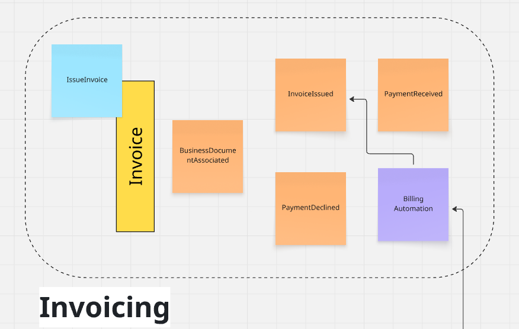

> *Nota*: La captura muestra el bounded context Invoicing para documentos comerciales referenciales y estados de pago referenciales. Elaboración propia.

*Design-Level EventStorming — Step 10: Sales.*

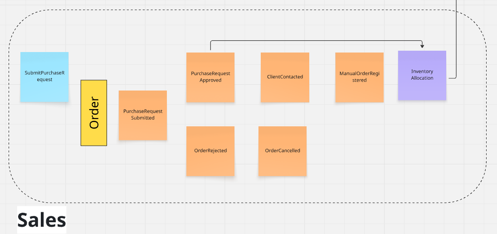

> *Nota*: La captura muestra el bounded context Sales para solicitud de compra, validación y decisiones comerciales. Elaboración propia.

*Design-Level EventStorming — Step 10: Identity and Access Management.*

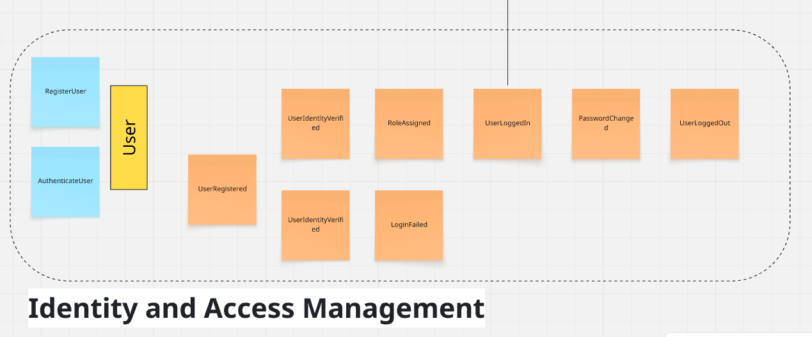

> *Nota*: La captura muestra el bounded context Identity and Access Management para identidad, autenticación, roles y sesiones. Elaboración propia.

*Bounded contexts finales derivados del Design-Level EventStorming.*

| Bounded Context | Aggregate principal | Domain Events representativos | Commands representativos | Read Models / vistas relacionadas |
|---|---|---|---|---|
| Tenant Management | `Tenant` | `OrganizationRegistrationSubmitted`, `OrganizationEligibilityReviewed`, `OrganizationApproved`, `OrganizationRejected`, `AdditionalOrganizationInformationRequested`, `CompanyWorkspaceEnabled`, `CustomerOnboarded` | `RegisterOrganization` | `Organization Registration Dashboard`, `Registration Form` |
| Catalog Management | `Catalog` | `CatalogPublished`, `ProductAddedToCatalog`, `CatalogProductDeactivated`, `PromotionActivated` | `PublishCatalog` | `Product Catalog View`, `Inventory & Pricing Dashboard` |
| Sales | `Order` | `PurchaseRequestSubmitted`, `PurchaseRequestApproved`, `OrderRejected`, `OrderCancelled`, `ClientContacted`, `ManualOrderRegistered` | `SubmitPurchaseRequest` | `Order Details & Stock Status` |
| Warehouse | `Warehouse` | `InventorySynced`, `InventoryReserved`, `LotsAssigned` | `ReserveInventory` | `Order Details & Stock Status`, `Inventory & Pricing Dashboard` |
| Logistics | `Shipment` | `ShipmentStarted`, `TemperatureRecorded`, `DeliveryRescheduled`, `OrderDelivered` | `StartShipment` | `Pending Shipments List`, `Order Fulfillment Report` |
| Invoicing | `Invoice` | `BusinessDocumentAssociated`, `InvoiceIssued`, `PaymentReceived`, `PaymentDeclined` | `IssueInvoice` | `Order Fulfillment Report` |
| Identity and Access Management | `User` | `UserRegistered`, `UserIdentityVerified`, `UserIdentityRejected`, `RoleAssigned`, `UserLoggedIn`, `PasswordChanged`, `LoginFailed`, `UserLoggedOut` | `RegisterUser`, `AuthenticateUser` | User/session/access views, role and membership views |

> *Nota*: La tabla actualiza el mapa de bounded contexts a partir del EventStorming final. Identity and Access Management y Tenant Management se reconocen como bounded contexts explícitos, mientras que Shared Kernel permanece como soporte transversal y no como flujo principal de negocio. Elaboración propia.

Este cierre permite alinear el Design-Level EventStorming con las vistas C4 posteriores, el diseño orientado a objetos y el diseño de base de datos. La separación por bounded contexts evita mezclar responsabilidades de tenant/workspace, autenticación, catálogo, ventas, almacén, logística y documentos comerciales referenciales.

### 4.6.2. Software Architecture Context Diagram

El C4 Context Diagram posiciona a **Nexa Platform** como el sistema central y muestra su relación con cinco actores y un proveedor externo configurable. Visitor representa al visitante empresarial del Website; Buyer corresponde a **S3 — B2B Buyer Portal / Elena Litano**; Sales Staff corresponde a **S1 — Commercial Coordination / Valeria Sánchez**; Logistics Staff corresponde a **S2 — Operations / Roberto García**; y Company Owner representa el subalcance administrativo de S2, no un segmento adicional. Stripe se documenta como integración referencial para pagos y conserva un estado seguro ante credenciales no configuradas.

*C4 Context Diagram de Nexa.*

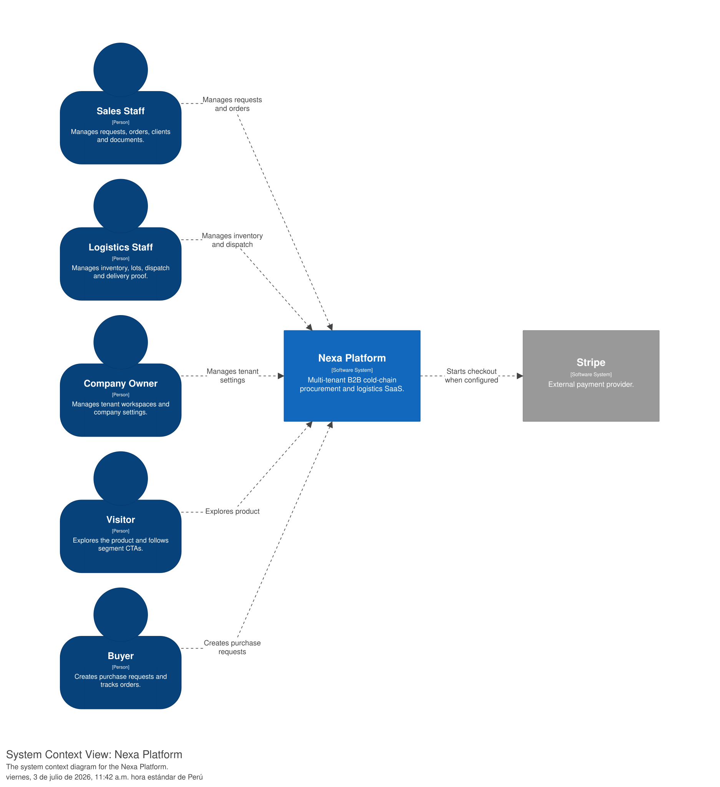

> *Nota*: El diagrama muestra la relación entre los actores externos, el sistema Nexa Platform y el proveedor externo configurable de pagos. Elaboración propia.

*Leyenda del C4 Context Diagram de Nexa.*

> *Nota*: La leyenda resume los tipos de elementos y relaciones usados en el diagrama de contexto. Elaboración propia.

*Actores y sistemas del C4 Context Diagram de Nexa.*

| Element | Type | Project mapping | Responsibility |
|---|---|---|---|
| Visitor | Person | Visitante empresarial del Website público | Revisa la información pública y utiliza los CTAs de registro o login. |
| Buyer | Person | S3 — B2B Buyer Portal / Elena Litano | Consulta catálogo, prepara solicitudes y revisa órdenes, tracking y documentos visibles. |
| Sales Staff | Person | S1 — Commercial Coordination / Valeria Sánchez | Valida solicitudes, administra clientes y formaliza órdenes comerciales. |
| Logistics Staff | Person | S2 — Operations / Roberto García | Gestiona inventario, lotes, despachos y evidencia de entrega. |
| Company Owner | Person | Subalcance administrativo de S2 — Operations / Account Owner | Administra workspaces y opciones visibles de configuración de la organización. |
| Nexa Platform | Software System | Ecosistema Nexa | Integra las superficies públicas y autenticadas con servicios de dominio y persistencia. |
| Stripe | External Software System | Proveedor externo configurable | Soporta flujos referenciales de pago cuando existen credenciales y un estado seguro cuando no están configuradas. |

> *Nota*: La tabla resume los actores, sistemas y responsabilidades representados en el diagrama de contexto. Elaboración propia.

### 4.6.3. Software Architecture Container Diagrams

El C4 Container Diagram describe los límites técnicos de alto nivel de Nexa. El Website público se implementa como Landing Page estática; la Web Application concentra Buyer Portal, Sales, Logistics y el subalcance de Company Owner; la RESTful API expone los servicios de aplicación; PostgreSQL conserva la persistencia relacional; y Stripe representa un proveedor externo configurable. La WebApp no accede directamente a la base de datos: su comunicación se realiza mediante solicitudes HTTP/JSON hacia la API.

*C4 Container Diagram de Nexa.*

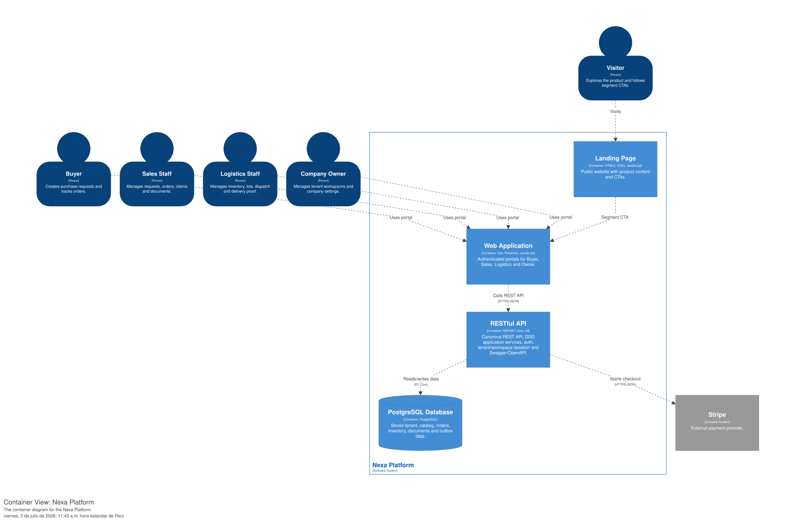

> *Nota*: El diagrama representa los contenedores principales de Nexa y sus relaciones de comunicación. Elaboración propia.

*Leyenda del C4 Container Diagram de Nexa.*

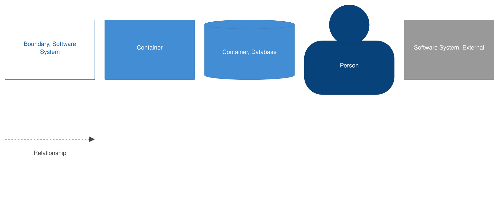

> *Nota*: La leyenda describe los tipos de contenedores y relaciones usados en la vista C4 Container. Elaboración propia.

*Contenedores principales del C4 Container Diagram de Nexa.*

| Container | Technology | Responsibility | Main interactions |
|---|---|---|---|
| Landing Page | HTML5, CSS3, JavaScript | Comunica propuesta de valor, soluciones, pricing, FAQ, contenido institucional y CTAs hacia registro o login. | Recibe al Visitor y redirige hacia la Web Application. |
| Web Application | Vue 3, Vite, PrimeVue, PrimeFlex, PrimeIcons, Vue Router, Vue I18n, Axios | Proporciona las experiencias autenticadas de Buyer, Sales, Logistics y Company Owner según rol y workspace. | Consume la RESTful API mediante HTTP/JSON. |
| RESTful API | ASP.NET Core Web API, C#, EF Core, Npgsql, Swagger/OpenAPI | Expone servicios para autenticación, tenants, catálogo, ventas, inventario, logística, facturación referencial, pagos referenciales y perfiles. | Atiende la WebApp, persiste mediante EF Core y se comunica con Stripe cuando está configurado. |
| PostgreSQL Database | PostgreSQL | Persiste tenants, usuarios, catálogo, clientes B2B, órdenes, inventario, despachos, documentos y pagos referenciales. | Recibe lecturas y escrituras exclusivamente desde la RESTful API. |
| Stripe | External Payment Provider | Proporciona una integración externa configurable para flujos referenciales de pago. | Recibe solicitudes desde la API cuando hay configuración; en caso contrario, la plataforma conserva un estado seguro. |

> *Nota*: La tabla resume las tecnologías, responsabilidades e interacciones de los contenedores representados. Elaboración propia.

### 4.6.4. Software Architecture Components Diagrams

El nivel C3 se divide en tres vistas para conservar legibilidad y distinguir responsabilidades técnicas: Backend Components para la RESTful API, Frontend Components para la WebApp y Website Components para la Landing Page pública. Esta separación mantiene la trazabilidad con los contenedores de 4.6.3 y con los bounded contexts, sin condensar superficies diferentes en un único diagrama genérico.

#### 4.6.4.1. Backend Components

La vista backend organiza la API en interfaces REST, seguridad y multi-tenancy, módulos de dominio, servicios de aplicación y persistencia. REST Controllers y Swagger/OpenAPI exponen y documentan contratos; Authentication/IAM y Authorization and Tenant Middleware protegen el acceso; Command Services y Query Services coordinan los casos de uso; y Repositories, Unit of Work, EF Core DbContext y Domain Events/Outbox conectan el dominio con PostgreSQL. Los módulos representados cubren Tenant and Workspace Management, Profile and Client Accounts, Catalog Management, Sales Management, Inventory/Warehouse, Logistics/Dispatch, Business Documents/Invoicing, Payments y Promotions.

*C4 Backend Components Diagram de Nexa.*

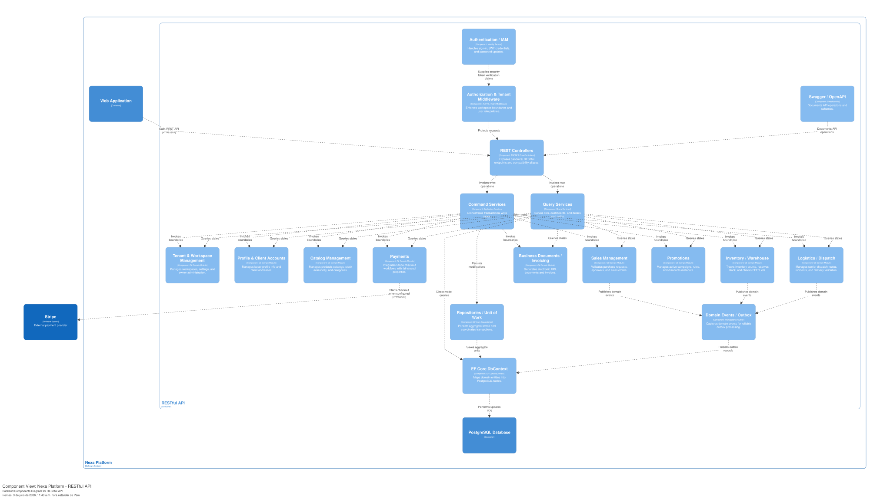

> *Nota*: El diagrama muestra los componentes principales del backend de Nexa, incluyendo controladores REST, servicios de aplicación, módulos de dominio, persistencia y base de datos. Elaboración propia.

*Leyenda del C4 Backend Components Diagram de Nexa.*

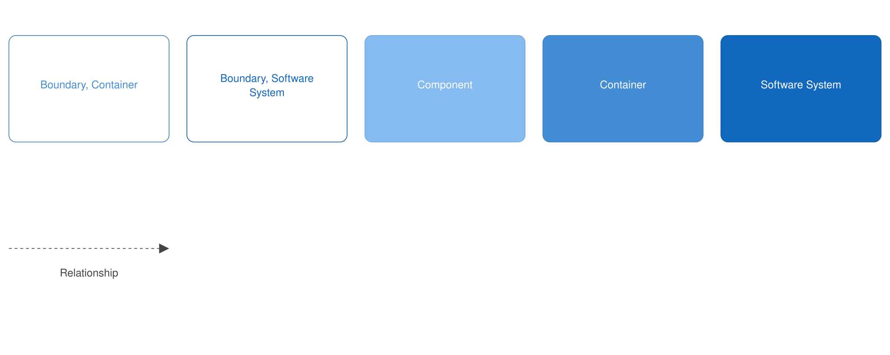

> *Nota*: La leyenda resume la clasificación visual de componentes usada en el diagrama backend. Elaboración propia.

*Componentes principales del backend de Nexa.*

| Component group | Main responsibility | Related bounded context or layer |
|---|---|---|
| REST Controllers y Swagger/OpenAPI | Exponer endpoints RESTful y documentar operaciones y esquemas. | Interfaces / API Layer |
| Authentication/IAM y Authorization and Tenant Middleware | Validar identidad, roles y límites de workspace antes de atender solicitudes. | Identity and Access Management / Shared Security |
| Módulos de dominio | Gestionar tenant/workspace, perfiles y clientes, catálogo, ventas, inventario, logística, documentos, pagos referenciales y promociones. | Tenant Management, Catalog Management, Sales, Warehouse, Logistics e Invoicing |
| Command Services y Query Services | Orquestar casos de escritura y rutas de consulta sin trasladar reglas del dominio a los controladores. | Application Layer |
| Domain Events/Outbox y Repositories/Unit of Work | Registrar eventos transaccionales y persistir agregados coordinando unidades de trabajo. | Domain / Infrastructure Layers |
| EF Core DbContext y PostgreSQL Database | Mapear entidades y ejecutar lecturas o escrituras relacionales mediante EF Core y Npgsql. | Persistence Layer |

> *Nota*: La tabla resume los grupos de componentes, sus responsabilidades y su relación con los contextos o capas del backend. Elaboración propia.

#### 4.6.4.2. Frontend Components

La WebApp utiliza Vue 3 y Vite como base, PrimeVue, PrimeFlex y PrimeIcons para la interfaz, Vue Router para navegación protegida, Vue I18n para internacionalización y Axios para consumir la API. App Shell/Layout y Router/Route Guards organizan la navegación; Auth Store, Tenant/Workspace Context y los feature stores de Pinia mantienen estado evidenciado; las vistas se agrupan en Buyer Portal, Sales, Logistics y Company Owner/Account Ownership; y los componentes compartidos gestionan presentación, mensajes y estados seguros de integración.

*C4 Frontend Components Diagram de Nexa.*

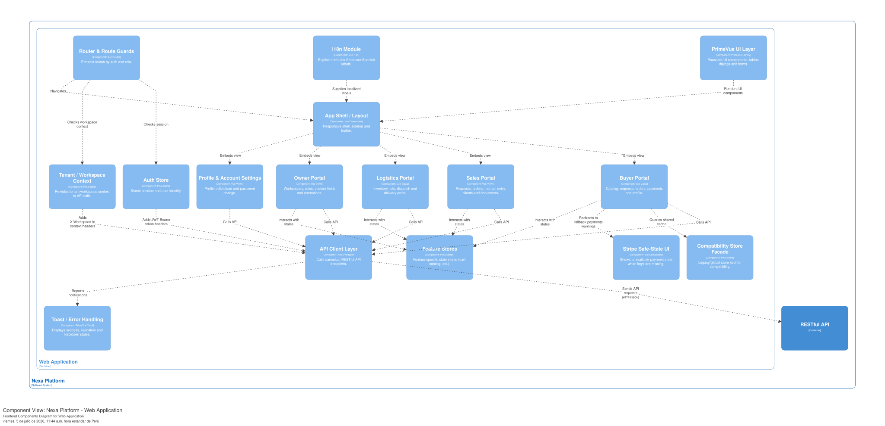

> *Nota*: El diagrama presenta los componentes principales de la WebApp, organizados por vistas funcionales, servicios de cliente, ruteo, internacionalización y componentes compartidos. Elaboración propia.

*Leyenda del C4 Frontend Components Diagram de Nexa.*

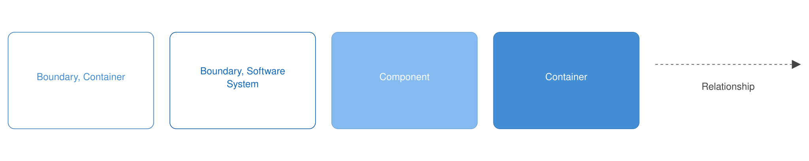

> *Nota*: La leyenda resume los tipos de componentes y relaciones representados en la vista frontend. Elaboración propia.

*Componentes principales de la WebApp de Nexa.*

| Component group | Main responsibility | Related user scope |
|---|---|---|
| App Shell/Layout y Router/Route Guards | Estructurar sidebar, topbar y navegación protegida por sesión, rol y workspace. | S1, S2 y S3 |
| Auth Store y Tenant/Workspace Context | Mantener identidad autenticada y contexto activo para las solicitudes a la API. | Alcance transversal autenticado |
| Buyer Portal views | Presentar catálogo, solicitudes, órdenes, tracking, documentos visibles, pagos referenciales y perfil. | S3 — B2B Buyer Portal |
| Sales views | Presentar solicitudes, órdenes, registro manual, clientes, catálogo y documentos comerciales. | S1 — Commercial Coordination |
| Logistics y Account Ownership views | Presentar inventario, lotes, despachos, evidencia de entrega y opciones administrativas del workspace. | S2 — Operations / Account Owner |
| API Client, Vue I18n, PrimeVue UI y Shared Components | Consumir la API, localizar textos y reutilizar componentes, formularios, tablas, diálogos y mensajes. | Alcance transversal de la WebApp |
| Pinia feature stores y Compatibility Store Facade | Mantener estado específico de funcionalidades y compatibilidad con el almacenamiento global evidenciado. | Soporte de estado de las vistas |

> *Nota*: La tabla resume los grupos de componentes de la WebApp y el alcance de usuario al que brindan soporte. Elaboración propia.

#### 4.6.4.3. Website Components

El Website público se implementa con HTML5, CSS3 y JavaScript. Sus componentes organizan navegación pública, homepage, Platform, Buyer Portal, páginas de Solutions para importadores, distribuidores y operadores de cámaras frías, Pricing, FAQ, About the Product, About the Team y páginas legales. Los CTAs conectan el contenido público con registro y login de la WebApp; el responsive layout y los metadatos apoyan la adaptación visual y la organización semántica.

*C4 Website Components Diagram de Nexa.*

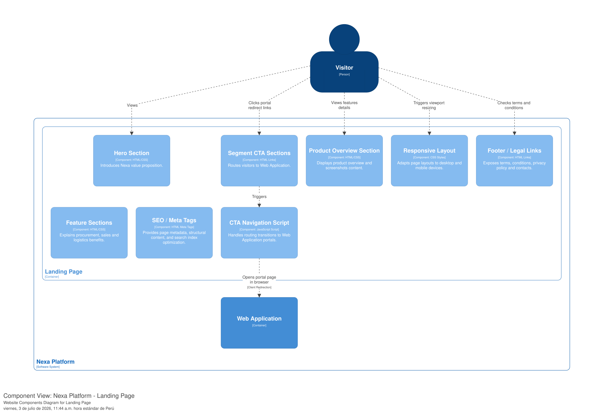

> *Nota*: El diagrama muestra los componentes principales del Website público de Nexa, incluyendo navegación, páginas informativas, páginas legales y CTAs hacia la plataforma. Elaboración propia.

*Leyenda del C4 Website Components Diagram de Nexa.*

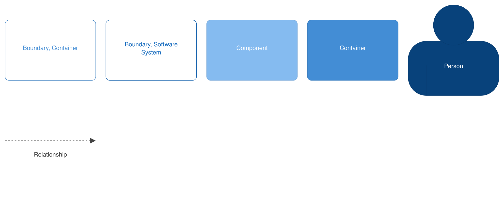

> *Nota*: La leyenda resume los elementos visuales usados para describir la estructura del Website. Elaboración propia.

*Componentes principales del Website de Nexa.*

| Component group | Main responsibility | Related website area |
|---|---|---|
| Public Navigation y Hero Section | Presentar la propuesta de valor y facilitar acceso a las páginas públicas principales. | Home y navegación global |
| Platform, Buyer Portal y Feature Sections | Explicar capacidades del producto y continuidad hacia las experiencias autenticadas. | Platform, Buyer Portal y About the Product |
| Solutions, Pricing y FAQ | Organizar la propuesta por tipo de empresa, planes y preguntas frecuentes. | Solutions Hub, Importers, Distributors, Cold Storage, Pricing y FAQ |
| Company y contenido institucional | Reforzar confianza mediante información de producto y equipo. | Company, About the Product y About the Team |
| Footer/Legal Links | Exponer términos, privacidad y cookies desde la navegación secundaria. | Terms, Privacy y Cookies |
| CTA Navigation Script | Dirigir al visitante hacia registro de organización o login en la WebApp. | CTAs públicos |
| Responsive Layout y SEO/Meta Tags | Adaptar el contenido a distintos anchos y describir semánticamente las páginas públicas. | Alcance transversal del Website |

> *Nota*: La tabla resume los componentes públicos y las áreas del Website con las que se relacionan. Elaboración propia.
