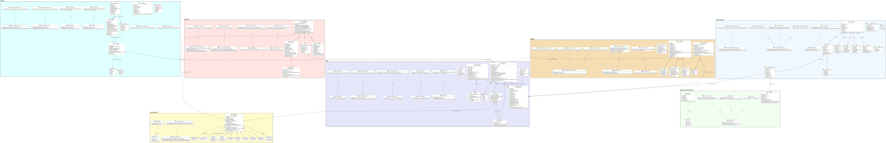
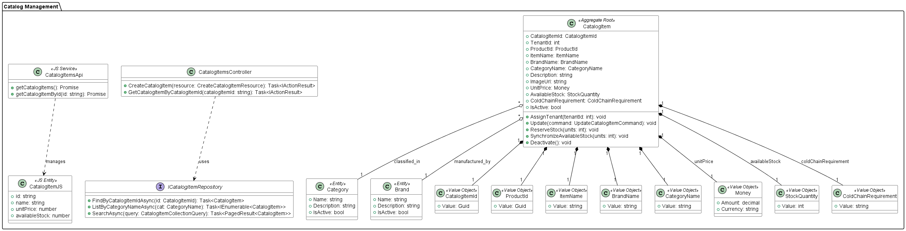
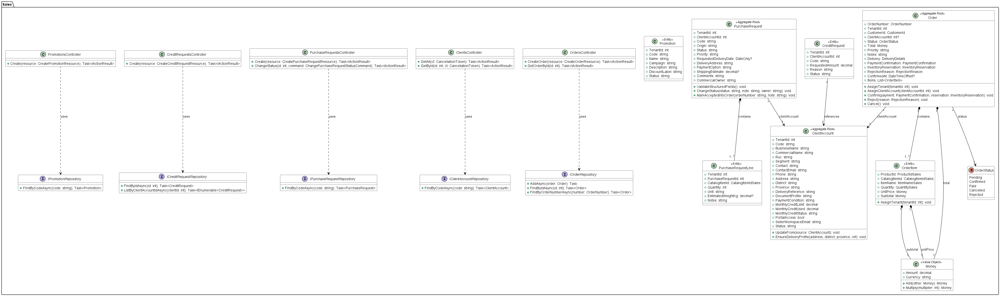
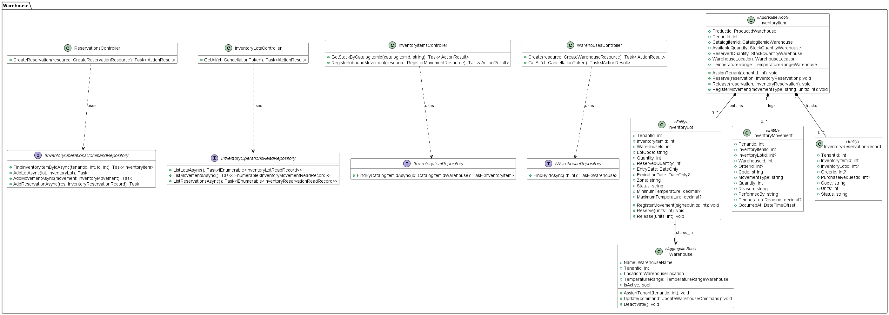
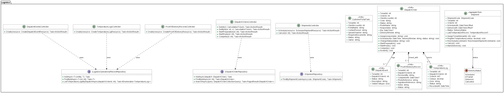
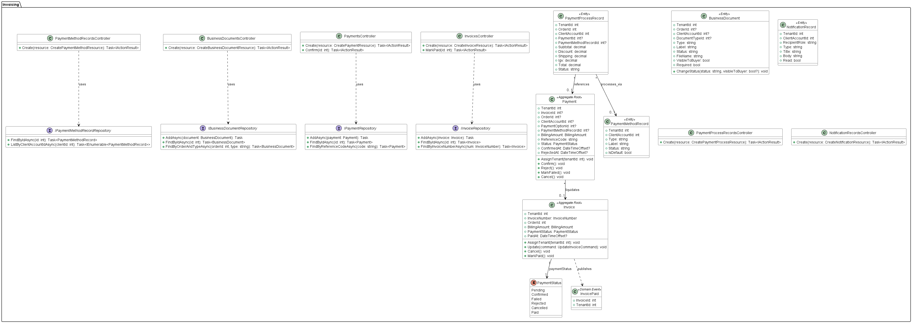
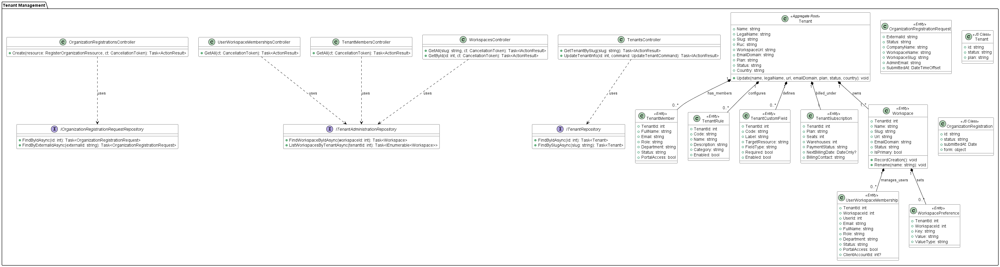
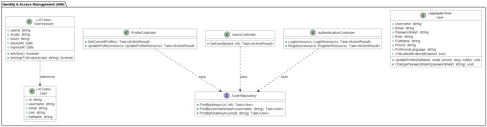

## 4.7. Software Object-Oriented Design

Esta sección presenta el diseño orientado a objetos de la plataforma Nexa. El diseño está estructurado a partir de los patrones tácticos de Domain-Driven Design (DDD) y modela la estructura de clases, interfaces, tipos de datos y relaciones de los componentes de negocio. 

El modelo se organiza alrededor de los siete bounded contexts core del sistema:

- **Catalog Management**
- **Sales**
- **Warehouse**
- **Logistics**
- **Invoicing**
- **Tenant Management**
- **Identity and Access Management (IAM)**.

### 4.7.1. Class Diagrams

Los diagramas de clases describen el diseño estático y el comportamiento de las clases principales en cada uno de los contextos delimitados. Para cada componente se especifican atributos, métodos y visibilidad, así como las cardinalidades y los tipos de asociación (composición, agregación, herencia y dependencia).

Se consideraron los siguientes criterios:

*Criterios aplicados al diseño orientado a objetos de Nexa.*

| Criterio | Aplicación en Nexa |
|---|---|
| **Separación por Bounded Context** | Cada diagrama de clases representa de forma aislada e independiente uno de los siete contextos delimitados de la solución. |
| **Entidades y Agregados** | Clases con identidad propia y ciclo de vida transaccional, tales como `CatalogItem`, `PurchaseRequest`, `Order`, `InventoryLot`, `DispatchOrder` e `Invoice`. |
| **Value Objects** | Clases sin identidad que modelan atributos inmutables del dominio, tales como `Money`, `StockQuantity`, `ColdChainRequirement`, `ShipmentCode` y `BillingAmount`. |
| **Enumeraciones** | Tipos estructurados que controlan los estados del ciclo de vida del negocio, tales como `OrderStatus`, `DeliveryStatus` y `PaymentStatus`. |
| **Multiplicidad y Relaciones** | Asignación estricta de multiplicidades y cardinalidades en el diagrama UML para modelar la agregación, composición y herencia en el dominio. |
| **Desacoplamiento Controlado** | Evita referencias directas de memoria entre agregados de diferentes contextos, utilizando en su lugar identificadores externos (`Id`) para la integración. |
| **Trazabilidad** | Coherencia estricta entre el modelo táctico orientado a objetos, los requisitos funcionales (User Stories) y la persistencia de datos (DbSets y Tablas). |

> *Nota*: La tabla resume los criterios, responsabilidades y elementos principales del diseño orientado a objetos de Nexa. Elaboración propia.

#### Consolidated Class Diagram

*Diagrama consolidado de clases de Nexa.*

> *Nota*: El diagrama muestra la estructura consolidada de clases, relaciones y responsabilidades principales de Nexa. Elaboración propia.

El diagrama consolidado de clases presenta la estructura completa del diseño orientado a objetos de Nexa, agrupando los siete bounded contexts definidos para la solución. Este diagrama funciona como la vista maestra del modelo táctico, a partir de la cual se derivan las vistas individuales por bounded context.

*Responsabilidades generales y clases principales por bounded context.*

| Bounded Context | Responsabilidad general | Clases principales |
|---|---|---|
| Tenant Management | Gestión de la estructura SaaS multi-tenant, workspaces, reglas de configuración, suscripciones y membresías. | `Tenant`, `TenantMember`, `Workspace`, `UserWorkspaceMembership`, `TenantSubscription`, `OrganizationRegistrationRequest`, `ITenantRepository` |
| Identity and Access Management (IAM) | Autenticación de credenciales, control de accesos, roles globales y perfiles de usuarios. | `User`, `IUserRepository`, `AuthenticationController`, `UsersController`, `ProfileController` |
| Catalog Management | Gestión de productos, categorías, marcas, precios y conservación de cadena de frío. | `CatalogItem`, `Category`, `Brand`, `ColdChainRequirement`, `ICatalogItemRepository`, `CatalogItemsController` |
| Sales | Gestión de clientes B2B, alertas de crédito, procesamiento de solicitudes de compra y confirmación de órdenes de venta. | `Order`, `OrderItem`, `ClientAccount`, `PurchaseRequest`, `PurchaseRequestLine`, `CreditRequest`, `IOrderRepository` |
| Warehouse | Gestión física de almacenes, existencias agregadas, lotes con vencimiento, movimientos y reservas de stock bajo criterios FEFO. | `Warehouse`, `InventoryItem`, `InventoryLot`, `InventoryMovement`, `InventoryReservationRecord`, `IWarehouseRepository` |
| Logistics | Programación de envíos, órdenes de despacho en ruta, eventos de trazabilidad, mediciones térmicas y evidencia de entrega. | `Shipment`, `DispatchOrder`, `DispatchEvent`, `ProofOfDeliveryRecord`, `TemperatureLog`, `CustomerPortalTask`, `IDispatchOrderRepository` |
| Invoicing | Emisión de facturas comerciales, registro de pagos simulados, visibilidad de archivos financieros y cálculo de cargos y tasas. | `Invoice`, `Payment`, `BusinessDocument`, `PaymentMethodRecord`, `PaymentProcessRecord`, `IInvoiceRepository` |

> *Nota*: La tabla resume los criterios, responsabilidades y elementos principales del diseño orientado a objetos de Nexa. Elaboración propia.

#### Catalog Management Class Diagram

*Diagrama de clases de Catalog Management.*

> *Nota*: El diagrama muestra la estructura de clases, relaciones y responsabilidades principales del bounded context correspondiente. Elaboración propia.

El contexto de Catalog Management administra la información comercial de los productos gourmet, sus categorías y marcas correspondientes, regulando adicionalmente las condiciones técnicas de conservación térmica (cadena de frío) y stock disponible.

*Clases, interfaces y enums de Catalog Management.*

| Clase / Interface / Enum | Tipo | Responsabilidad | Origen / Capa |
|---|---|---|---|
| `CatalogItem` | Aggregate Root | Producto publicado en el catálogo del tenant con precios y stock visible. | Domain (Backend) |
| `Category` | Entity | Clasificación comercial de productos. | Domain (Backend) |
| `Brand` | Entity | Marca del fabricante asociada a los productos. | Domain (Backend) |
| `CatalogItemId` | Value Object | Identificador único del ítem en el catálogo comercial. | Domain (Backend) |
| `ProductId` | Value Object | Identificador único del producto a nivel de producción. | Domain (Backend) |
| `ItemName` | Value Object | Objeto de valor que encapsula el nombre descriptivo del producto. | Domain (Backend) |
| `BrandName` | Value Object | Objeto de valor que resguarda la marca comercial registrada. | Domain (Backend) |
| `CategoryName` | Value Object | Objeto de valor que representa la categoría de clasificación gourmet. | Domain (Backend) |
| `Money` | Value Object | Representa el importe monetario y la divisa del catálogo. | Domain (Backend) |
| `StockQuantity` | Value Object | Representa la cantidad física de existencias en el catálogo. | Domain (Backend) |
| `ColdChainRequirement` | Value Object | Restricciones de cadena de frío y conservación del producto. | Domain (Backend) |
| `ICatalogItemRepository` | Interface | Contrato para la persistencia y búsquedas del catálogo comercial. | Domain (Backend) |
| `CatalogItemsController` | Controller | Endpoints REST para el registro y consulta de productos del catálogo. | Interface / API (Backend) |
| `CatalogItem` | JS Class | Representa un producto del catálogo en la UI. | Frontend |
| `CatalogItemsApi` | Service | Cliente HTTP (Axios) para consumir los servicios del catálogo. | Frontend |

> *Nota*: La tabla resume las clases, interfaces y enums principales del bounded context correspondiente, manteniendo la separación por capas y responsabilidades del diseño orientado a objetos. Elaboración propia.

Las relaciones lógicas asocian cada producto (`CatalogItem`) a su categoría (`Category`) y marca (`Brand`). Cada producto expone métodos específicos como `ReserveStock()` and `SynchronizeAvailableStock()` para reflejar los cambios transaccionales del stock operativo e interactúa con el frontend a través del servicio adaptado `CatalogItemsApi`.

#### Sales Class Diagram

*Diagrama de clases de Sales.*

> *Nota*: El diagrama muestra la estructura de clases, relaciones y responsabilidades principales del bounded context correspondiente. Elaboración propia.

El contexto de Sales gobierna el proceso comercial B2B de pedidos. Este contexto recibe y valida solicitudes de compra iniciales, valida la capacidad de crédito del cliente mediante su cuenta comercial y confirma formalmente la creación de las órdenes del negocio.

*Clases, interfaces y enums de Sales.*

| Clase / Interface / Enum | Tipo | Responsabilidad | Origen / Capa |
|---|---|---|---|
| `Order` | Aggregate Root | Orden comercial de venta confirmada y en proceso. | Domain (Backend) |
| `OrderItem` | Entity | Ítem de producto y cantidad que forma parte de una orden comercial. | Domain (Backend) |
| `ClientAccount` | Aggregate Root | Cuenta comercial del cliente B2B con control de crédito y plazos. | Domain (Backend) |
| `PurchaseRequest` | Aggregate Root | Solicitud de compra inicial generada desde el portal B2B. | Domain (Backend) |
| `PurchaseRequestLine` | Entity | Línea detallada de artículo y cantidad en la solicitud de compra. | Domain (Backend) |
| `CreditRequest` | Entity | Solicitud de crédito o ampliación comercial para cuentas cliente. | Domain (Backend) |
| `Promotion` | Entity | Promoción comercial aplicable a los productos de catálogo. | Domain (Backend) |
| `OrderStatus` | Enum | Estados del ciclo de vida de la orden (Pending, Confirmed, Paid, Cancelled, Rejected). | Domain (Backend) |
| `Money` | Value Object | Estructura para importes monetarios en el contexto de ventas, con método `Add()`. | Domain (Backend) |
| `IOrderRepository` | Interface | Contrato de persistencia para las órdenes comerciales. | Domain (Backend) |
| `IClientAccountRepository` | Interface | Contrato de persistencia para las cuentas comerciales B2B. | Domain (Backend) |
| `IPurchaseRequestRepository` | Interface | Contrato de persistencia para las solicitudes de compra. | Domain (Backend) |
| `ICreditRequestRepository` | Interface | Contrato de persistencia para solicitudes de ampliación de crédito. | Domain (Backend) |
| `IPromotionRepository` | Interface | Contrato de persistencia para promociones y campañas comerciales. | Domain (Backend) |
| `OrdersController` | Controller | Endpoints REST para el registro, confirmación e historial de pedidos. | Interface / API (Backend) |
| `ClientsController` | Controller | Endpoint REST para gestionar las cuentas comerciales de clientes B2B. | Interface / API (Backend) |
| `PurchaseRequestsController` | Controller | Endpoint REST para administrar las solicitudes de compra del cliente B2B. | Interface / API (Backend) |
| `CreditRequestsController` | Controller | Endpoint REST para gestionar las solicitudes de ampliación de crédito. | Interface / API (Backend) |
| `PromotionsController` | Controller | Endpoint REST para registrar y administrar las campañas de promociones. | Interface / API (Backend) |
| `Order` | JS Class | Representa la orden de venta comercial en la UI del cliente. | Frontend |

> *Nota*: La tabla resume las clases, interfaces y enums principales del bounded context correspondiente, manteniendo la separación por capas y responsabilidades del diseño orientado a objetos. Elaboración propia.

Las clases definen que una orden (`Order`) se compone directamente de múltiples ítems (`OrderItem`), y se asocia de forma referencial a una cuenta comercial (`ClientAccount`). `Order` expone métodos para controlar la transición del estado comercial de la orden (`Confirm`, `Reject`, `Cancel`). Las sumas acumuladas de importes se resuelven mediante el método `Add()` de `Money`.

#### Warehouse Class Diagram

*Diagrama de clases de Warehouse.*

> *Nota*: El diagrama muestra la estructura de clases, relaciones y responsabilidades principales del bounded context correspondiente. Elaboración propia.

El contexto de Warehouse administra el almacenamiento y disponibilidad física de los productos. Gestiona la configuración espacial de almacenes, el stock de productos, los movimientos de ingreso o egreso de stock, y las reservas asociadas a la demanda comercial.

*Clases, interfaces y enums de Warehouse.*

| Clase / Interface / Enum | Tipo | Responsabilidad | Origen / Capa |
|---|---|---|---|
| `Warehouse` | Aggregate Root | Almacén físico con límites de temperatura controlada. | Domain (Backend) |
| `InventoryItem` | Aggregate Root | Existencias agregadas y reservadas de un producto en el almacén. | Domain (Backend) |
| `InventoryLot` | Entity | Lote físico de inventario asociado a un vencimiento y control térmico. | Domain (Backend) |
| `InventoryMovement` | Entity | Registro de movimientos de stock (ingreso, salida o ajuste). | Domain (Backend) |
| `InventoryReservationRecord` | Entity | Reserva física de stock asociada a una orden o solicitud comercial. | Domain (Backend) |
| `IWarehouseRepository` | Interface | Contrato de persistencia de almacenes físicos. | Domain (Backend) |
| `IInventoryItemRepository` | Interface | Contrato para el control del inventario y existencias. | Domain (Backend) |
| `IInventoryOperationsCommandRepository` | Interface | Contrato para registrar de forma transaccional lotes, movimientos y reservas. | Domain (Backend) |
| `IInventoryOperationsReadRepository` | Interface | Contrato para realizar consultas agregadas de lotes y movimientos de stock. | Domain (Backend) |
| `WarehousesController` | Controller | Endpoint REST para registrar y consultar almacenes físicos. | Interface / API (Backend) |
| `InventoryItemsController` | Controller | Endpoint REST para consultar existencias físicas y registrar ingresos. | Interface / API (Backend) |
| `InventoryLotsController` | Controller | Endpoint REST para consultar el stock clasificado por lotes. | Interface / API (Backend) |
| `ReservationsController` | Controller | Endpoint REST para gestionar las solicitudes de reservas de stock. | Interface / API (Backend) |

> *Nota*: La tabla resume las clases, interfaces y enums principales del bounded context correspondiente, manteniendo la separación por capas y responsabilidades del diseño orientado a objetos. Elaboración propia.

El modelo estructural divide la existencia agregada (`InventoryItem`) en lotes físicos específicos (`InventoryLot`), permitiendo una administración granular del inventario. La lógica del negocio expone métodos como `Reserve()` and `Release()` en `InventoryItem`, que interactúan con `InventoryReservationRecord` y `InventoryLot` para apartar mercancía perecible siguiendo estrictas directrices basadas en la fecha de expiración del lote.

#### Logistics Class Diagram

*Diagrama de clases de Logistics.*

> *Nota*: El diagrama muestra la estructura de clases, relaciones y responsabilidades principales del bounded context correspondiente. Elaboración propia.

El contexto de Logistics programa y supervisa el despacho físico de los pedidos. Registra asignaciones de transportistas y vehículos, control térmico de la cadena de frío referencial en ruta, incidentes logísticos y evidencias finales de la entrega del pedido.

*Clases, interfaces y enums de Logistics.*

| Clase / Interface / Enum | Tipo | Responsabilidad | Origen / Capa |
|---|---|---|---|
| `Shipment` | Aggregate Root | Estado de entrega macro y control térmico del envío de un pedido. | Domain (Backend) |
| `DispatchOrder` | Entity | Orden operativa de despacho asignada a un transportista y ruta. | Domain (Backend) |
| `DispatchEvent` | Entity | Evento de trazabilidad logística registrado en ruta. | Domain (Backend) |
| `ProofOfDeliveryRecord` | Entity | Evidencia final de entrega con firmas y conformidad del comprador. | Domain (Backend) |
| `TemperatureLog` | Entity | Medición referencial de temperatura de cadena de frío tomada en ruta. | Domain (Backend) |
| `CustomerPortalTask` | Entity | Requisitos de entrega documental exigidos por el cliente B2B. | Domain (Backend) |
| `DeliveryStatus` | Enum | Estados del ciclo de vida del despacho (Scheduled, InTransit, Delivered, Cancelled). | Domain (Backend) |
| `IShipmentRepository` | Interface | Contrato de persistencia de envíos. | Domain (Backend) |
| `IDispatchOrderRepository` | Interface | Contrato de persistencia de órdenes de despacho. | Domain (Backend) |
| `ILogisticsOperationalRecordRepository` | Interface | Contrato de persistencia para eventos, firmas y logs térmicos. | Domain (Backend) |
| `ShipmentsController` | Controller | Endpoint REST para programar y cancelar envíos operativos. | Interface / API (Backend) |
| `DispatchOrdersController` | Controller | Endpoint REST para gestionar la preparación, inicio de ruta y entrega de pedidos. | Interface / API (Backend) |
| `ProofOfDeliveryRecordsController` | Controller | Endpoint REST para registrar la conformidad física firmada de entrega. | Interface / API (Backend) |
| `TemperatureLogsController` | Controller | Endpoint REST para registrar telemetría y lecturas térmicas en ruta. | Interface / API (Backend) |
| `DispatchEventsController` | Controller | Endpoint REST para reportar incidentes o avances en ruta. | Interface / API (Backend) |

> *Nota*: La tabla resume las clases, interfaces y enums principales del bounded context correspondiente, manteniendo la separación por capas y responsabilidades del diseño orientado a objetos. Elaboración propia.

El ciclo logístico inicia con la programación de un envío (`Shipment`). Operativamente, se crea una orden de despacho (`DispatchOrder`) asociada a una ruta, registrando incidentes o progresos a través de `DispatchEvent`. Los registros de temperatura se administran mediante `TemperatureLog`, vinculados al método `Shipment.RegisterTemperature(celsius)`. La entrega concluye al registrarse la conformidad del receptor en `ProofOfDeliveryRecord`.

#### Invoicing Class Diagram

*Diagrama de clases de Invoicing.*

> *Nota*: El diagrama muestra la estructura de clases, relaciones y responsabilidades principales del bounded context correspondiente. Elaboración propia.

El contexto de Invoicing centraliza las operaciones de cobro y cumplimiento documental del pedido. Emite facturas comerciales, asocia transacciones de pagos simulados, y proporciona visibilidad de los archivos comerciales para el cliente B2B.

*Clases, interfaces y enums de Invoicing.*

| Clase / Interface / Enum | Tipo | Responsabilidad | Origen / Capa |
|---|---|---|---|
| `Invoice` | Aggregate Root | Factura comercial generada para una orden de venta. | Domain (Backend) |
| `Payment` | Aggregate Root | Transacción de cobro simulado asociada a una factura o pedido. | Domain (Backend) |
| `BusinessDocument` | Entity | Archivo comercial complementario visible en el portal (XML, PDF). | Domain (Backend) |
| `PaymentMethodRecord` | Entity | Método de pago registrado por el comprador en su portal B2B. | Domain (Backend) |
| `PaymentProcessRecord` | Entity | Cálculo detallado de cargos: flete, subtotal, IGV y total comercial. | Domain (Backend) |
| `NotificationRecord` | Entity | Alerta o notificación de cobro para el cliente. | Domain (Backend) |
| `PaymentStatus` | Enum | Estados de pago simulados (Pending, Confirmed, Failed, Rejected, Cancelled, Paid). | Domain (Backend) |
| `InvoicePaid` | Domain Event | Evento de dominio publicado tras conciliar y confirmar el pago de la factura. | Domain (Backend) |
| `IInvoiceRepository` | Interface | Contrato de persistencia de facturas comerciales. | Domain (Backend) |
| `IPaymentRepository` | Interface | Contrato de persistencia para transacciones de cobros simulados. | Domain (Backend) |
| `IBusinessDocumentRepository` | Interface | Contrato de persistencia de documentos complementarios (XML, PDF). | Domain (Backend) |
| `IPaymentMethodRecordRepository` | Interface | Contrato de persistencia de los métodos de pago guardados por clientes B2B. | Domain (Backend) |
| `InvoicesController` | Controller | Endpoint REST para registrar facturas y marcarlas como canceladas. | Interface / API (Backend) |
| `PaymentsController` | Controller | Endpoint REST para gestionar transacciones de cobros y conciliaciones. | Interface / API (Backend) |
| `BusinessDocumentsController` | Controller | Endpoint REST para administrar los documentos comerciales visibles. | Interface / API (Backend) |
| `PaymentMethodRecordsController` | Controller | Endpoint REST para administrar las tarjetas y medios de pago del cliente. | Interface / API (Backend) |
| `PaymentProcessRecordsController` | Controller | Endpoint REST para procesar las liquidaciones de cobro detalladas. | Interface / API (Backend) |
| `NotificationRecordsController` | Controller | Endpoint REST para enviar notificaciones e historial de cobranza. | Interface / API (Backend) |

> *Nota*: La tabla resume las clases, interfaces y enums principales del bounded context correspondiente, manteniendo la separación por capas y responsabilidades del diseño orientado a objetos. Elaboración propia.

En este contexto, la facturación se representa por la clase `Invoice`, que expone operaciones para cancelar la factura (`Cancel`) o certificar su cobro (`MarkPaid`), publicando un evento de dominio `InvoicePaid`. La visibilidad documental es controlada por la clase `BusinessDocument` y sus reglas de estado, y la persistencia de los archivos complementarios se delega a `IBusinessDocumentRepository`.

#### Tenant Management Class Diagram

*Diagrama de clases de Tenant Management.*

> *Nota*: El diagrama muestra la estructura de clases, relaciones y responsabilidades principales del bounded context correspondiente. Elaboración propia.

El contexto de Tenant Management administra el soporte multi-tenant de la aplicación. Gestiona el aprovisionamiento de las organizaciones o cuentas empresariales, el registro e historial de suscripciones y la delegación de espacios de trabajo (workspaces) y sus miembros operativos.

*Clases, interfaces y enums de Tenant Management.*

| Clase / Interface / Enum | Tipo | Responsabilidad | Origen / Capa |
|---|---|---|---|
| `Tenant` | Aggregate Root | Representa a la organización o empresa cliente registrada en el portal SaaS. | Domain (Backend) |
| `TenantMember` | Entity | Miembro administrativo o del personal asignado a un tenant. | Domain (Backend) |
| `TenantRule` | Entity | Regla operativa personalizada configurada para el tenant. | Domain (Backend) |
| `TenantCustomField` | Entity | Campo personalizado dinámico definido por el tenant para sus recursos. | Domain (Backend) |
| `Workspace` | Entity | Espacio de trabajo del tenant con su subdominio y configuración regional. | Domain (Backend) |
| `UserWorkspaceMembership` | Entity | Vincula a un usuario con un workspace y rol específico en el tenant. | Domain (Backend) |
| `WorkspacePreference` | Entity | Preferencia de clave-valor establecida para el workspace del tenant. | Domain (Backend) |
| `TenantSubscription` | Entity | Estipula la suscripción comercial activa y límites contratados. | Domain (Backend) |
| `OrganizationRegistrationRequest` | Entity | Solicitud de alta de una nueva organización pendiente de aprobación. | Domain (Backend) |
| `ITenantRepository` | Interface | Contrato para la persistencia e historial de tenants. | Domain (Backend) |
| `ITenantAdministrationRepository` | Interface | Contrato para la administración de workspaces y membresías de personal. | Domain (Backend) |
| `IOrganizationRegistrationRequestRepository` | Interface | Contrato para la persistencia de solicitudes de alta de organizaciones. | Domain (Backend) |
| `TenantsController` | Controller | Expone los endpoints REST para registrar y consultar organizaciones. | Interface / API (Backend) |
| `WorkspacesController` | Controller | Endpoint REST para administrar los espacios de trabajo del tenant. | Interface / API (Backend) |
| `TenantMembersController` | Controller | Endpoint REST para gestionar los miembros operativos del tenant. | Interface / API (Backend) |
| `UserWorkspaceMembershipsController` | Controller | Endpoint REST para administrar las membresías de los workspaces. | Interface / API (Backend) |
| `OrganizationRegistrationsController` | Controller | Endpoint REST para gestionar las solicitudes de registro organizacionales. | Interface / API (Backend) |
| `Tenant` | JS Class | Representación en el frontend de la configuración y datos del tenant. | Frontend |
| `OrganizationRegistration` | JS Class | Representación en el frontend del estado de la solicitud de registro. | Frontend |

> *Nota*: La tabla resume las clases, interfaces y enums principales del bounded context correspondiente, manteniendo la separación por capas y responsabilidades del diseño orientado a objetos. Elaboración propia.

Las asociaciones en este contexto definen que un agregado `Tenant` posee de forma compositiva una suscripción activa (`TenantSubscription`) y múltiples workspaces (`Workspace`). La membresía operativa (`UserWorkspaceMembership`) vincula jerárquicamente a los usuarios del contexto IAM dentro de la jerarquía de un workspace en Tenant Management.

#### Identity and Access Management (IAM) Class Diagram

*Diagrama de clases de Identity and Access Management.*

> *Nota*: El diagrama muestra la estructura de clases, relaciones y responsabilidades principales del bounded context correspondiente. Elaboración propia.

El contexto de Identity and Access Management (IAM) es responsable de las operaciones globales de autenticación, autorización de accesos, resguardo criptográfico de credenciales de usuario y mantenimiento de roles del sistema.

*Clases, interfaces y enums de Identity and Access Management.*

| Clase / Interface / Enum | Tipo | Responsabilidad | Origen / Capa |
|---|---|---|---|
| `User` | Aggregate Root | Cuenta global de usuario con credenciales hash y rol asignado. | Domain (Backend) |
| `IUserRepository` | Interface | Contrato de persistencia e inicio de sesión de usuarios. | Domain (Backend) |
| `AuthenticationController` | Controller | Endpoint REST para el login y registro de nuevos usuarios. | Interface / API (Backend) |
| `UsersController` | Controller | Endpoint REST para la consulta y administración de cuentas de usuario. | Interface / API (Backend) |
| `ProfileController` | Controller | Endpoint REST para la gestión del perfil del usuario autenticado. | Interface / API (Backend) |
| `User` | JS Class | Representa el perfil del usuario autenticado en la UI. | Frontend |
| `UserSession` | JS Class | Encapsula el token de acceso y la sesión activa en el navegador. | Frontend |

> *Nota*: La tabla resume las clases, interfaces y enums principales del bounded context correspondiente, manteniendo la separación por capas y responsabilidades del diseño orientado a objetos. Elaboración propia.

El diseño orienta a `User` como raíz de agregado con métodos para actualizar datos de perfil (`UpdateProfile`) y cambiar la contraseña cifrada (`ChangePasswordHash`). Los controladores autentican las credenciales delegando la validación del correo y nombre de usuario en el contrato `IUserRepository`.

#### Cross-context decoupling note

El diseño orientado a objetos mantiene la separación entre bounded contexts mediante identificadores compartidos, contratos de API y referencias controladas por ID. Catalog Management expone identificadores de catálogo y producto; Sales referencia clientes, solicitudes y órdenes; Warehouse utiliza identificadores de orden y solicitud para reservas; Logistics utiliza identificadores de orden y cliente para despachos; Invoicing utiliza identificadores de orden, factura y pago; Tenant Management delimita la operación por organización; e Identity and Access Management centraliza la identidad de usuario sin acoplarse a datos operacionales del negocio.
