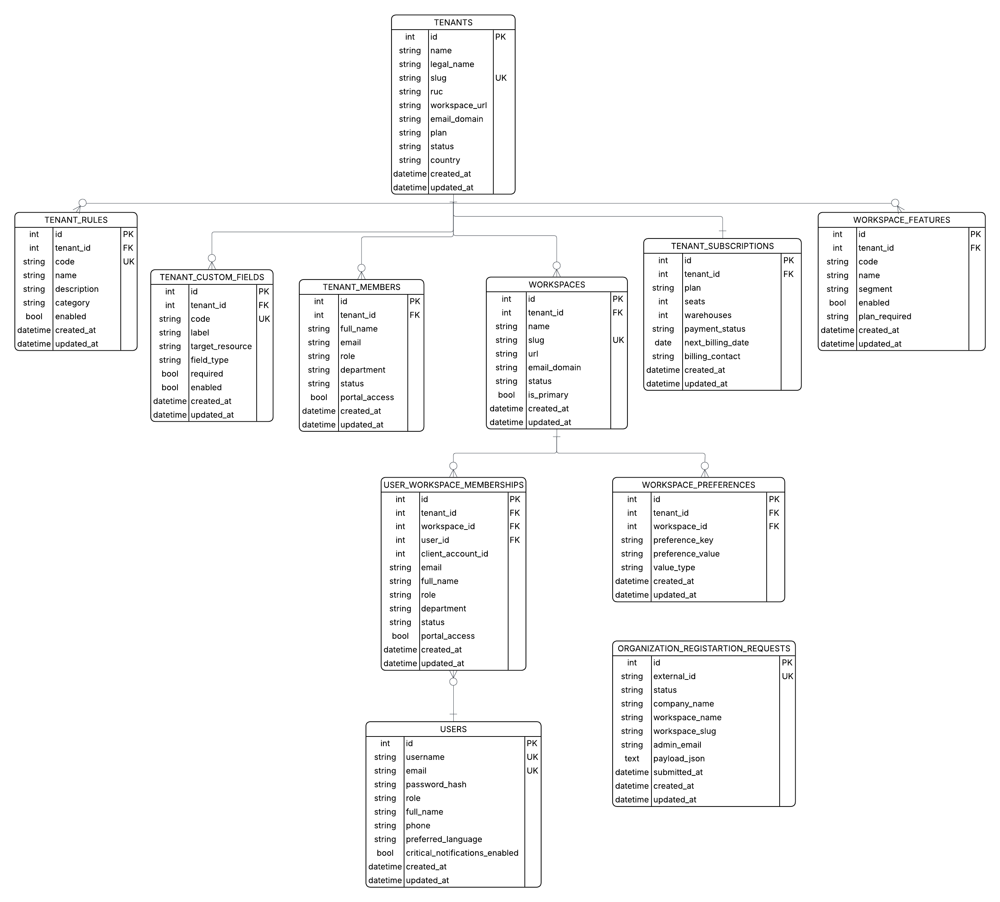
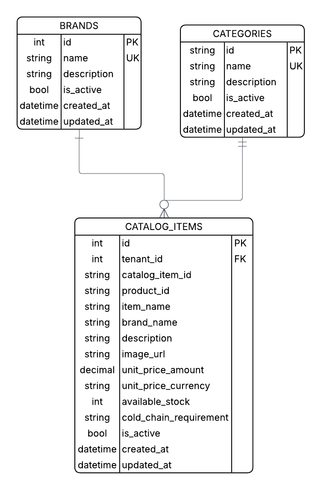
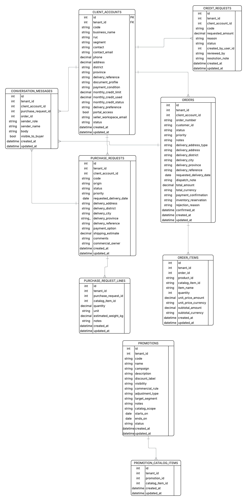
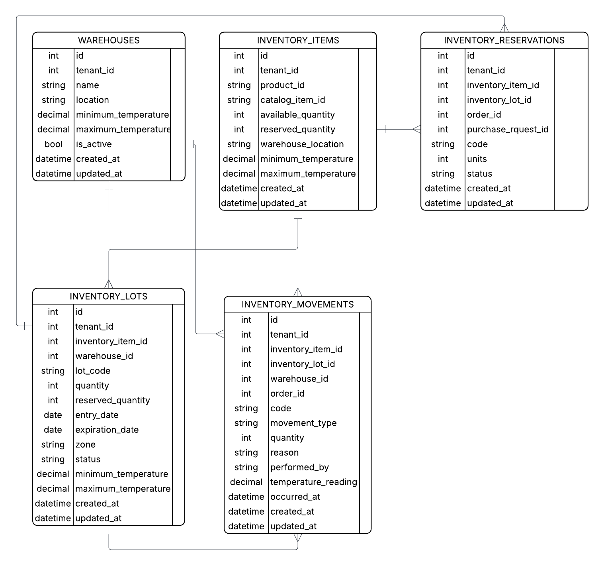
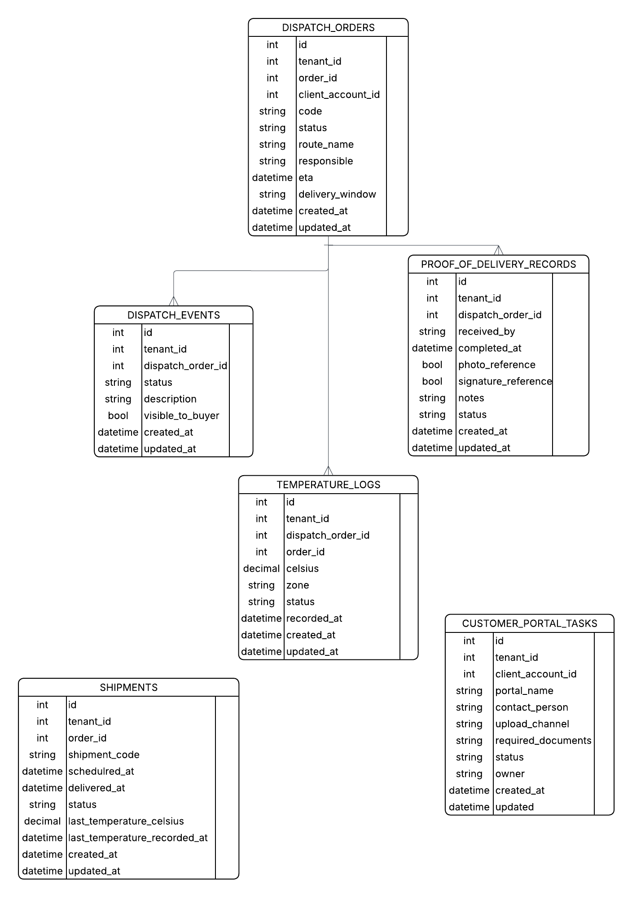
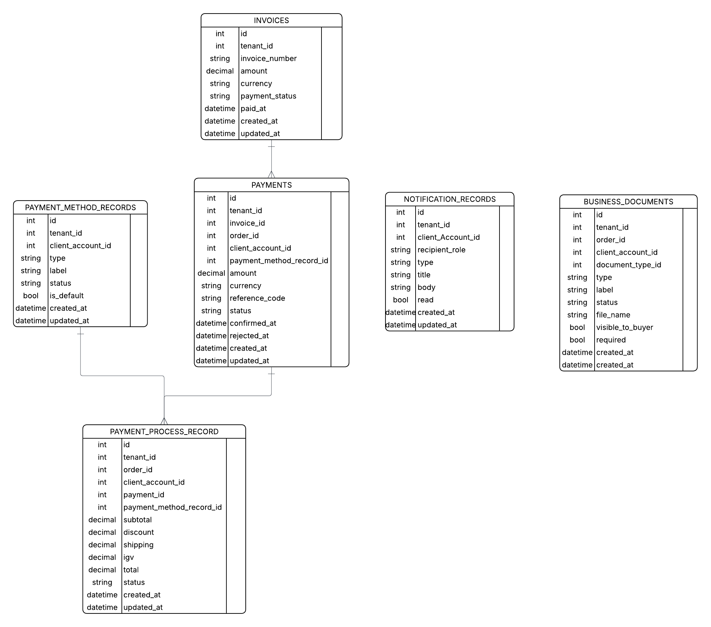
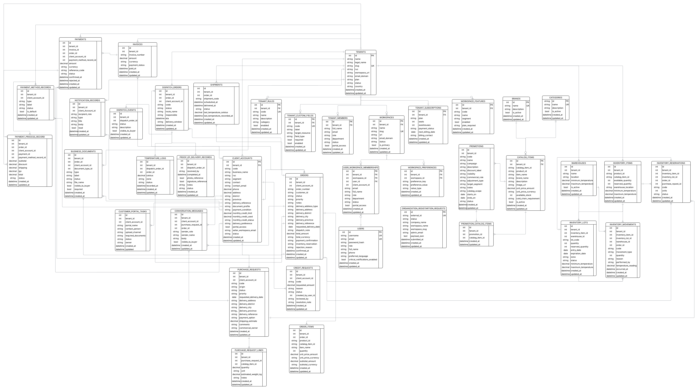

## 4.8. Database Design

Esta sección presenta el diseño de base de datos de Nexa, actualizado de acuerdo con los bounded contexts definidos en la arquitectura de dominio y con la estructura relacional implementada en el backend `King.Nexa.Platform`. El modelo de persistencia se organiza bajo un enfoque multi-tenant orientado a SaaS, donde la información operativa de cada organización se separa lógicamente mediante el identificador `tenant_id` en las tablas transaccionales y de configuración que pertenecen a cada tenant.

El modelo se organiza alrededor de cinco bounded contexts principales de la plataforma: **Catalog Management**, **Sales**, **Warehouse**, **Logistics** e **Invoicing**. Además, incluye contextos y estructuras de soporte transversal para **Tenant Management**, **Identity & Access Management** y catálogos compartidos de referencia. Los read models se mantienen como estructuras derivadas de consulta para dashboards y reportes, sin tratarse como un bounded context independiente del negocio.

Desde la perspectiva DDD, las relaciones entre tablas de distintos bounded contexts se interpretan como referencias persistentes por identificador dentro de un modelo relacional integrado. Estas relaciones no implican que los aggregates de un contexto accedan directamente al comportamiento interno de otro contexto. La coordinación entre contextos debe realizarse mediante application services, domain events, integration events o consultas controladas según el caso de uso.

### 4.8.1. Database Diagrams

Los diagramas de base de datos se agrupan por contexto para preservar los límites del dominio y mejorar la mantenibilidad. Esta estructura evita que los datos comerciales, de catálogo, inventario, logística, facturación y soporte multi-tenant se mezclen en un mismo modelo conceptual sin criterio táctico.

*Grupos de persistencia definidos para el diseño de base de datos.*

| Grupo | Propósito |
|---|---|
| Tenant Management and Identity & Access Support | Soporta la gestión de organizaciones, workspaces, usuarios, membresías, reglas, personalización, suscripciones y sesiones de acceso. |
| Catalog Management | Persiste el catálogo maestro de productos, categorías, marcas, precios, stock visible y condiciones de conservación. |
| Sales | Persiste cuentas B2B, solicitudes de compra, líneas de solicitud, órdenes, ítems de orden, promociones, mensajes comerciales y solicitudes de crédito. |
| Warehouse | Persiste almacenes, ítems de inventario, lotes, movimientos de stock y reservas de inventario. |
| Logistics | Persiste envíos, órdenes de despacho, eventos de despacho, evidencias de entrega, mediciones de temperatura y tareas de portal de cliente. |
| Invoicing | Persiste facturas, pagos, documentos comerciales, métodos de pago, procesos de pago y notificaciones. |
| Read Models | Persiste o representa estructuras derivadas de consulta para dashboards y vistas de reporte. |

> *Nota*: La tabla resume las tablas principales, restricciones o relaciones del bloque de persistencia correspondiente. Elaboración propia.

#### Tenant Management and Identity & Access Support Database Diagram

*Diagrama de base de datos de Tenant Management e Identity and Access.*

> *Nota*: Tenant Management e Identity & Access Management se representan como capacidades de soporte transversal. No forman parte de los bounded contexts core del negocio, pero habilitan el funcionamiento SaaS multi-tenant de la plataforma. Elaboración propia.

El modelo de soporte administra organizaciones, espacios de trabajo, membresías, reglas de configuración, campos personalizados, suscripciones y usuarios. La tabla `tenants` representa a cada organización B2B que opera en Nexa. La relación entre usuarios y tenants no se modela de forma directa, sino mediante `user_workspace_memberships`, que conecta `users`, `workspaces` y `tenants`.

*Tablas principales de Tenant Management e Identity and Access.*

| Tabla | Columnas principales | Descripción |
|---|---|---|
| `tenants` | `id`, `name`, `legal_name`, `slug`, `ruc`, `workspace_url`, `email_domain`, `plan`, `status`, `country`, `created_at`, `updated_at` | Almacena las organizaciones B2B que utilizan Nexa como plataforma SaaS. |
| `users` | `id`, `username`, `email`, `password_hash`, `role`, `full_name`, `phone`, `preferred_language`, `critical_notifications_enabled`, `created_at`, `updated_at` | Almacena usuarios globales de acceso a la plataforma. |
| `tenant_members` | `id`, `tenant_id`, `full_name`, `email`, `role`, `department`, `status`, `portal_access`, `created_at`, `updated_at` | Registra miembros administrativos asociados a un tenant. |
| `tenant_rules` | `id`, `tenant_id`, `code`, `name`, `description`, `category`, `enabled`, `created_at`, `updated_at` | Almacena reglas configurables por organización. |
| `tenant_custom_fields` | `id`, `tenant_id`, `code`, `label`, `target_resource`, `field_type`, `required`, `enabled`, `created_at`, `updated_at` | Permite definir campos personalizados por tenant para recursos específicos. |
| `tenant_subscriptions` | `id`, `tenant_id`, `plan`, `seats`, `warehouses`, `payment_status`, `next_billing_date`, `billing_contact`, `created_at`, `updated_at` | Registra la suscripción comercial asociada a cada tenant. |
| `workspaces` | `id`, `tenant_id`, `name`, `slug`, `url`, `email_domain`, `status`, `is_primary`, `created_at`, `updated_at` | Representa los espacios de trabajo configurados para cada organización. |
| `workspace_features` | `id`, `tenant_id`, `code`, `name`, `segment`, `enabled`, `plan_required`, `created_at`, `updated_at` | Registra funcionalidades habilitadas para cada tenant. |
| `user_workspace_memberships` | `id`, `tenant_id`, `workspace_id`, `user_id`, `client_account_id`, `email`, `full_name`, `role`, `department`, `status`, `portal_access`, `created_at`, `updated_at` | Vincula usuarios con workspaces y, cuando corresponde, con una cuenta B2B del contexto Sales. |
| `workspace_preferences` | `id`, `tenant_id`, `workspace_id`, `key`, `value`, `value_type`, `created_at`, `updated_at` | Almacena preferencias y configuraciones por workspace. |
| `organization_registration_requests` | `id`, `external_id`, `status`, `company_name`, `workspace_name`, `workspace_slug`, `admin_email`, `payload_json`, `submitted_at`, `created_at`, `updated_at` | Registra solicitudes de registro de organizaciones antes de crear formalmente el tenant. |

> *Nota*: La tabla resume las tablas principales, restricciones o relaciones del bloque de persistencia correspondiente. Elaboración propia.

Restricciones principales:

*Restricciones principales de Tenant Management e Identity and Access.*

| Restricción | Descripción |
|---|---|
| `tenants.slug` UK | Evita duplicidad de identificadores públicos de organización. |
| `tenant_members.tenant_id` FK | Referencia a `tenants.id`. |
| `tenant_rules.tenant_id` FK | Referencia a `tenants.id`. |
| `tenant_custom_fields.tenant_id` FK | Referencia a `tenants.id`. |
| `tenant_subscriptions.tenant_id` FK + UK | Cada tenant mantiene una suscripción principal. |
| `workspaces.tenant_id` FK | Referencia a `tenants.id`. |
| `workspace_features.tenant_id` FK | Referencia a `tenants.id`. |
| `user_workspace_memberships.tenant_id` FK | Referencia a `tenants.id`. |
| `user_workspace_memberships.workspace_id` FK | Referencia a `workspaces.id` dentro del mismo tenant. |
| `user_workspace_memberships.user_id` FK | Referencia a `users.id`. |
| `workspace_preferences.workspace_id` FK | Referencia a `workspaces.id` dentro del mismo tenant. |
| `organization_registration_requests.external_id` UK | Evita duplicidad de solicitudes externas de registro. |

> *Nota*: La tabla resume las tablas principales, restricciones o relaciones del bloque de persistencia correspondiente. Elaboración propia.

#### Catalog Management Database Diagram

*Diagrama de base de datos de Catalog Management.*

> *Nota*: Catalog Management almacena el catálogo maestro de productos, sus categorías, marcas, precios, stock visible y condiciones de cadena de frío. Elaboración propia.

Catalog Management utiliza `catalog_item_id` y `product_id` como identificadores persistentes de producto dentro del alcance de cada tenant. La unicidad de estos identificadores debe evaluarse junto con `tenant_id`, debido a que cada organización opera su propio catálogo.

*Tablas principales de Catalog Management.*

| Tabla | Columnas principales | Descripción |
|---|---|---|
| `catalog_items` | `id`, `tenant_id`, `catalog_item_id`, `product_id`, `item_name`, `brand_name`, `category_name`, `description`, `image_url`, `unit_price_amount`, `unit_price_currency`, `available_stock`, `cold_chain_requirement`, `is_active`, `created_at`, `updated_at` | Almacena productos del catálogo comercial de cada tenant. |
| `categories` | `id`, `name`, `description`, `is_active`, `created_at`, `updated_at` | Almacena categorías de productos utilizadas para clasificación comercial. |
| `brands` | `id`, `name`, `description`, `is_active`, `created_at`, `updated_at` | Almacena marcas de productos utilizadas en el catálogo. |

> *Nota*: La tabla resume las tablas principales, restricciones o relaciones del bloque de persistencia correspondiente. Elaboración propia.

Restricciones principales:

*Restricciones principales de Catalog Management.*

| Restricción | Descripción |
|---|---|
| `catalog_items.tenant_id` FK | Referencia a `tenants.id`. |
| `catalog_items.tenant_id + catalog_item_id` UK | Asegura que cada ítem de catálogo sea único dentro del tenant. |
| `catalog_items.tenant_id + product_id` UK | Asegura que cada identificador de producto sea único dentro del tenant. |
| `categories.name` UK | Evita duplicidad de categorías maestras. |
| `brands.name` UK | Evita duplicidad de marcas maestras. |
| `catalog_items.cold_chain_requirement` CHECK | Restringe el requisito de conservación a valores controlados del dominio. |

> *Nota*: La tabla resume las tablas principales, restricciones o relaciones del bloque de persistencia correspondiente. Elaboración propia.

#### Sales Database Diagram

*Diagrama de base de datos de Sales.*

> *Nota*: Sales almacena cuentas B2B, solicitudes de compra, órdenes comerciales, ítems de orden, promociones, mensajes comerciales y solicitudes de crédito. Elaboración propia.

El modelo de Sales separa las solicitudes de compra (`purchase_requests`) de las órdenes confirmadas (`orders`). Esta separación permite registrar demanda comercial, validación de crédito, coordinación con inventario y posterior confirmación de pedidos.

*Tablas principales de Sales.*

| Tabla | Columnas principales | Descripción |
|---|---|---|
| `client_accounts` | `id`, `tenant_id`, `code`, `business_name`, `commercial_name`, `ruc`, `segment`, `contact`, `contact_email`, `phone`, `address`, `district`, `province`, `delivery_reference`, `document_profile`, `payment_condition`, `monthly_credit_limit`, `monthly_credit_used`, `monthly_credit_status`, `delivery_preference`, `portal_access`, `seller_workspace_email`, `status`, `created_at`, `updated_at` | Almacena cuentas de clientes B2B asociadas a cada tenant. |
| `purchase_requests` | `id`, `tenant_id`, `client_account_id`, `code`, `origin`, `status`, `priority`, `delivery_address`, `delivery_district`, `delivery_city`, `delivery_province`, `delivery_reference`, `requested_delivery_date`, `payment_option`, `shipping_estimate`, `comments`, `commercial_owner`, `created_at`, `updated_at` | Registra solicitudes de compra previas a la confirmación de una orden. |
| `purchase_request_lines` | `id`, `tenant_id`, `purchase_request_id`, `catalog_item_id`, `quantity`, `unit`, `estimated_weight_kg`, `notes`, `created_at`, `updated_at` | Registra los productos solicitados en cada solicitud de compra. |
| `orders` | `id`, `tenant_id`, `client_account_id`, `order_number`, `customer_id`, `status`, `priority`, `notes`, `delivery_address_type`, `delivery_address`, `delivery_district`, `delivery_city`, `delivery_province`, `delivery_reference`, `requested_delivery_date`, `dispatch_note`, `total_amount`, `total_currency`, `payment_confirmation`, `inventory_reservation`, `rejection_reason`, `confirmed_at`, `created_at`, `updated_at` | Almacena órdenes comerciales confirmadas o gestionadas por el tenant. |
| `order_items` | `id`, `tenant_id`, `order_id`, `product_id`, `catalog_item_id`, `item_name`, `quantity`, `unit_price_amount`, `unit_price_currency`, `subtotal_amount`, `subtotal_currency` | Registra los productos incluidos en cada orden. |
| `promotions` | `id`, `tenant_id`, `code`, `name`, `campaign`, `description`, `discount_label`, `visibility`, `commercial_rule`, `adjustment_type`, `target_segment`, `notes`, `catalog_scope`, `starts_on`, `ends_on`, `status`, `created_at`, `updated_at` | Almacena promociones comerciales por tenant. |
| `promotion_catalog_items` | `id`, `tenant_id`, `promotion_id`, `catalog_item_id`, `created_at`, `updated_at` | Relaciona promociones con ítems de catálogo. |
| `conversation_messages` | `id`, `tenant_id`, `client_account_id`, `purchase_request_id`, `order_id`, `sender_role`, `sender_name`, `body`, `visible_to_buyer`, `created_at`, `updated_at` | Registra mensajes comerciales asociados a cuentas, solicitudes u órdenes. |
| `credit_requests` | `id`, `tenant_id`, `client_account_id`, `code`, `requested_amount`, `reason`, `status`, `created_by_user_id`, `reviewed_by`, `resolution_note`, `created_at`, `updated_at` | Registra solicitudes de crédito o ampliación comercial para clientes B2B. |

> *Nota*: La tabla resume las tablas principales, restricciones o relaciones del bloque de persistencia correspondiente. Elaboración propia.

Restricciones principales:

*Restricciones principales de Sales.*

| Restricción | Descripción |
|---|---|
| `client_accounts.tenant_id` FK | Referencia a `tenants.id`. |
| `client_accounts.tenant_id + code` UK | Evita duplicidad de código de cliente dentro del tenant. |
| `purchase_requests.tenant_id + code` UK | Evita duplicidad de solicitudes dentro del tenant. |
| `purchase_requests.client_account_id` FK | Referencia a `client_accounts.id` dentro del mismo tenant. |
| `purchase_request_lines.purchase_request_id` FK | Referencia a `purchase_requests.id` dentro del mismo tenant. |
| `purchase_request_lines.catalog_item_id` FK | Referencia a `catalog_items.id` dentro del mismo tenant. |
| `orders.tenant_id + order_number` UK | Evita duplicidad de número de orden dentro del tenant. |
| `orders.client_account_id` FK | Referencia a `client_accounts.id` dentro del mismo tenant. |
| `order_items.order_id` FK | Referencia a `orders.id` dentro del mismo tenant. |
| `promotions.tenant_id + code` UK | Evita duplicidad de campañas promocionales dentro del tenant. |
| `promotion_catalog_items.tenant_id + promotion_id + catalog_item_id` UK | Evita asignar dos veces el mismo producto a una promoción. |
| `credit_requests.tenant_id + code` UK | Evita duplicidad de solicitudes de crédito dentro del tenant. |

> *Nota*: La tabla resume las tablas principales, restricciones o relaciones del bloque de persistencia correspondiente. Elaboración propia.

#### Warehouse Database Diagram

*Diagrama de base de datos de Warehouse.*

> *Nota*: Warehouse almacena almacenes, ítems de inventario, lotes físicos, reservas de stock y movimientos de inventario. Elaboración propia.

El modelo de Warehouse se basa en ítems de inventario y lotes porque los productos gourmet refrigerados requieren control de disponibilidad, reserva, vencimiento, temperatura y trazabilidad. Las reservas se representan de forma explícita mediante `inventory_reservation_records`, permitiendo conectar la disponibilidad de stock con órdenes o solicitudes de compra.

*Tablas principales de Warehouse.*

| Tabla | Columnas principales | Descripción |
|---|---|---|
| `warehouses` | `id`, `tenant_id`, `name`, `location`, `minimum_temperature`, `maximum_temperature`, `is_active`, `created_at`, `updated_at` | Almacena almacenes físicos operados por cada tenant. |
| `inventory_items` | `id`, `tenant_id`, `product_id`, `catalog_item_id`, `available_quantity`, `reserved_quantity`, `warehouse_location`, `minimum_temperature`, `maximum_temperature`, `created_at`, `updated_at` | Almacena disponibilidad agregada de inventario por producto del catálogo. |
| `inventory_lots` | `id`, `tenant_id`, `inventory_item_id`, `warehouse_id`, `lot_code`, `quantity`, `reserved_quantity`, `entry_date`, `expiration_date`, `zone`, `status`, `minimum_temperature`, `maximum_temperature`, `created_at`, `updated_at` | Registra lotes físicos de inventario con control de almacén, zona, vencimiento y temperatura. |
| `inventory_movements` | `id`, `tenant_id`, `inventory_item_id`, `inventory_lot_id`, `warehouse_id`, `order_id`, `code`, `movement_type`, `quantity`, `reason`, `performed_by`, `temperature_reading`, `occurred_at`, `created_at`, `updated_at` | Registra entradas, salidas, ajustes y movimientos operativos de stock. |
| `inventory_reservation_records` | `id`, `tenant_id`, `inventory_item_id`, `inventory_lot_id`, `order_id`, `purchase_request_id`, `code`, `units`, `status`, `created_at`, `updated_at` | Registra reservas de inventario asociadas a órdenes o solicitudes de compra. |

> *Nota*: La tabla resume las tablas principales, restricciones o relaciones del bloque de persistencia correspondiente. Elaboración propia.

Restricciones principales:

*Restricciones principales de Warehouse.*

| Restricción | Descripción |
|---|---|
| `warehouses.tenant_id` FK | Referencia a `tenants.id`. |
| `warehouses.tenant_id + location` UK | Evita duplicidad de ubicación de almacén dentro del tenant. |
| `inventory_items.tenant_id + catalog_item_id` UK | Evita duplicidad de stock agregado para el mismo ítem de catálogo dentro del tenant. |
| `inventory_lots.inventory_item_id` FK | Referencia a `inventory_items.id` dentro del mismo tenant. |
| `inventory_lots.warehouse_id` FK | Referencia a `warehouses.id` dentro del mismo tenant. |
| `inventory_lots.tenant_id + lot_code` UK | Evita duplicidad de lotes dentro del tenant. |
| `inventory_movements.inventory_item_id` FK | Referencia a `inventory_items.id` dentro del mismo tenant. |
| `inventory_movements.inventory_lot_id` FK | Referencia opcional a `inventory_lots.id` dentro del mismo tenant. |
| `inventory_movements.order_id` FK | Referencia opcional a `orders.id` dentro del mismo tenant. |
| `inventory_movements.tenant_id + code` UK | Evita duplicidad de códigos de movimiento dentro del tenant. |
| `inventory_reservation_records.inventory_item_id` FK | Referencia a `inventory_items.id` dentro del mismo tenant. |
| `inventory_reservation_records.inventory_lot_id` FK | Referencia opcional a `inventory_lots.id` dentro del mismo tenant. |
| `inventory_reservation_records.order_id` FK | Referencia opcional a `orders.id` dentro del mismo tenant. |
| `inventory_reservation_records.purchase_request_id` FK | Referencia opcional a `purchase_requests.id` dentro del mismo tenant. |
| `inventory_reservation_records.tenant_id + code` UK | Evita duplicidad de reservas dentro del tenant. |

> *Nota*: La tabla resume las tablas principales, restricciones o relaciones del bloque de persistencia correspondiente. Elaboración propia.

#### Logistics Database Diagram

*Diagrama de base de datos de Logistics.*

> *Nota*: Logistics almacena envíos, órdenes de despacho, eventos de trazabilidad, controles de temperatura, tareas de portal de cliente y evidencia de entrega. Elaboración propia.

El modelo de Logistics parte de la orden comercial y registra la coordinación de entrega. `shipments` representa el envío general, mientras que `dispatch_orders` representa órdenes específicas de despacho vinculadas a pedidos y clientes. Los eventos, controles de temperatura y evidencias de entrega permiten mantener trazabilidad operativa.

*Tablas principales de Logistics.*

| Tabla | Columnas principales | Descripción |
|---|---|---|
| `shipments` | `id`, `tenant_id`, `order_id`, `shipment_code`, `scheduled_at`, `delivered_at`, `status`, `last_temperature_celsius`, `last_temperature_recorded_at`, `created_at`, `updated_at` | Registra envíos asociados a órdenes y su estado general. |
| `dispatch_orders` | `id`, `tenant_id`, `order_id`, `client_account_id`, `code`, `status`, `route_name`, `responsible`, `eta`, `delivery_window`, `created_at`, `updated_at` | Registra órdenes de despacho por pedido, cliente y ruta. |
| `dispatch_events` | `id`, `tenant_id`, `dispatch_order_id`, `status`, `description`, `visible_to_buyer`, `created_at`, `updated_at` | Registra eventos de seguimiento durante el despacho. |
| `proof_of_delivery_records` | `id`, `tenant_id`, `dispatch_order_id`, `received_by`, `completed_at`, `photo_reference`, `signature_reference`, `notes`, `status`, `created_at`, `updated_at` | Almacena la evidencia final de entrega. |
| `temperature_logs` | `id`, `tenant_id`, `dispatch_order_id`, `order_id`, `celsius`, `zone`, `status`, `recorded_at`, `created_at`, `updated_at` | Registra mediciones de temperatura durante la operación logística. |
| `customer_portal_tasks` | `id`, `tenant_id`, `client_account_id`, `portal_name`, `contact_person`, `upload_channel`, `required_documents`, `status`, `owner`, `created_at`, `updated_at` | Registra tareas de carga documental o coordinación con clientes B2B. |

> *Nota*: La tabla resume las tablas principales, restricciones o relaciones del bloque de persistencia correspondiente. Elaboración propia.

Restricciones principales:

*Restricciones principales de Logistics.*

| Restricción | Descripción |
|---|---|
| `shipments.tenant_id + shipment_code` UK | Evita duplicidad de códigos de envío dentro del tenant. |
| `dispatch_orders.order_id` FK | Referencia a `orders.id` dentro del mismo tenant. |
| `dispatch_orders.client_account_id` FK | Referencia a `client_accounts.id` dentro del mismo tenant. |
| `dispatch_orders.tenant_id + code` UK | Evita duplicidad de órdenes de despacho dentro del tenant. |
| `dispatch_events.dispatch_order_id` FK | Referencia a `dispatch_orders.id` dentro del mismo tenant. |
| `proof_of_delivery_records.dispatch_order_id` FK + UK | Cada orden de despacho tiene una evidencia principal de entrega. |
| `temperature_logs.dispatch_order_id` FK | Referencia opcional a `dispatch_orders.id` dentro del mismo tenant. |
| `temperature_logs.order_id` FK | Referencia opcional a `orders.id` dentro del mismo tenant. |
| `customer_portal_tasks.client_account_id` FK | Referencia a `client_accounts.id` dentro del mismo tenant. |

> *Nota*: La tabla resume las tablas principales, restricciones o relaciones del bloque de persistencia correspondiente. Elaboración propia.

#### Invoicing Database Diagram

*Diagrama de base de datos de Invoicing.*

> *Nota*: Invoicing almacena facturas, pagos, documentos comerciales, métodos de pago, registros del proceso de pago y notificaciones asociadas al flujo financiero. Elaboración propia.

El modelo de Invoicing proporciona visibilidad de pagos, documentos y estado financiero para clientes y operadores del tenant. En el alcance actual, el proceso de pago puede operar con registros internos o simulados, pero el diseño de base de datos mantiene una estructura extensible para facturación, métodos de pago, procesos de pago y notificaciones.

*Tablas principales de Invoicing.*

| Tabla | Columnas principales | Descripción |
|---|---|---|
| `invoices` | `id`, `tenant_id`, `order_id`, `invoice_number`, `amount`, `currency`, `payment_status`, `paid_at`, `created_at`, `updated_at` | Almacena facturas emitidas por tenant y vinculadas a órdenes. |
| `payments` | `id`, `tenant_id`, `invoice_id`, `order_id`, `client_account_id`, `payment_option_id`, `payment_method_record_id`, `amount`, `currency`, `reference_code`, `status`, `confirmed_at`, `rejected_at`, `created_at`, `updated_at` | Registra pagos asociados a facturas, órdenes, clientes o métodos de pago. |
| `business_documents` | `id`, `tenant_id`, `order_id`, `client_account_id`, `document_type_id`, `type`, `label`, `status`, `file_name`, `visible_to_buyer`, `required`, `created_at`, `updated_at` | Almacena documentos comerciales vinculados a órdenes o clientes. |
| `payment_method_records` | `id`, `tenant_id`, `client_account_id`, `type`, `label`, `status`, `is_default`, `created_at`, `updated_at` | Almacena métodos de pago autorizados para cuentas cliente. |
| `payment_process_records` | `id`, `tenant_id`, `order_id`, `client_account_id`, `payment_id`, `payment_method_record_id`, `subtotal`, `discount`, `shipping`, `igv`, `total`, `status`, `created_at`, `updated_at` | Registra cálculos financieros y estado del proceso de pago. |
| `notification_records` | `id`, `tenant_id`, `client_account_id`, `recipient_role`, `type`, `title`, `body`, `read`, `created_at`, `updated_at` | Registra notificaciones financieras o documentales para usuarios y clientes. |

> *Nota*: La tabla resume las tablas principales, restricciones o relaciones del bloque de persistencia correspondiente. Elaboración propia.

Restricciones principales:

*Restricciones principales de Invoicing.*

| Restricción | Descripción |
|---|---|
| `invoices.tenant_id` FK | Referencia a `tenants.id`. |
| `invoices.tenant_id + invoice_number` UK | Evita duplicidad de facturas dentro del tenant. |
| `payments.invoice_id` FK | Referencia opcional a `invoices.id` dentro del mismo tenant. |
| `payments.order_id` FK | Referencia opcional a `orders.id` dentro del mismo tenant. |
| `payments.client_account_id` FK | Referencia opcional a `client_accounts.id` dentro del mismo tenant. |
| `payments.payment_option_id` FK | Referencia a `payment_options.id`. |
| `payments.payment_method_record_id` FK | Referencia opcional a `payment_method_records.id` dentro del mismo tenant. |
| `payments.tenant_id + reference_code` UK | Evita duplicidad de códigos de referencia de pago dentro del tenant. |
| `business_documents.order_id` FK | Referencia opcional a `orders.id` dentro del mismo tenant. |
| `business_documents.client_account_id` FK | Referencia opcional a `client_accounts.id` dentro del mismo tenant. |
| `business_documents.document_type_id` FK | Referencia a `document_types.id`. |
| `payment_method_records.client_account_id` FK | Referencia a `client_accounts.id` dentro del mismo tenant. |
| `payment_process_records.payment_id` FK | Referencia opcional a `payments.id` dentro del mismo tenant. |
| `notification_records.client_account_id` FK | Referencia opcional a `client_accounts.id` dentro del mismo tenant. |

> *Nota*: La tabla resume las tablas principales, restricciones o relaciones del bloque de persistencia correspondiente. Elaboración propia.

#### Full Database Diagram

*Diagrama completo de base de datos de Nexa.*

> *Nota*: El diagrama completo de base de datos consolida las principales estructuras relacionales requeridas por los cinco bounded contexts y las capacidades de soporte transversal. Elaboración propia.

El diagrama completo debe representar a `tenants` como entidad transversal del modelo SaaS. Esta tabla se conecta mediante `tenant_id` con las tablas operativas de los bounded contexts, pero no debe conectarse directamente con `users`. La relación correcta entre organización, workspace y usuario se resuelve mediante `workspaces` y `user_workspace_memberships`.

*Conexiones multi-tenant desde tenants.id.*

| Conexión desde `tenants.id` | Tabla destino | Finalidad de la conexión |
|---|---|---|
| `tenants.id` → `workspaces.tenant_id` | `workspaces` | Define los espacios de trabajo de la organización. |
| `tenants.id` → `user_workspace_memberships.tenant_id` | `user_workspace_memberships` | Delimita membresías y permisos dentro de un tenant. |
| `tenants.id` → `catalog_items.tenant_id` | `catalog_items` | Separa el catálogo comercial por organización. |
| `tenants.id` → `client_accounts.tenant_id` | `client_accounts` | Separa las cuentas B2B por organización. |
| `tenants.id` → `purchase_requests.tenant_id` | `purchase_requests` | Separa solicitudes de compra por organización. |
| `tenants.id` → `orders.tenant_id` | `orders` | Separa órdenes comerciales por organización. |
| `tenants.id` → `warehouses.tenant_id` | `warehouses` | Separa almacenes por organización. |
| `tenants.id` → `inventory_items.tenant_id` | `inventory_items` | Separa inventario agregado por organización. |
| `tenants.id` → `inventory_lots.tenant_id` | `inventory_lots` | Separa lotes físicos por organización. |
| `tenants.id` → `inventory_movements.tenant_id` | `inventory_movements` | Separa movimientos de stock por organización. |
| `tenants.id` → `inventory_reservation_records.tenant_id` | `inventory_reservation_records` | Separa reservas de inventario por organización. |
| `tenants.id` → `shipments.tenant_id` | `shipments` | Separa envíos por organización. |
| `tenants.id` → `dispatch_orders.tenant_id` | `dispatch_orders` | Separa órdenes de despacho por organización. |
| `tenants.id` → `temperature_logs.tenant_id` | `temperature_logs` | Separa mediciones de temperatura por organización. |
| `tenants.id` → `invoices.tenant_id` | `invoices` | Separa facturas por organización. |
| `tenants.id` → `payments.tenant_id` | `payments` | Separa pagos por organización. |
| `tenants.id` → `business_documents.tenant_id` | `business_documents` | Separa documentos comerciales por organización. |
| `tenants.id` → `notification_records.tenant_id` | `notification_records` | Separa notificaciones por organización. |

> *Nota*: La tabla resume las tablas principales, restricciones o relaciones del bloque de persistencia correspondiente. Elaboración propia.

Relaciones principales entre contextos:

*Relaciones principales entre contextos de base de datos.*

| Relación | Descripción |
|---|---|
| `workspaces` → `user_workspace_memberships` ← `users` | Vincula usuarios globales con espacios de trabajo de un tenant. |
| `client_accounts` → `purchase_requests` | Una cuenta B2B puede generar múltiples solicitudes de compra. |
| `purchase_requests` → `purchase_request_lines` | Una solicitud contiene líneas de productos solicitados. |
| `purchase_requests` → `inventory_reservation_records` | Una solicitud puede originar reservas de inventario. |
| `client_accounts` → `orders` | Una cuenta B2B puede generar múltiples órdenes. |
| `orders` → `order_items` | Una orden contiene ítems de productos. |
| `orders` → `inventory_movements` | Una orden puede originar movimientos de inventario. |
| `orders` → `inventory_reservation_records` | Una orden puede consumir o mantener reservas de stock. |
| `orders` → `shipments` | Una orden puede generar envíos. |
| `orders` → `dispatch_orders` | Una orden puede generar órdenes de despacho. |
| `orders` → `invoices` | Una orden puede generar facturas. |
| `invoices` → `payments` | Una factura puede ser liquidada por uno o más pagos. |
| `dispatch_orders` → `dispatch_events` | Una orden de despacho registra eventos de seguimiento. |
| `dispatch_orders` → `proof_of_delivery_records` | Una orden de despacho se cierra con evidencia de entrega. |
| `dispatch_orders` → `temperature_logs` | Una orden de despacho puede registrar mediciones de temperatura. |
| `catalog_items` → `purchase_request_lines` | Los ítems solicitados referencian productos del catálogo. |
| `catalog_items` → `promotion_catalog_items` | Las promociones pueden aplicarse a ítems del catálogo. |
| `catalog_items` → `inventory_items` | El inventario referencia productos del catálogo mediante identificadores persistidos. |
| `inventory_items` → `inventory_lots` | Un ítem de inventario puede tener múltiples lotes físicos. |
| `inventory_items` → `inventory_movements` | Un ítem de inventario puede registrar múltiples movimientos. |
| `inventory_items` → `inventory_reservation_records` | Un ítem de inventario puede tener múltiples reservas. |

> *Nota*: La tabla resume las tablas principales, restricciones o relaciones del bloque de persistencia correspondiente. Elaboración propia.

Los diagramas de base de datos utilizados en esta sección fueron elaborados en Lucidchart. El enlace completo para consultar los database diagrams es el siguiente:

https://lucid.app/lucidchart/59a20e35-1812-46de-ab32-b732d6c47650/edit?viewport_loc=-9787%2C-2175%2C20388%2C10438%2C0_0&invitationId=inv_d09f7dfb-47e4-4621-a80e-a33b66489322

La siguiente tabla resume la agrupación completa de base de datos:

*Agrupación completa del diseño de base de datos.*

| Contexto / área de soporte | Tablas principales | Relaciones principales | Propósito |
|---|---|---|---|
| Tenant Management and Identity & Access Support | `tenants`, `users`, `tenant_members`, `tenant_rules`, `tenant_custom_fields`, `tenant_subscriptions`, `workspaces`, `workspace_features`, `user_workspace_memberships`, `workspace_preferences`, `organization_registration_requests` | Los tenants tienen workspaces; los usuarios se vinculan a workspaces mediante membresías; cada tenant define reglas, campos, suscripción y preferencias. | Permite acceso seguro, separación multi-tenant, administración de organizaciones y configuración SaaS. |
| Catalog Management | `catalog_items`, `categories`, `brands` | Los tenants registran ítems de catálogo; categorías y marcas clasifican información comercial. | Persiste el catálogo comercial de productos. |
| Sales | `client_accounts`, `purchase_requests`, `purchase_request_lines`, `orders`, `order_items`, `promotions`, `promotion_catalog_items`, `conversation_messages`, `credit_requests` | Los clientes generan solicitudes y órdenes; las órdenes contienen ítems; las promociones se asocian a ítems de catálogo; los mensajes apoyan la coordinación comercial. | Persiste el flujo comercial B2B. |
| Warehouse | `warehouses`, `inventory_items`, `inventory_lots`, `inventory_movements`, `inventory_reservation_records` | Los almacenes contienen lotes; los ítems de inventario agrupan disponibilidad; los lotes tienen movimientos y reservas. | Persiste stock, lotes, reservas y trazabilidad de inventario. |
| Logistics | `shipments`, `dispatch_orders`, `dispatch_events`, `proof_of_delivery_records`, `temperature_logs`, `customer_portal_tasks` | Las órdenes generan envíos y despachos; los despachos tienen eventos, evidencia y mediciones de temperatura. | Persiste monitoreo de despacho y trazabilidad de entrega. |
| Invoicing | `invoices`, `payments`, `business_documents`, `payment_method_records`, `payment_process_records`, `notification_records` | Las órdenes generan facturas y documentos; las facturas se liquidan con pagos; los procesos de pago calculan subtotal, descuentos, envío, IGV y total. | Persiste documentos comerciales, pagos, facturas y notificaciones financieras. |
| Shared / Lookups | `audit_logs`, `payment_options`, `document_types`, `unit_of_measures`, `countries`, `departments`, `provinces`, `districts` | Las tablas compartidas normalizan opciones, tipos de documento, unidades, ubicaciones y auditoría. | Soporta codificaciones transversales y trazabilidad técnica. |
| Read models derivados | `sales_report_read_model`, `inventory_report_read_model`, `dispatch_report_read_model`, `payment_status_read_model` | Los read models se derivan de tablas operativas de Sales, Warehouse, Logistics e Invoicing. | Soporta dashboards y vistas de reporting. |

> *Nota*: La tabla resume las tablas principales, restricciones o relaciones del bloque de persistencia correspondiente. Elaboración propia.

Este diseño de base de datos mantiene consistencia con el modelo de dominio. Los datos de producto pertenecen a Catalog Management, la demanda comercial pertenece a Sales, el control de stock pertenece a Warehouse, la trazabilidad de entrega pertenece a Logistics, y la visibilidad documental y de pagos pertenece a Invoicing. El soporte multi-tenant se mantiene como una capa transversal que delimita la información de cada organización dentro de la plataforma.
