### 5.2.4. Sprint 4

El Sprint 4 corresponde al cierre técnico TB2 de Nexa. El incremento reúne la Landing Page pública, la Web Application orientada a Buyer, Sales, Logistics y administración de cuenta, la Platform API y la persistencia PostgreSQL. Esta relación permite documentar la continuidad entre el acceso público, la interacción por rol, los servicios RESTful y los datos requeridos por los recorridos principales.

Los releases `nexa-website v4.0.0`, `nexa-webapp v3.0.0` y `nexa-platform v2.0.0` constituyeron la base del cierre. A partir de ellos, los patches `v4.0.1`, `v3.0.1` y `v2.0.1` consolidaron el polish y los hotfixes finales asociados con navegación, rutas públicas, contratos de servicio y preparación de evidencia.

La documentación del sprint vincula commits, builds, pruebas, estructura backend, Swagger/OpenAPI y despliegues académicos como evidencia verificable. Su propósito es sustentar la revisión académica del cierre TB2 y delimitar el alcance observado, sin atribuirle uso comercial.

#### 5.2.4.1. Sprint Planning 4
La planificación del Sprint 4 organizó el cierre definitivo del hito TB2 por segmento, integrando la versión productiva de la Landing Page, la versión final y totalmente integrada de la Web Application y la versión consolidada de los Web Services de Nexa Platform. El sprint priorizó la culminación completa del roadmap del backend organizado por bounded contexts, junto con el reemplazo absoluto de servicios simulados (mocks), el despliegue final y estable en Render, la optimización de la persistencia en PostgreSQL y la entrega de la suite completa de documentación interactiva en Swagger/OpenAPI. Este alcance asegura la cobertura total e interconexión de todos los flujos de negocio para el Segmento 1, Segmento 2 y Segmento 3, declarando formalmente el estado de operación lista para producción y la validación académica final del ecosistema.

| Campo | Registro                                                                                                                                                                                                                                                                                                                                                                                                                                                                                                                                                                                                                                                                                                                                                                                                                                                                                                                                                                                                                                                                                                                                                                                                                                                                                                          |
|---|-------------------------------------------------------------------------------------------------------------------------------------------------------------------------------------------------------------------------------------------------------------------------------------------------------------------------------------------------------------------------------------------------------------------------------------------------------------------------------------------------------------------------------------------------------------------------------------------------------------------------------------------------------------------------------------------------------------------------------------------------------------------------------------------------------------------------------------------------------------------------------------------------------------------------------------------------------------------------------------------------------------------------------------------------------------------------------------------------------------------------------------------------------------------------------------------------------------------------------------------------------------------------------------------------------------------|
| Sprint # | Sprint 4                                                                                                                                                                                                                                                                                                                                                                                                                                                                                                                                                                                                                                                                                                                                                                                                                                                                                                                                                                                                                                                                                                                                                                                                                                                                                                          |
| **Sprint Planning Background** | Cuarto e incremento final del proyecto orientado a consolidar el cierre definitivo e integración total de Nexa Platform con ASP.NET Core Web API, completando la totalidad de los bounded contexts y desplegando la suite completa de recursos REST para Catalog Management, Sales, Warehouse, Logistics e Invoicing, asegurando la trazabilidad absoluta con el cierre TB2 de la Landing Page (v4.0.0) y la Web Application (v3.0.0).                                                                                                                                                                                                                                                                                                                                                                                                                                                                                                                                                                                                                                                                                                                                                                                                                                                                            |
| Date | 2026-06-22                                                                                                                                                                                                                                                                                                                                                                                                                                                                                                                                                                                                                                                                                                                                                                                                                                                                                                                                                                                                                                                                                                                                                                                                                                                                                                        |
| Time | 08:00 PM                                                                                                                                                                                                                                                                                                                                                                                                                                                                                                                                                                                                                                                                                                                                                                                                                                                                                                                                                                                                                                                                                                                                                                                                                                                                                                          |
| Location | Reunión virtual del equipo                                                                                                                                                                                                                                                                                                                                                                                                                                                                                                                                                                                                                                                                                                                                                                                                                                                                                                                                                                                                                                                                                                                                                                                                                                                                                        |
| Prepared By | Yucra Sandoval, Diego Sebastian                                                                                                                                                                                                                                                                                                                                                                                                                                                                                                                                                                                                                                                                                                                                                                                                                                                                                                                                                                                                                                                                                                                                                                                                                                                                                   |
| Attendees (to planning meeting) | Yucra Sandoval, Diego Sebastian / Verde Bueno, Joaquín / Marín Cueva, César / Rojas Mancilla, Gerard / Torrejón, Gino                                                                                                                                                                                                                                                                                                                                                                                                                                                                                                                                                                                                                                                                                                                                                                                                                                                                                                                                                                                                                                                                                                                                                                                             |
| Sprint 3 Review Summary | El Sprint 3 dejó como base la arquitectura foundation del backend (v1.0.0), el despliegue inicial controlado en Render y PostgreSQL, junto con la documentación Swagger/OpenAPI preliminar para los flujos principales de los tres segmentos, manteniendo operación parcial con servicios simulados.                                                                                                                                                                                                                                                                                                                                                                                                                                                                                                                                                                                                                                                                                                                                                                                                                                                                                                                                                                                                              |
| Sprint 3 Retrospective Summary | El equipo identificó la necesidad de acelerar la migración definitiva del frontend hacia los endpoints reales, eliminando los mocks remanentes y optimizando las políticas IAM para garantizar la consistencia en el entorno de producción.                                                                                                                                                                                                                                                                                                                                                                                                                                                                                                                                                                                                                                                                                                                                                                                                                                                                                                                                                                                                                                                                       |
| **Sprint Goal & User Stories** | Sprint 4 planning summary                                                                                                                                                                                                                                                                                                                                                                                                                                                                                                                                                                                                                                                                                                                                                                                                                                                                                                                                                                                                                                                                                                                                                                                                                                                                                         |
| Sprint 4 Goal | 
**Nuestro foco está en** consolidar la versión final operativa de Nexa mediante la integración de la Landing Page, la Web Application y los Web Services, ofreciendo visibilidad sobre el estado comercial de las solicitudes, soporte a los flujos de despacho y facturación, mayor autonomía para los compradores B2B y un entorno estable para que el equipo frontend consuma servicios reales sin depender de simulaciones. **Creemos que esto** entrega una gestión comercial más transparente al equipo de coordinación comercial, una operación logística más precisa para el personal operativo, una experiencia de compra B2B más flexible para los compradores y una base técnica más confiable para los desarrolladores frontend. **Esto será confirmado cuando** los visitantes accedan desde la Landing Page a las vistas correspondientes de la Web Application; los responsables comerciales puedan monitorear el estado de las solicitudes desde la plataforma; el personal operativo gestione despachos y comprobantes con datos persistidos; los compradores B2B completen solicitudes comerciales y descarguen comprobantes; y los desarrolladores frontend validen el consumo de los servicios REST desplegados bajo políticas de seguridad IAM.
 |
| Sprint 4 Velocity | 229 horas                                                                                                                                                                                                                                                                                                                                                                                                                                                                                                                                                                                                                                                                                                                                                                                                                                                                                                                                                                                                                                                                                                                                                                                                                                                                                                         |
| Sum of Hours | 229 horas                                                                                                                                                                                                                                                                                                                                                                                                                                                                                                                                                                                                                                                                                                                                                                                                                                                                                                                                                                                                                                                                                                                                                                                                                                                                                                         |

> *Nota:* El dato se obtiene del Sprint Backlog 4 en Jira, donde la estimación visible del sprint registra `229 de 229`. Para mantener consistencia con la métrica solicitada para Sprint 4 y con la columna `Estimation (Hours)` del Sprint Backlog, el valor se expresa como `229 horas`.

La planificación estableció criterios observables para conectar el objetivo del sprint con las evidencias presentadas en las subsecciones posteriores. De esta manera, cada frente de cierre se sustenta mediante una fuente técnica o visual identificable y no únicamente mediante una declaración de cumplimiento.

*Reunión virtual del equipo para coordinación de Sprint 4.*

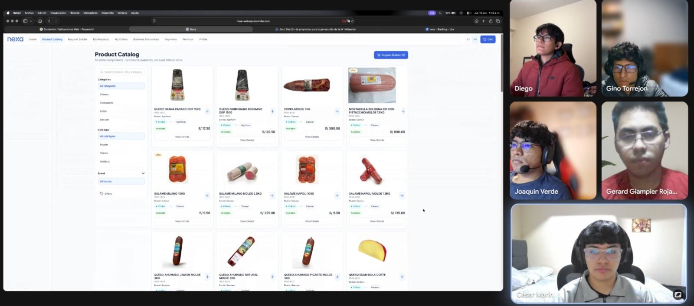

> *Nota*: La captura muestra una sesión virtual de coordinación del equipo durante la planificación y revisión del Sprint 4. Elaboración propia.

#### 5.2.4.2. Aspect Leaders and Collaborators

*Distribución de liderazgos y colaboradores por bounded context en el Sprint 4.*

| Team Member | GitHub Username | Catalog Management | Sales | Warehouse | IAM | Tenant Management | Invoicing | Logistics | Shared Kernel |
|---|---|:---:|:---:|:---:|:---:|:---:|:---:|:---:|:---:|
| Yucra Sandoval, Diego Sebastian | DiegoS284 | C | L | C | L | - | C | C | C |
| Verde Bueno, Joaquín Francisco | JoaquinVerde115 | C | C | L | - | C | C | C | C |
| Marín Cueva, César Fernando | Cmarin2802 | - | C | - | C | L | C | L | L |
| Torrejón De Los Santos, Gino Rodrigo | R0obxdnt-bit | L | C | C | - | C | - | - | C |
| Rojas Mancilla, Gerard Gianpier | GerardRojasMancilla | - | - | C | C | - | L | C | C |

> *Nota*: La tabla organiza el liderazgo y la colaboración técnica. L identifica al responsable principal y C la participación de soporte, integración o revisión. Elaboración propia.

Catalog Management comprende el catálogo refrigerado; Sales cubre solicitudes, órdenes y coordinación B2B; Warehouse se ocupa de disponibilidad e inventario; IAM de autenticación y acceso; Tenant Management de tenant, workspace, miembros y reglas; Invoicing de documentos comerciales y pagos referenciales; Logistics de despacho y seguimiento. Shared Kernel actúa como soporte transversal y no como bounded context principal de negocio.

IAM y Tenant Management aparecen de forma explícita porque el cierre incorpora autenticación, autorización, registro organizacional y gobierno del workspace como capacidades que sostienen los recorridos por rol. Shared Kernel, en cambio, agrupa elementos técnicos reutilizables y preocupaciones transversales sin representar un dominio de negocio independiente. Esta distribución permite leer el Sprint 4 por responsabilidades funcionales y reconocer cómo cada liderazgo contribuyó al cierre de los distintos frentes.

#### 5.2.4.3. Sprint Backlog 4

El Sprint Backlog 4 concentra la trazabilidad documental del cierre técnico TB2 de Nexa. Jira registra 62 User Stories y work-items principales, con responsables, estados y estimaciones visibles; la estimación agregada del sprint coincide con la evidencia visual: 229 de 229.

**Sprint Backlog 4 en Jira**

La captura presenta el backlog del Sprint 4 registrado en Jira y permite revisar las User Stories, los work-items técnicos, sus responsables, estados y estimaciones asociadas al despliegue académico y al cierre TB2.

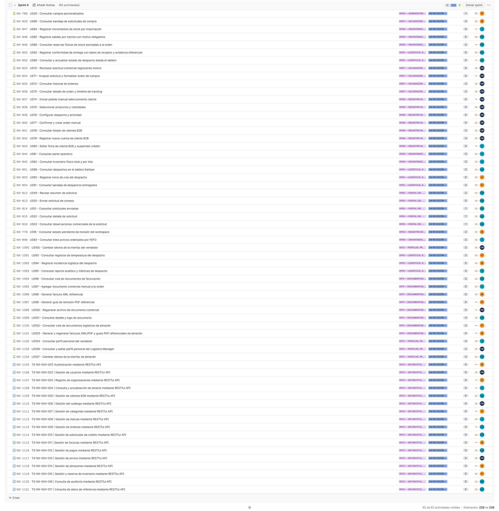

> *Nota*: La captura evidencia la planificación del Sprint 4 en Jira, con actividades visibles, responsables, estados, estimaciones y work-items asociados al cierre TB2 de Nexa. Elaboración propia.

**URL del board/backlog:** https://team-nexa.atlassian.net/jira/software/projects/NX/boards/1/backlog?atlOrigin=eyJpIjoiMjRhMGNhM2M0N2Q4NDAzODk3OTdjY2MwNjU1N2ZjZTkiLCJwIjoiaiJ9

La siguiente tabla documenta las incidencias principales registradas en Jira para el Sprint 4. Los títulos y datos de seguimiento conservan la trazabilidad de los flujos funcionales, los documentos comerciales referenciales, los pagos referenciales y los servicios técnicos incluidos en este corte.

| Sprint # | User Story Id | User Story Title | Work-Item / Task Id | Task Title | Description | Estimation (Hours) | Assigned To | Status |
|---|---|---|---|---|---|---:|---|---|
| Sprint 4 | US26 | Consultar campos personalizados | NX-789 | Consultar campos personalizados | Trazabilidad documental del User Story «Consultar campos personalizados» conforme a su registro en Jira. | 1.0 | Gino Torrejon | Finalizado |
| Sprint 4 | US66 | Consultar bandeja de solicitudes de compra | NX-829 | Consultar bandeja de solicitudes de compra | Trazabilidad documental del User Story «Consultar bandeja de solicitudes de compra» conforme a su registro en Jira. | 2.0 | Joaquín Francisco Verde Bueno | Finalizado |
| Sprint 4 | US84 | Registrar movimientos de stock por importación | NX-847 | Registrar movimientos de stock por importación | Trazabilidad documental del User Story «Registrar movimientos de stock por importación» conforme a su registro en Jira. | 5.0 | Diego | Finalizado |
| Sprint 4 | US85 | Registrar salidas por merma con motivo obligatorio | NX-848 | Registrar salidas por merma con motivo obligatorio | Trazabilidad documental del User Story «Registrar salidas por merma con motivo obligatorio» conforme a su registro en Jira. | 5.0 | Gerard Gianpier Rojas Mancilla | Finalizado |
| Sprint 4 | US86 | Consultar reservas físicas de stock asociadas a la orden | NX-849 | Consultar reservas físicas de stock asociadas a la orden | Trazabilidad documental del User Story «Consultar reservas físicas de stock asociadas a la orden» conforme a su registro en Jira. | 2.0 | Gerard Gianpier Rojas Mancilla | Finalizado |
| Sprint 4 | US92 | Registrar conformidad de entrega con datos de receptor y evidencia referencial | NX-855 | Registrar conformidad de entrega con datos de receptor y evidencia referencial | Trazabilidad documental del User Story «Registrar conformidad de entrega con datos de receptor y evidencia referencial» conforme a su registro en Jira. | 5.0 | Gerard Gianpier Rojas Mancilla | Finalizado |
| Sprint 4 | US89 | Consultar y actualizar estado de despacho desde el tablero | NX-852 | Consultar y actualizar estado de despacho desde el tablero | Trazabilidad documental del User Story «Consultar y actualizar estado de despacho desde el tablero» conforme a su registro en Jira. | 5.0 | Gerard Gianpier Rojas Mancilla | Finalizado |
| Sprint 4 | US70 | Rechazar solicitud comercial registrando motivo | NX-833 | Rechazar solicitud comercial registrando motivo | Trazabilidad documental del User Story «Rechazar solicitud comercial registrando motivo» conforme a su registro en Jira. | 5.0 | César Marín | Finalizado |
| Sprint 4 | US71 | Aceptar solicitud y formalizar orden de compra | NX-834 | Aceptar solicitud y formalizar orden de compra | Trazabilidad documental del User Story «Aceptar solicitud y formalizar orden de compra» conforme a su registro en Jira. | 5.0 | César Marín | Finalizado |
| Sprint 4 | US72 | Consultar historial de órdenes | NX-835 | Consultar historial de órdenes | Trazabilidad documental del User Story «Consultar historial de órdenes» conforme a su registro en Jira. | 2.0 | César Marín | Finalizado |
| Sprint 4 | US73 | Consultar detalle de orden y timeline de tracking | NX-836 | Consultar detalle de orden y timeline de tracking | Trazabilidad documental del User Story «Consultar detalle de orden y timeline de tracking» conforme a su registro en Jira. | 2.0 | César Marín | Finalizado |
| Sprint 4 | US74 | Iniciar pedido manual seleccionando cliente | NX-837 | Iniciar pedido manual seleccionando cliente | Trazabilidad documental del User Story «Iniciar pedido manual seleccionando cliente» conforme a su registro en Jira. | 5.0 | César Marín | Finalizado |
| Sprint 4 | US75 | Seleccionar productos y cantidades | NX-838 | Seleccionar productos y cantidades | Trazabilidad documental del User Story «Seleccionar productos y cantidades» conforme a su registro en Jira. | 5.0 | César Marín | Finalizado |
| Sprint 4 | US76 | Configurar despacho y prioridad | NX-839 | Configurar despacho y prioridad | Trazabilidad documental del User Story «Configurar despacho y prioridad» conforme a su registro en Jira. | 5.0 | César Marín | Finalizado |
| Sprint 4 | US77 | Confirmar y crear orden manual | NX-840 | Confirmar y crear orden manual | Trazabilidad documental del User Story «Confirmar y crear orden manual» conforme a su registro en Jira. | 5.0 | César Marín | Finalizado |
| Sprint 4 | US78 | Consultar listado de clientes B2B | NX-841 | Consultar listado de clientes B2B | Trazabilidad documental del User Story «Consultar listado de clientes B2B» conforme a su registro en Jira. | 2.0 | César Marín | Finalizado |
| Sprint 4 | US79 | Registrar nueva cuenta de cliente B2B | NX-842 | Registrar nueva cuenta de cliente B2B | Trazabilidad documental del User Story «Registrar nueva cuenta de cliente B2B» conforme a su registro en Jira. | 3.0 | César Marín | Finalizado |
| Sprint 4 | US80 | Editar ficha de cliente B2B y suspender crédito | NX-843 | Editar ficha de cliente B2B y suspender crédito | Trazabilidad documental del User Story «Editar ficha de cliente B2B y suspender crédito» conforme a su registro en Jira. | 5.0 | Diego | Finalizado |
| Sprint 4 | US81 | Consultar panel operativo | NX-844 | Consultar panel operativo | Trazabilidad documental del User Story «Consultar panel operativo» conforme a su registro en Jira. | 2.0 | Diego | Finalizado |
| Sprint 4 | US82 | Consultar inventario físico total y por lote | NX-845 | Consultar inventario físico total y por lote | Trazabilidad documental del User Story «Consultar inventario físico total y por lote» conforme a su registro en Jira. | 2.0 | Diego | Finalizado |
| Sprint 4 | US88 | Consultar despachos en el tablero Kanban | NX-851 | Consultar despachos en el tablero Kanban | Trazabilidad documental del User Story «Consultar despachos en el tablero Kanban» conforme a su registro en Jira. | 2.0 | Gerard Gianpier Rojas Mancilla | Finalizado |
| Sprint 4 | US90 | Registrar inicio de ruta del despacho | NX-853 | Registrar inicio de ruta del despacho | Trazabilidad documental del User Story «Registrar inicio de ruta del despacho» conforme a su registro en Jira. | 5.0 | Gino Torrejon | Finalizado |
| Sprint 4 | US91 | Consultar bandeja de despachos entregados | NX-854 | Consultar bandeja de despachos entregados | Trazabilidad documental del User Story «Consultar bandeja de despachos entregados» conforme a su registro en Jira. | 2.0 | Gino Torrejon | Finalizado |
| Sprint 4 | US49 | Revisar resumen de solicitud | NX-812 | Revisar resumen de solicitud | Trazabilidad documental del User Story «Revisar resumen de solicitud» conforme a su registro en Jira. | 2.0 | Gerard Gianpier Rojas Mancilla | Finalizado |
| Sprint 4 | US50 | Enviar solicitud de compra | NX-813 | Enviar solicitud de compra | Trazabilidad documental del User Story «Enviar solicitud de compra» conforme a su registro en Jira. | 5.0 | Gerard Gianpier Rojas Mancilla | Finalizado |
| Sprint 4 | US51 | Consultar solicitudes enviadas | NX-814 | Consultar solicitudes enviadas | Trazabilidad documental del User Story «Consultar solicitudes enviadas» conforme a su registro en Jira. | 1.0 | Gerard Gianpier Rojas Mancilla | Finalizado |
| Sprint 4 | US52 | Consultar detalle de solicitud | NX-815 | Consultar detalle de solicitud | Trazabilidad documental del User Story «Consultar detalle de solicitud» conforme a su registro en Jira. | 1.0 | Gerard Gianpier Rojas Mancilla | Finalizado |
| Sprint 4 | US53 | Consultar observaciones comerciales de la solicitud | NX-816 | Consultar observaciones comerciales de la solicitud | Trazabilidad documental del User Story «Consultar observaciones comerciales de la solicitud» conforme a su registro en Jira. | 1.0 | Gerard Gianpier Rojas Mancilla | Finalizado |
| Sprint 4 | US16 | Consultar estado pendiente de revisión del workspace | NX-779 | Consultar estado pendiente de revisión del workspace | Trazabilidad documental del User Story «Consultar estado pendiente de revisión del workspace» conforme a su registro en Jira. | 2.0 | Joaquín Francisco Verde Bueno | Finalizado |
| Sprint 4 | US83 | Consultar lotes activos ordenados por FEFO | NX-846 | Consultar lotes activos ordenados por FEFO | Trazabilidad documental del User Story «Consultar lotes activos ordenados por FEFO» conforme a su registro en Jira. | 2.0 | Diego | Finalizado |
| Sprint 4 | US105 | Cambiar idioma de la interfaz del vendedor | NX-1090 | Cambiar idioma de la interfaz del vendedor | Trazabilidad documental del User Story «Cambiar idioma de la interfaz del vendedor» conforme a su registro en Jira. | 2.0 | César Marín | Finalizado |
| Sprint 4 | US93 | Consultar registros de temperatura del despacho | NX-1091 | Consultar registros de temperatura del despacho | Trazabilidad documental del User Story «Consultar registros de temperatura del despacho» conforme a su registro en Jira. | 2.0 | Gino Torrejon | Finalizado |
| Sprint 4 | US94 | Registrar incidencia logística del despacho | NX-1092 | Registrar incidencia logística del despacho | Trazabilidad documental del User Story «Registrar incidencia logística del despacho» conforme a su registro en Jira. | 5.0 | Joaquín Francisco Verde Bueno | Finalizado |
| Sprint 4 | US95 | Consultar reporte analítico y métricas de despacho | NX-1093 | Consultar reporte analítico y métricas de despacho | Trazabilidad documental del User Story «Consultar reporte analítico y métricas de despacho» conforme a su registro en Jira. | 2.0 | Diego | Finalizado |
| Sprint 4 | US96 | Consultar cola de documentos de facturación | NX-1094 | Consultar cola de documentos de facturación | Trazabilidad documental del User Story «Consultar cola de documentos de facturación» conforme a su registro en Jira. | 2.0 | Gerard Gianpier Rojas Mancilla | Finalizado |
| Sprint 4 | US97 | Agregar documento comercial manual a la orden | NX-1095 | Agregar documento comercial manual a la orden | Trazabilidad documental del User Story «Agregar documento comercial manual a la orden» conforme a su registro en Jira. | 5.0 | Diego | Finalizado |
| Sprint 4 | US98 | Generar factura documento referencial | NX-1096 | Generar factura documento referencial | Trazabilidad documental del User Story «Generar factura documento referencial» conforme a su registro en Jira. | 5.0 | Joaquín Francisco Verde Bueno | Finalizado |
| Sprint 4 | US99 | Generar guía de remisión PDF referencial | NX-1097 | Generar guía de remisión PDF referencial | Trazabilidad documental del User Story «Generar guía de remisión PDF referencial» conforme a su registro en Jira. | 5.0 | Gino Torrejon | Finalizado |
| Sprint 4 | US100 | Regenerar archivo de documento comercial | NX-1098 | Regenerar archivo de documento comercial | Trazabilidad documental del User Story «Regenerar archivo de documento comercial» conforme a su registro en Jira. | 5.0 | César Marín | Finalizado |
| Sprint 4 | US101 | Consultar detalle y logs de documento | NX-1099 | Consultar detalle y logs de documento | Trazabilidad documental del User Story «Consultar detalle y logs de documento» conforme a su registro en Jira. | 2.0 | Gerard Gianpier Rojas Mancilla | Finalizado |
| Sprint 4 | US102 | Consultar cola de documentos logísticos de almacén | NX-1100 | Consultar cola de documentos logísticos de almacén | Trazabilidad documental del User Story «Consultar cola de documentos logísticos de almacén» conforme a su registro en Jira. | 2.0 | Gino Torrejon | Finalizado |
| Sprint 4 | US103 | Generar y regenerar facturas documentos y guías PDF referenciales de almacén | NX-1101 | Generar y regenerar facturas documentos y guías PDF referenciales de almacén | Trazabilidad documental del User Story «Generar y regenerar facturas documentos y guías PDF referenciales de almacén» conforme a su registro en Jira. | 5.0 | Joaquín Francisco Verde Bueno | Finalizado |
| Sprint 4 | US104 | Consultar perfil personal del vendedor | NX-1102 | Consultar perfil personal del vendedor | Trazabilidad documental del User Story «Consultar perfil personal del vendedor» conforme a su registro en Jira. | 2.0 | Diego | Finalizado |
| Sprint 4 | US106 | Consultar y editar perfil personal del Logistics Manager | NX-1103 | Consultar y editar perfil personal del Logistics Manager | Trazabilidad documental del User Story «Consultar y editar perfil personal del Logistics Manager» conforme a su registro en Jira. | 2.0 | César Marín | Finalizado |
| Sprint 4 | US107 | Cambiar idioma de la interfaz de almacén | NX-1104 | Cambiar idioma de la interfaz de almacén | Trazabilidad documental del User Story «Cambiar idioma de la interfaz de almacén» conforme a su registro en Jira. | 2.0 | Gerard Gianpier Rojas Mancilla | Finalizado |
| Sprint 4 | TS-NX-004-001 | Autenticación mediante RESTful API | NX-1105 | Autenticación mediante RESTful API | Trazabilidad documental del work-item técnico «Autenticación mediante RESTful API» conforme a su registro en Jira. | 5.0 | Joaquín Francisco Verde Bueno | Finalizado |
| Sprint 4 | TS-NX-004-002 | Gestión de usuarios mediante RESTful API | NX-1106 | Gestión de usuarios mediante RESTful API | Trazabilidad documental del work-item técnico «Gestión de usuarios mediante RESTful API» conforme a su registro en Jira. | 5.0 | César Marín | Finalizado |
| Sprint 4 | TS-NX-004-003 | Registro de organizaciones mediante RESTful API | NX-1107 | Registro de organizaciones mediante RESTful API | Trazabilidad documental del work-item técnico «Registro de organizaciones mediante RESTful API» conforme a su registro en Jira. | 5.0 | Gino Torrejon | Finalizado |
| Sprint 4 | TS-NX-004-004 | Consulta y actualización de tenants mediante RESTful API | NX-1108 | Consulta y actualización de tenants mediante RESTful API | Trazabilidad documental del work-item técnico «Consulta y actualización de tenants mediante RESTful API» conforme a su registro en Jira. | 5.0 | Diego | Finalizado |
| Sprint 4 | TS-NX-004-005 | Gestión de clientes B2B mediante RESTful API | NX-1109 | Gestión de clientes B2B mediante RESTful API | Trazabilidad documental del work-item técnico «Gestión de clientes B2B mediante RESTful API» conforme a su registro en Jira. | 5.0 | Gerard Gianpier Rojas Mancilla | Finalizado |
| Sprint 4 | TS-NX-004-006 | Gestión del catálogo mediante RESTful API | NX-1110 | Gestión del catálogo mediante RESTful API | Trazabilidad documental del work-item técnico «Gestión del catálogo mediante RESTful API» conforme a su registro en Jira. | 5.0 | César Marín | Finalizado |
| Sprint 4 | TS-NX-004-007 | Gestión de categorías mediante RESTful API | NX-1111 | Gestión de categorías mediante RESTful API | Trazabilidad documental del work-item técnico «Gestión de categorías mediante RESTful API» conforme a su registro en Jira. | 5.0 | Gino Torrejon | Finalizado |
| Sprint 4 | TS-NX-004-008 | Gestión de marcas mediante RESTful API | NX-1112 | Gestión de marcas mediante RESTful API | Trazabilidad documental del work-item técnico «Gestión de marcas mediante RESTful API» conforme a su registro en Jira. | 5.0 | Diego | Finalizado |
| Sprint 4 | TS-NX-004-009 | Gestión de órdenes mediante RESTful API | NX-1113 | Gestión de órdenes mediante RESTful API | Trazabilidad documental del work-item técnico «Gestión de órdenes mediante RESTful API» conforme a su registro en Jira. | 5.0 | Gerard Gianpier Rojas Mancilla | Finalizado |
| Sprint 4 | TS-NX-004-010 | Gestión de solicitudes de crédito mediante RESTful API | NX-1114 | Gestión de solicitudes de crédito mediante RESTful API | Trazabilidad documental del work-item técnico «Gestión de solicitudes de crédito mediante RESTful API» conforme a su registro en Jira. | 5.0 | Gerard Gianpier Rojas Mancilla | Finalizado |
| Sprint 4 | TS-NX-004-011 | Gestión de facturas mediante RESTful API | NX-1115 | Gestión de facturas mediante RESTful API | Trazabilidad documental del work-item técnico «Gestión de facturas mediante RESTful API» conforme a su registro en Jira. | 5.0 | Joaquín Francisco Verde Bueno | Finalizado |
| Sprint 4 | TS-NX-004-012 | Gestión de pagos mediante RESTful API | NX-1116 | Gestión de pagos mediante RESTful API | Trazabilidad documental del work-item técnico «Gestión de pagos mediante RESTful API» conforme a su registro en Jira. | 5.0 | Gerard Gianpier Rojas Mancilla | Finalizado |
| Sprint 4 | TS-NX-004-013 | Gestión de envíos mediante RESTful API | NX-1117 | Gestión de envíos mediante RESTful API | Trazabilidad documental del work-item técnico «Gestión de envíos mediante RESTful API» conforme a su registro en Jira. | 5.0 | César Marín | Finalizado |
| Sprint 4 | TS-NX-004-014 | Gestión de almacenes mediante RESTful API | NX-1118 | Gestión de almacenes mediante RESTful API | Trazabilidad documental del work-item técnico «Gestión de almacenes mediante RESTful API» conforme a su registro en Jira. | 5.0 | Joaquín Francisco Verde Bueno | Finalizado |
| Sprint 4 | TS-NX-004-015 | Gestión y reserva de inventario mediante RESTful API | NX-1119 | Gestión y reserva de inventario mediante RESTful API | Trazabilidad documental del work-item técnico «Gestión y reserva de inventario mediante RESTful API» conforme a su registro en Jira. | 5.0 | Gino Torrejon | Finalizado |
| Sprint 4 | TS-NX-004-016 | Consulta de auditoría mediante RESTful API | NX-1120 | Consulta de auditoría mediante RESTful API | Trazabilidad documental del work-item técnico «Consulta de auditoría mediante RESTful API» conforme a su registro en Jira. | 5.0 | Gerard Gianpier Rojas Mancilla | Finalizado |
| Sprint 4 | TS-NX-004-017 | Consulta de datos de referencia mediante RESTful API | NX-1121 | Consulta de datos de referencia mediante RESTful API | Trazabilidad documental del work-item técnico «Consulta de datos de referencia mediante RESTful API» conforme a su registro en Jira. | 5.0 | Gerard Gianpier Rojas Mancilla | Finalizado |

**Seguimiento de subtasks Sprint 4 en Jira**

La captura presenta el listado de subtasks utilizado para revisar su asignación, estado y relación con los issues padre del Sprint 4.

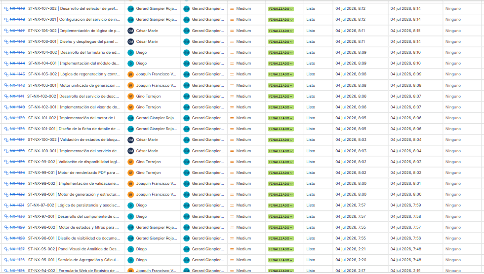

> *Nota*: La captura evidencia el seguimiento de subtasks del Sprint 4 en Jira. Las subtasks se vinculan con el sprint mediante sus issues padre cuando Jira no expone directamente el campo Sprint en incidencias hijas. Elaboración propia.

La siguiente tabla documenta las subtasks asociadas a los issues padre del Sprint 4. La pertenencia al sprint se determina mediante esa relación cuando la incidencia hija no expone directamente el campo Sprint.

| Sprint # | Belongs To (US / Task) | Parent Id | Parent Title | Subtask Id | Subtask Title | Description | Estimation (Hours) | Assigned To | Status |
|---|---|---|---|---|---|---|---:|---|---|
| Sprint 4 | US16 (NX-779) | NX-779 | Consultar estado pendiente de revisión del workspace | NX-902 | Desarrollo del motor de configuración de ofertas y validación de reglas | Atender el alcance de «Desarrollo del motor de configuración de ofertas y validación de reglas» según la subtask registrada en Jira. | 6.0 | Joaquín Francisco Verde Bueno | Finalizado |
| Sprint 4 | US16 (NX-779) | NX-779 | Consultar estado pendiente de revisión del workspace | NX-903 | Integración del visor de ofertas y estados de ausencia | Atender el alcance de «Integración del visor de ofertas y estados de ausencia» según la subtask registrada en Jira. | 6.0 | Joaquín Francisco Verde Bueno | Finalizado |
| Sprint 4 | US26 (NX-789) | NX-789 | Consultar campos personalizados | NX-922 | Motor de gestión de estados y restricciones de respuesta | Atender el alcance de «Motor de gestión de estados y restricciones de respuesta» según la subtask registrada en Jira. | 6.0 | Gino Torrejon | Finalizado |
| Sprint 4 | US26 (NX-789) | NX-789 | Consultar campos personalizados | NX-923 | Implementación del hilo de comunicación y notificación de actualización | Atender el alcance de «Implementación del hilo de comunicación y notificación de actualización» según la subtask registrada en Jira. | 6.0 | Gino Torrejon | Finalizado |
| Sprint 4 | US49 (NX-812) | NX-812 | Revisar resumen de solicitud | NX-969 | Motor de gestión del Tenant | Atender el alcance de «Motor de gestión del Tenant» según la subtask registrada en Jira. | 6.0 | Gerard Gianpier Rojas Mancilla | Finalizado |
| Sprint 4 | US49 (NX-812) | NX-812 | Revisar resumen de solicitud | NX-970 | Lógica de validación de campos corporativos | Atender el alcance de «Lógica de validación de campos corporativos» según la subtask registrada en Jira. | 4.0 | Gerard Gianpier Rojas Mancilla | Finalizado |
| Sprint 4 | US50 (NX-813) | NX-813 | Enviar solicitud de compra | NX-971 | Módulo de gestión de usuarios y asignación de roles | Atender el alcance de «Módulo de gestión de usuarios y asignación de roles» según la subtask registrada en Jira. | 6.0 | Gerard Gianpier Rojas Mancilla | Finalizado |
| Sprint 4 | US50 (NX-813) | NX-813 | Enviar solicitud de compra | NX-972 | Motor de control de acceso y validación de plan | Atender el alcance de «Motor de control de acceso y validación de plan» según la subtask registrada en Jira. | 6.0 | Gerard Gianpier Rojas Mancilla | Finalizado |
| Sprint 4 | US51 (NX-814) | NX-814 | Consultar solicitudes enviadas | NX-973 | Matriz de permisos granulares | Atender el alcance de «Matriz de permisos granulares» según la subtask registrada en Jira. | 4.0 | Gerard Gianpier Rojas Mancilla | Finalizado |
| Sprint 4 | US51 (NX-814) | NX-814 | Consultar solicitudes enviadas | NX-974 | Lógica de herencia de funciones por equipo | Atender el alcance de «Lógica de herencia de funciones por equipo» según la subtask registrada en Jira. | 4.0 | Gerard Gianpier Rojas Mancilla | Finalizado |
| Sprint 4 | US52 (NX-815) | NX-815 | Consultar detalle de solicitud | NX-975 | Dashboard de Suscripción | Atender el alcance de «Dashboard de Suscripción» según la subtask registrada en Jira. | 6.0 | Gerard Gianpier Rojas Mancilla | Finalizado |
| Sprint 4 | US52 (NX-815) | NX-815 | Consultar detalle de solicitud | NX-976 | Interceptor de funcionalidades bloqueadas | Atender el alcance de «Interceptor de funcionalidades bloqueadas» según la subtask registrada en Jira. | 4.0 | Gerard Gianpier Rojas Mancilla | Finalizado |
| Sprint 4 | US53 (NX-816) | NX-816 | Consultar observaciones comerciales de la solicitud | NX-977 | Módulo de Tareas Externas | Atender el alcance de «Módulo de Tareas Externas» según la subtask registrada en Jira. | 6.0 | Gerard Gianpier Rojas Mancilla | Finalizado |
| Sprint 4 | US53 (NX-816) | NX-816 | Consultar observaciones comerciales de la solicitud | NX-978 | Validador de consistencia y registro | Atender el alcance de «Validador de consistencia y registro» según la subtask registrada en Jira. | 4.0 | Gerard Gianpier Rojas Mancilla | Finalizado |
| Sprint 4 | US53 (NX-816) | NX-816 | Consultar observaciones comerciales de la solicitud | NX-979 | Integración en la Trazabilidad Comercial | Atender el alcance de «Integración en la Trazabilidad Comercial» según la subtask registrada en Jira. | 4.0 | Gerard Gianpier Rojas Mancilla | Finalizado |
| Sprint 4 | US66 (NX-829) | NX-829 | Consultar bandeja de solicitudes de compra | NX-1005 | Vinculación de Lotes a Órdenes de Despacho | Atender el alcance de «Vinculación de Lotes a Órdenes de Despacho» según la subtask registrada en Jira. | 6.0 | Joaquín Francisco Verde Bueno | Finalizado |
| Sprint 4 | US66 (NX-829) | NX-829 | Consultar bandeja de solicitudes de compra | NX-1006 | Validador de completitud y estado de preparación | Atender el alcance de «Validador de completitud y estado de preparación» según la subtask registrada en Jira. | 4.0 | Joaquín Francisco Verde Bueno | Finalizado |
| Sprint 4 | US70 (NX-833) | NX-833 | Rechazar solicitud comercial registrando motivo | NX-1013 | Módulo de asignación de transporte | Atender el alcance de «Módulo de asignación de transporte» según la subtask registrada en Jira. | 4.0 | César Marín | Finalizado |
| Sprint 4 | US70 (NX-833) | NX-833 | Rechazar solicitud comercial registrando motivo | NX-1014 | Control de flujo y validación de seguridad | Atender el alcance de «Control de flujo y validación de seguridad» según la subtask registrada en Jira. | 4.0 | César Marín | Finalizado |
| Sprint 4 | US71 (NX-834) | NX-834 | Aceptar solicitud y formalizar orden de compra | NX-1015 | Módulo de planificación logística | Atender el alcance de «Módulo de planificación logística» según la subtask registrada en Jira. | 6.0 | César Marín | Finalizado |
| Sprint 4 | US71 (NX-834) | NX-834 | Aceptar solicitud y formalizar orden de compra | NX-1016 | Validador de completitud y estado limpio | Atender el alcance de «Validador de completitud y estado limpio» según la subtask registrada en Jira. | 4.0 | César Marín | Finalizado |
| Sprint 4 | US72 (NX-835) | NX-835 | Consultar historial de órdenes | NX-1017 | Motor de gestión de estados | Atender el alcance de «Motor de gestión de estados» según la subtask registrada en Jira. | 6.0 | César Marín | Finalizado |
| Sprint 4 | US72 (NX-835) | NX-835 | Consultar historial de órdenes | NX-1018 | Interfaz de control de salidas | Atender el alcance de «Interfaz de control de salidas» según la subtask registrada en Jira. | 4.0 | César Marín | Finalizado |
| Sprint 4 | US73 (NX-836) | NX-836 | Consultar detalle de orden y timeline de tracking | NX-1019 | Motor de Transición de Estados | Atender el alcance de «Motor de Transición de Estados» según la subtask registrada en Jira. | 6.0 | César Marín | Finalizado |
| Sprint 4 | US73 (NX-836) | NX-836 | Consultar detalle de orden y timeline de tracking | NX-1020 | Sincronización de visibilidad y control de interfaz | Atender el alcance de «Sincronización de visibilidad y control de interfaz» según la subtask registrada en Jira. | 4.0 | César Marín | Finalizado |
| Sprint 4 | US74 (NX-837) | NX-837 | Iniciar pedido manual seleccionando cliente | NX-1021 | Módulo de Registro de Novedades | Atender el alcance de «Módulo de Registro de Novedades» según la subtask registrada en Jira. | 6.0 | César Marín | Finalizado |
| Sprint 4 | US74 (NX-837) | NX-837 | Iniciar pedido manual seleccionando cliente | NX-1022 | Validador de calidad y visibilidad informativa | Atender el alcance de «Validador de calidad y visibilidad informativa» según la subtask registrada en Jira. | 4.0 | César Marín | Finalizado |
| Sprint 4 | US75 (NX-838) | NX-838 | Seleccionar productos y cantidades | NX-1023 | Motor de Reprogramación Logística | Atender el alcance de «Motor de Reprogramación Logística» según la subtask registrada en Jira. | 6.0 | César Marín | Finalizado |
| Sprint 4 | US75 (NX-838) | NX-838 | Seleccionar productos y cantidades | NX-1024 | Validador de consistencia y comunicación | Atender el alcance de «Validador de consistencia y comunicación» según la subtask registrada en Jira. | 6.0 | César Marín | Finalizado |
| Sprint 4 | US76 (NX-839) | NX-839 | Configurar despacho y prioridad | NX-1025 | Visibilidad Comercial | Atender el alcance de «Visibilidad Comercial» según la subtask registrada en Jira. | 6.0 | Gerard Gianpier Rojas Mancilla | Finalizado |
| Sprint 4 | US76 (NX-839) | NX-839 | Configurar despacho y prioridad | NX-1026 | Sistema de Alertas de estado para coordinación | Atender el alcance de «Sistema de Alertas de estado para coordinación» según la subtask registrada en Jira. | 6.0 | Gerard Gianpier Rojas Mancilla | Finalizado |
| Sprint 4 | US77 (NX-840) | NX-840 | Confirmar y crear orden manual | NX-1027 | Portal de Seguimiento del Comprador | Atender el alcance de «Portal de Seguimiento del Comprador» según la subtask registrada en Jira. | 6.0 | César Marín | Finalizado |
| Sprint 4 | US77 (NX-840) | NX-840 | Confirmar y crear orden manual | NX-1028 | Integración contextual de tracking | Atender el alcance de «Integración contextual de tracking» según la subtask registrada en Jira. | 4.0 | César Marín | Finalizado |
| Sprint 4 | US78 (NX-841) | NX-841 | Consultar listado de clientes B2B | NX-1029 | Módulo de Registro de Cadena de Frío | Atender el alcance de «Módulo de Registro de Cadena de Frío» según la subtask registrada en Jira. | 4.0 | César Marín | Finalizado |
| Sprint 4 | US78 (NX-841) | NX-841 | Consultar listado de clientes B2B | NX-1030 | Motor de Validación y Alertas Operativas | Atender el alcance de «Motor de Validación y Alertas Operativas» según la subtask registrada en Jira. | 4.0 | César Marín | Finalizado |
| Sprint 4 | US79 (NX-842) | NX-842 | Registrar nueva cuenta de cliente B2B | NX-1031 | Motor de Reglas de Conservación | Atender el alcance de «Motor de Reglas de Conservación» según la subtask registrada en Jira. | 4.0 | César Marín | Finalizado |
| Sprint 4 | US79 (NX-842) | NX-842 | Registrar nueva cuenta de cliente B2B | NX-1032 | Visibilidad de Riesgos en Tablero Operativo | Atender el alcance de «Visibilidad de Riesgos en Tablero Operativo» según la subtask registrada en Jira. | 4.0 | César Marín | Finalizado |
| Sprint 4 | US80 (NX-843) | NX-843 | Editar ficha de cliente B2B y suspender crédito | NX-1033 | Motor de Cierre Logístico | Atender el alcance de «Motor de Cierre Logístico» según la subtask registrada en Jira. | 4.0 | Diego | Finalizado |
| Sprint 4 | US80 (NX-843) | NX-843 | Editar ficha de cliente B2B y suspender crédito | NX-1034 | Validador de Integridad y Habilitador de Evidencias | Atender el alcance de «Validador de Integridad y Habilitador de Evidencias» según la subtask registrada en Jira. | 6.0 | Diego | Finalizado |
| Sprint 4 | US81 (NX-844) | NX-844 | Consultar panel operativo | NX-1035 | Módulo de Gestión de Evidencia de Entrega | Atender el alcance de «Módulo de Gestión de Evidencia de Entrega» según la subtask registrada en Jira. | 6.0 | Diego | Finalizado |
| Sprint 4 | US81 (NX-844) | NX-844 | Consultar panel operativo | NX-1036 | Servidor de Documentación y Visibilidad de Cliente | Atender el alcance de «Servidor de Documentación y Visibilidad de Cliente» según la subtask registrada en Jira. | 4.0 | Diego | Finalizado |
| Sprint 4 | US82 (NX-845) | NX-845 | Consultar inventario físico total y por lote | NX-1037 | Módulo de Consulta Documental | Atender el alcance de «Módulo de Consulta Documental» según la subtask registrada en Jira. | 4.0 | Diego | Finalizado |
| Sprint 4 | US82 (NX-845) | NX-845 | Consultar inventario físico total y por lote | NX-1038 | Gestor de Privacidad y Estado Vacío | Atender el alcance de «Gestor de Privacidad y Estado Vacío» según la subtask registrada en Jira. | 4.0 | Diego | Finalizado |
| Sprint 4 | US83 (NX-846) | NX-846 | Consultar lotes activos ordenados por FEFO | NX-1039 | Motor de Agregación de Datos Logísticos | Atender el alcance de «Motor de Agregación de Datos Logísticos» según la subtask registrada en Jira. | 6.0 | Diego | Finalizado |
| Sprint 4 | US83 (NX-846) | NX-846 | Consultar lotes activos ordenados por FEFO | NX-1040 | Componente Visual Ejecutivo Operativa | Atender el alcance de «Componente Visual Ejecutivo Operativa» según la subtask registrada en Jira. | 6.0 | Diego | Finalizado |
| Sprint 4 | US84 (NX-847) | NX-847 | Registrar movimientos de stock por importación | NX-1041 | Motor de Valorización Financiera | Atender el alcance de «Motor de Valorización Financiera» según la subtask registrada en Jira. | 6.0 | Diego | Finalizado |
| Sprint 4 | US84 (NX-847) | NX-847 | Registrar movimientos de stock por importación | NX-1042 | Interfaz de Resumen Transparente | Atender el alcance de «Interfaz de Resumen Transparente» según la subtask registrada en Jira. | 6.0 | Diego | Finalizado |
| Sprint 4 | US85 (NX-848) | NX-848 | Registrar salidas por merma con motivo obligatorio | NX-1043 | Selector de Métodos de Pago Adaptativo | Atender el alcance de «Selector de Métodos de Pago Adaptativo» según la subtask registrada en Jira. | — | Gerard Gianpier Rojas Mancilla | Finalizado |
| Sprint 4 | US85 (NX-848) | NX-848 | Registrar salidas por merma con motivo obligatorio | NX-1044 | Motor de Validación de Flujo | Atender el alcance de «Motor de Validación de Flujo» según la subtask registrada en Jira. | — | Gerard Gianpier Rojas Mancilla | Finalizado |
| Sprint 4 | US86 (NX-849) | NX-849 | Consultar reservas físicas de stock asociadas a la orden | NX-1045 | Motor de Cierre de Transacción | Atender el alcance de «Motor de Cierre de Transacción» según la subtask registrada en Jira. | 6.0 | Gerard Gianpier Rojas Mancilla | Finalizado |
| Sprint 4 | US86 (NX-849) | NX-849 | Consultar reservas físicas de stock asociadas a la orden | NX-1046 | Gestor de Respuesta y Seguridad de Entorno | Atender el alcance de «Gestor de Respuesta y Seguridad de Entorno» según la subtask registrada en Jira. | 4.0 | Gerard Gianpier Rojas Mancilla | Finalizado |
| Sprint 4 | US88 (NX-851) | NX-851 | Consultar despachos en el tablero Kanban | NX-1049 | Panel de Control Documental | Atender el alcance de «Panel de Control Documental» según la subtask registrada en Jira. | 6.0 | Gerard Gianpier Rojas Mancilla | Finalizado |
| Sprint 4 | US88 (NX-851) | NX-851 | Consultar despachos en el tablero Kanban | NX-1050 | Gestor de Permisos y Acceso Seguro | Atender el alcance de «Gestor de Permisos y Acceso Seguro» según la subtask registrada en Jira. | 4.0 | Gerard Gianpier Rojas Mancilla | Finalizado |
| Sprint 4 | US89 (NX-852) | NX-852 | Consultar y actualizar estado de despacho desde el tablero | NX-1051 | Visibilidad de Cobros | Atender el alcance de «Visibilidad de Cobros» según la subtask registrada en Jira. | 6.0 | Gerard Gianpier Rojas Mancilla | Finalizado |
| Sprint 4 | US89 (NX-852) | NX-852 | Consultar y actualizar estado de despacho desde el tablero | NX-1052 | Motor de Agregación y Filtrado Operativo | Atender el alcance de «Motor de Agregación y Filtrado Operativo» según la subtask registrada en Jira. | 4.0 | Gerard Gianpier Rojas Mancilla | Finalizado |
| Sprint 4 | US90 (NX-853) | NX-853 | Registrar inicio de ruta del despacho | NX-1053 | Módulo de Acceso Documental Selectivo | Atender el alcance de «Módulo de Acceso Documental Selectivo» según la subtask registrada en Jira. | 6.0 | Gino Torrejon | Finalizado |
| Sprint 4 | US90 (NX-853) | NX-853 | Registrar inicio de ruta del despacho | NX-1054 | Motor de Validación de Acceso | Atender el alcance de «Motor de Validación de Acceso» según la subtask registrada en Jira. | 6.0 | Gino Torrejon | Finalizado |
| Sprint 4 | US90 (NX-853) | NX-853 | Registrar inicio de ruta del despacho | NX-1055 | Gestor de Brechas Documentales | Atender el alcance de «Gestor de Brechas Documentales» según la subtask registrada en Jira. | 4.0 | Gino Torrejon | Finalizado |
| Sprint 4 | US91 (NX-854) | NX-854 | Consultar bandeja de despachos entregados | NX-1056 | Motor de Eventos y Notificaciones | Atender el alcance de «Motor de Eventos y Notificaciones» según la subtask registrada en Jira. | 6.0 | Gino Torrejon | Finalizado |
| Sprint 4 | US91 (NX-854) | NX-854 | Consultar bandeja de despachos entregados | NX-1057 | Gestor de Preferencias y Plantillas de Alerta | Atender el alcance de «Gestor de Preferencias y Plantillas de Alerta» según la subtask registrada en Jira. | 6.0 | Gino Torrejon | Finalizado |
| Sprint 4 | US92 (NX-855) | NX-855 | Registrar conformidad de entrega con datos de receptor y evidencia referencial | NX-1058 | Módulo de Gestión de Cartera Operativa | Atender el alcance de «Módulo de Gestión de Cartera Operativa» según la subtask registrada en Jira. | 4.0 | Gerard Gianpier Rojas Mancilla | Finalizado |
| Sprint 4 | US92 (NX-855) | NX-855 | Registrar conformidad de entrega con datos de receptor y evidencia referencial | NX-1059 | Workflow de Gestión de Incidencias de Pago | Atender el alcance de «Workflow de Gestión de Incidencias de Pago» según la subtask registrada en Jira. | 6.0 | Gerard Gianpier Rojas Mancilla | Finalizado |
| Sprint 4 | US93 (NX-1091) | NX-1091 | Consultar registros de temperatura del despacho | NX-1122 | Servicio de Registro y Consulta de Temperatura de Despacho | Atender el alcance de «Servicio de Registro y Consulta de Temperatura de Despacho» según la subtask registrada en Jira. | — | Gino Torrejon | Finalizado |
| Sprint 4 | US93 (NX-1091) | NX-1091 | Consultar registros de temperatura del despacho | NX-1123 | Componente Visual de Monitoreo de Temperatura | Atender el alcance de «Componente Visual de Monitoreo de Temperatura» según la subtask registrada en Jira. | — | Gino Torrejon | Finalizado |
| Sprint 4 | US94 (NX-1092) | NX-1092 | Registrar incidencia logística del despacho | NX-1124 | Servicio de Registro de Incidencias Logísticas de Despacho | Atender el alcance de «Servicio de Registro de Incidencias Logísticas de Despacho» según la subtask registrada en Jira. | — | Joaquín Francisco Verde Bueno | Finalizado |
| Sprint 4 | US94 (NX-1092) | NX-1092 | Registrar incidencia logística del despacho | NX-1125 | Formulario Web de Registro de Incidencias Logísticas | Atender el alcance de «Formulario Web de Registro de Incidencias Logísticas» según la subtask registrada en Jira. | — | Joaquín Francisco Verde Bueno | Finalizado |
| Sprint 4 | US95 (NX-1093) | NX-1093 | Consultar reporte analítico y métricas de despacho | NX-1126 | Servicio de Agregación y Cálculo de Métricas de Despacho | Atender el alcance de «Servicio de Agregación y Cálculo de Métricas de Despacho» según la subtask registrada en Jira. | — | Diego | Finalizado |
| Sprint 4 | US95 (NX-1093) | NX-1093 | Consultar reporte analítico y métricas de despacho | NX-1127 | Panel Visual de Analítica de Despachos (Operational Analytics) | Atender el alcance de «Panel Visual de Analítica de Despachos (Operational Analytics)» según la subtask registrada en Jira. | — | Diego | Finalizado |
| Sprint 4 | US96 (NX-1094) | NX-1094 | Consultar cola de documentos de facturación | NX-1128 | Diseño de visibilidad de documentos por rol de ventas | Atender el alcance de «Diseño de visibilidad de documentos por rol de ventas» según la subtask registrada en Jira. | — | Gerard Gianpier Rojas Mancilla | Finalizado |
| Sprint 4 | US96 (NX-1094) | NX-1094 | Consultar cola de documentos de facturación | NX-1129 | Motor de estados y filtros para Business Documents | Atender el alcance de «Motor de estados y filtros para Business Documents» según la subtask registrada en Jira. | — | Gerard Gianpier Rojas Mancilla | Finalizado |
| Sprint 4 | US97 (NX-1095) | NX-1095 | Agregar documento comercial manual a la orden | NX-1130 | Desarrollo del componente de carga y validación de archivos | Atender el alcance de «Desarrollo del componente de carga y validación de archivos» según la subtask registrada en Jira. | — | Diego | Finalizado |
| Sprint 4 | US97 (NX-1095) | NX-1095 | Agregar documento comercial manual a la orden | NX-1131 | Lógica de persistencia y asociación de documentos | Atender el alcance de «Lógica de persistencia y asociación de documentos» según la subtask registrada en Jira. | — | Diego | Finalizado |
| Sprint 4 | US98 (NX-1096) | NX-1096 | Generar factura documento referencial | NX-1132 | Motor de generación y estructuración de archivos documento | Atender el alcance de «Motor de generación y estructuración de archivos documento» según la subtask registrada en Jira. | — | Joaquín Francisco Verde Bueno | Finalizado |
| Sprint 4 | US98 (NX-1096) | NX-1096 | Generar factura documento referencial | NX-1133 | Implementación de validaciones de integridad fiscal (RUC) | Atender el alcance de «Implementación de validaciones de integridad fiscal (RUC)» según la subtask registrada en Jira. | — | Joaquín Francisco Verde Bueno | Finalizado |
| Sprint 4 | US99 (NX-1097) | NX-1097 | Generar guía de remisión PDF referencial | NX-1134 | Motor de renderizado PDF para guías de remisión | Atender el alcance de «Motor de renderizado PDF para guías de remisión» según la subtask registrada en Jira. | — | Gino Torrejon | Finalizado |
| Sprint 4 | US99 (NX-1097) | NX-1097 | Generar guía de remisión PDF referencial | NX-1135 | Validación de disponibilidad logística | Atender el alcance de «Validación de disponibilidad logística» según la subtask registrada en Jira. | — | Gino Torrejon | Finalizado |
| Sprint 4 | US100 (NX-1098) | NX-1098 | Regenerar archivo de documento comercial | NX-1136 | Implementación del servicio de regeneración de documentos | Atender el alcance de «Implementación del servicio de regeneración de documentos» según la subtask registrada en Jira. | — | César Marín | Finalizado |
| Sprint 4 | US100 (NX-1098) | NX-1098 | Regenerar archivo de documento comercial | NX-1137 | Validación de estados de bloqueo comercial | Atender el alcance de «Validación de estados de bloqueo comercial» según la subtask registrada en Jira. | — | César Marín | Finalizado |
| Sprint 4 | US101 (NX-1099) | NX-1099 | Consultar detalle y logs de documento | NX-1138 | Diseño de la ficha de detalle de documento comercial | Atender el alcance de «Diseño de la ficha de detalle de documento comercial» según la subtask registrada en Jira. | — | Gerard Gianpier Rojas Mancilla | Finalizado |
| Sprint 4 | US101 (NX-1099) | NX-1099 | Consultar detalle y logs de documento | NX-1139 | Implementación del motor de logs de auditoría | Atender el alcance de «Implementación del motor de logs de auditoría» según la subtask registrada en Jira. | — | Gerard Gianpier Rojas Mancilla | Finalizado |
| Sprint 4 | US102 (NX-1100) | NX-1100 | Consultar cola de documentos logísticos de almacén | NX-1140 | Implementación del visor de documentos logísticos | Atender el alcance de «Implementación del visor de documentos logísticos» según la subtask registrada en Jira. | — | Gino Torrejon | Finalizado |
| Sprint 4 | US102 (NX-1100) | NX-1100 | Consultar cola de documentos logísticos de almacén | NX-1141 | Desarrollo del servicio de descarga y tracking de despacho | Atender el alcance de «Desarrollo del servicio de descarga y tracking de despacho» según la subtask registrada en Jira. | — | Gino Torrejon | Finalizado |
| Sprint 4 | US103 (NX-1101) | NX-1101 | Generar y regenerar facturas documentos y guías PDF referenciales de almacén | NX-1142 | Motor unificado de generación documental para Logística | Atender el alcance de «Motor unificado de generación documental para Logística» según la subtask registrada en Jira. | — | Joaquín Francisco Verde Bueno | Finalizado |
| Sprint 4 | US103 (NX-1101) | NX-1101 | Generar y regenerar facturas documentos y guías PDF referenciales de almacén | NX-1143 | Lógica de regeneración y control de versiones | Atender el alcance de «Lógica de regeneración y control de versiones» según la subtask registrada en Jira. | — | Joaquín Francisco Verde Bueno | Finalizado |
| Sprint 4 | US104 (NX-1102) | NX-1102 | Consultar perfil personal del vendedor | NX-1144 | Implementación del módulo de visualización de perfil | Atender el alcance de «Implementación del módulo de visualización de perfil» según la subtask registrada en Jira. | — | Diego | Finalizado |
| Sprint 4 | US104 (NX-1102) | NX-1102 | Consultar perfil personal del vendedor | NX-1145 | Desarrollo del formulario de edición de datos personales | Atender el alcance de «Desarrollo del formulario de edición de datos personales» según la subtask registrada en Jira. | — | Diego | Finalizado |
| Sprint 4 | US106 (NX-1103) | NX-1103 | Consultar y editar perfil personal del Logistics Manager | NX-1146 | Diseño y despliegue del panel My Profile para logística | Atender el alcance de «Diseño y despliegue del panel My Profile para logística» según la subtask registrada en Jira. | 6.0 | César Marín | Finalizado |
| Sprint 4 | US106 (NX-1103) | NX-1103 | Consultar y editar perfil personal del Logistics Manager | NX-1147 | Implementación de lógica de persistencia en base de datos IAM | Atender el alcance de «Implementación de lógica de persistencia en base de datos IAM» según la subtask registrada en Jira. | 6.0 | César Marín | Finalizado |
| Sprint 4 | US107 (NX-1104) | NX-1104 | Cambiar idioma de la interfaz de almacén | NX-1148 | Configuración del servicio de internacionalización (i18n) | Atender el alcance de «Configuración del servicio de internacionalización (i18n)» según la subtask registrada en Jira. | 4.0 | Gerard Gianpier Rojas Mancilla | Finalizado |
| Sprint 4 | US107 (NX-1104) | NX-1104 | Cambiar idioma de la interfaz de almacén | NX-1149 | Desarrollo del selector de preferencias de idioma | Atender el alcance de «Desarrollo del selector de preferencias de idioma» según la subtask registrada en Jira. | 4.0 | Gerard Gianpier Rojas Mancilla | Finalizado |
| Sprint 4 | TS-NX-004-001 (NX-1105) | NX-1105 | Autenticación mediante RESTful API | NX-1150 | Configuración del cliente HTTP y manejo de tokens | Atender el alcance de «Configuración del cliente HTTP y manejo de tokens» según la subtask registrada en Jira. | 4.0 | Joaquín Francisco Verde Bueno | Finalizado |
| Sprint 4 | TS-NX-004-001 (NX-1105) | NX-1105 | Autenticación mediante RESTful API | NX-1151 | Implementación de interceptores de sesión y errores | Atender el alcance de «Implementación de interceptores de sesión y errores» según la subtask registrada en Jira. | 4.0 | Joaquín Francisco Verde Bueno | Finalizado |
| Sprint 4 | TS-NX-004-002 (NX-1106) | NX-1106 | Gestión de usuarios mediante RESTful API | NX-1152 | Consumo y tipado del endpoint de perfil actual | Atender el alcance de «Consumo y tipado del endpoint de perfil actual» según la subtask registrada en Jira. | — | César Marín | Finalizado |
| Sprint 4 | TS-NX-004-002 (NX-1106) | NX-1106 | Gestión de usuarios mediante RESTful API | NX-1153 | Implementación del servicio de CRUD de usuarios con manejo de errores | Atender el alcance de «Implementación del servicio de CRUD de usuarios con manejo de errores» según la subtask registrada en Jira. | — | César Marín | Finalizado |
| Sprint 4 | TS-NX-004-003 (NX-1107) | NX-1107 | Registro de organizaciones mediante RESTful API | NX-1154 | Desarrollo del servicio de creación (POST) con validación de estado 201 | Atender el alcance de «Desarrollo del servicio de creación (POST) con validación de estado 201» según la subtask registrada en Jira. | — | Gino Torrejon | Finalizado |
| Sprint 4 | TS-NX-004-003 (NX-1107) | NX-1107 | Registro de organizaciones mediante RESTful API | NX-1155 | Configuración de la capa de comunicación y manejo de contratos | Atender el alcance de «Configuración de la capa de comunicación y manejo de contratos» según la subtask registrada en Jira. | — | Gino Torrejon | Finalizado |
| Sprint 4 | TS-NX-004-004 (NX-1108) | NX-1108 | Consulta y actualización de tenants mediante RESTful API | NX-1156 | Manejo de errores para búsqueda de tenants no registrados | Atender el alcance de «Manejo de errores para búsqueda de tenants no registrados» según la subtask registrada en Jira. | — | Diego | Finalizado |
| Sprint 4 | TS-NX-004-004 (NX-1108) | NX-1108 | Consulta y actualización de tenants mediante RESTful API | NX-1157 | Desarrollo de la lógica de actualización del tenant actual | Atender el alcance de «Desarrollo de la lógica de actualización del tenant actual» según la subtask registrada en Jira. | — | Diego | Finalizado |
| Sprint 4 | TS-NX-004-005 (NX-1109) | NX-1109 | Gestión de clientes B2B mediante RESTful API | NX-1158 | Implementación del flujo de creación de clientes (POST) | Atender el alcance de «Implementación del flujo de creación de clientes (POST)» según la subtask registrada en Jira. | — | Gerard Gianpier Rojas Mancilla | Finalizado |
| Sprint 4 | TS-NX-004-005 (NX-1109) | NX-1109 | Gestión de clientes B2B mediante RESTful API | NX-1159 | Desarrollo del motor de consulta individual (GET) con control 404 | Atender el alcance de «Desarrollo del motor de consulta individual (GET) con control 404» según la subtask registrada en Jira. | — | Gerard Gianpier Rojas Mancilla | Finalizado |
| Sprint 4 | TS-NX-004-006 (NX-1110) | NX-1110 | Gestión del catálogo mediante RESTful API | NX-1160 | Desarrollo del motor de validación para cadena de frío | Atender el alcance de «Desarrollo del motor de validación para cadena de frío» según la subtask registrada en Jira. | 4.0 | César Marín | Finalizado |
| Sprint 4 | TS-NX-004-006 (NX-1110) | NX-1110 | Gestión del catálogo mediante RESTful API | NX-1161 | Lógica de persistencia (CRUD) para el catálogo de productos | Atender el alcance de «Lógica de persistencia (CRUD) para el catálogo de productos» según la subtask registrada en Jira. | — | César Marín | Finalizado |
| Sprint 4 | TS-NX-004-007 (NX-1111) | NX-1111 | Gestión de categorías mediante RESTful API | NX-1162 | Lógica de actualización y administración de categorías | Atender el alcance de «Lógica de actualización y administración de categorías» según la subtask registrada en Jira. | — | Gino Torrejon | Finalizado |
| Sprint 4 | TS-NX-004-007 (NX-1111) | NX-1111 | Gestión de categorías mediante RESTful API | NX-1163 | Implementación del motor de consulta y manejo de errores 404 | Atender el alcance de «Implementación del motor de consulta y manejo de errores 404» según la subtask registrada en Jira. | — | Gino Torrejon | Finalizado |
| Sprint 4 | TS-NX-004-008 (NX-1112) | NX-1112 | Gestión de marcas mediante RESTful API | NX-1164 | Lógica de actualización y mantenimiento del catálogo de marcas | Atender el alcance de «Lógica de actualización y mantenimiento del catálogo de marcas» según la subtask registrada en Jira. | — | Diego | Finalizado |
| Sprint 4 | TS-NX-004-008 (NX-1112) | NX-1112 | Gestión de marcas mediante RESTful API | NX-1165 | Implementación del motor de consulta y manejo de errores 404 | Atender el alcance de «Implementación del motor de consulta y manejo de errores 404» según la subtask registrada en Jira. | — | Diego | Finalizado |
| Sprint 4 | TS-NX-004-009 (NX-1113) | NX-1113 | Gestión de órdenes mediante RESTful API | NX-1166 | Gestión del ciclo de vida y actualizaciones de órdenes | Atender el alcance de «Gestión del ciclo de vida y actualizaciones de órdenes» según la subtask registrada en Jira. | — | Gerard Gianpier Rojas Mancilla | Finalizado |
| Sprint 4 | TS-NX-004-009 (NX-1113) | NX-1113 | Gestión de órdenes mediante RESTful API | NX-1167 | Implementación del flujo de creación de órdenes | Atender el alcance de «Implementación del flujo de creación de órdenes» según la subtask registrada en Jira. | 4.0 | Gerard Gianpier Rojas Mancilla | Finalizado |
| Sprint 4 | TS-NX-004-010 (NX-1114) | NX-1114 | Gestión de solicitudes de crédito mediante RESTful API | NX-1168 | Lógica de administración y flujo de estado de solicitudes | Atender el alcance de «Lógica de administración y flujo de estado de solicitudes» según la subtask registrada en Jira. | — | Gerard Gianpier Rojas Mancilla | Finalizado |
| Sprint 4 | TS-NX-004-010 (NX-1114) | NX-1114 | Gestión de solicitudes de crédito mediante RESTful API | NX-1169 | Implementación del motor de consulta individual con control 404 | Atender el alcance de «Implementación del motor de consulta individual con control 404» según la subtask registrada en Jira. | — | Gerard Gianpier Rojas Mancilla | Finalizado |
| Sprint 4 | TS-NX-004-011 (NX-1115) | NX-1115 | Gestión de facturas mediante RESTful API | NX-1170 | Lógica de administración, actualización y anulación | Atender el alcance de «Lógica de administración, actualización y anulación» según la subtask registrada en Jira. | — | Joaquín Francisco Verde Bueno | Finalizado |
| Sprint 4 | TS-NX-004-011 (NX-1115) | NX-1115 | Gestión de facturas mediante RESTful API | NX-1171 | Desarrollo del servicio de generación de facturas (POST) | Atender el alcance de «Desarrollo del servicio de generación de facturas (POST)» según la subtask registrada en Jira. | — | Joaquín Francisco Verde Bueno | Finalizado |
| Sprint 4 | TS-NX-004-012 (NX-1116) | NX-1116 | Gestión de pagos mediante RESTful API | NX-1172 | Desarrollo del servicio de registro de pagos (POST) | Atender el alcance de «Desarrollo del servicio de registro de pagos (POST)» según la subtask registrada en Jira. | — | Gerard Gianpier Rojas Mancilla | Finalizado |
| Sprint 4 | TS-NX-004-012 (NX-1116) | NX-1116 | Gestión de pagos mediante RESTful API | NX-1173 | Lógica de sincronización y actualización de estados de pago | Atender el alcance de «Lógica de sincronización y actualización de estados de pago» según la subtask registrada en Jira. | — | Gerard Gianpier Rojas Mancilla | Finalizado |
| Sprint 4 | TS-NX-004-013 (NX-1117) | NX-1117 | Gestión de envíos mediante RESTful API | NX-1174 | Desarrollo del servicio de programación de envíos (POST) | Atender el alcance de «Desarrollo del servicio de programación de envíos (POST)» según la subtask registrada en Jira. | — | César Marín | Finalizado |
| Sprint 4 | TS-NX-004-013 (NX-1117) | NX-1117 | Gestión de envíos mediante RESTful API | NX-1175 | Lógica de administración del ciclo de vida del envío | Atender el alcance de «Lógica de administración del ciclo de vida del envío» según la subtask registrada en Jira. | — | César Marín | Finalizado |
| Sprint 4 | TS-NX-004-014 (NX-1118) | NX-1118 | Gestión de almacenes mediante RESTful API | NX-1176 | Desarrollo del servicio de creación de almacenes (POST) | Atender el alcance de «Desarrollo del servicio de creación de almacenes (POST)» según la subtask registrada en Jira. | 4.0 | Joaquín Francisco Verde Bueno | Finalizado |
| Sprint 4 | TS-NX-004-014 (NX-1118) | NX-1118 | Gestión de almacenes mediante RESTful API | NX-1177 | Lógica de administración, actualización y eliminación de almacenes | Atender el alcance de «Lógica de administración, actualización y eliminación de almacenes» según la subtask registrada en Jira. | 4.0 | Joaquín Francisco Verde Bueno | Finalizado |
| Sprint 4 | TS-NX-004-015 (NX-1119) | NX-1119 | Gestión y reserva de inventario mediante RESTful API | NX-1178 | Desarrollo del servicio de reserva de existencias (POST) | Atender el alcance de «Desarrollo del servicio de reserva de existencias (POST)» según la subtask registrada en Jira. | — | Gino Torrejon | Finalizado |
| Sprint 4 | TS-NX-004-015 (NX-1119) | NX-1119 | Gestión y reserva de inventario mediante RESTful API | NX-1179 | Lógica de administración, liberación y ajuste de inventario | Atender el alcance de «Lógica de administración, liberación y ajuste de inventario» según la subtask registrada en Jira. | — | Gino Torrejon | Finalizado |
| Sprint 4 | TS-NX-004-016 (NX-1120) | NX-1120 | Consulta de auditoría mediante RESTful API | NX-1180 | Desarrollo del motor de consulta con parámetros de paginación | Atender el alcance de «Desarrollo del motor de consulta con parámetros de paginación» según la subtask registrada en Jira. | — | Gerard Gianpier Rojas Mancilla | Finalizado |
| Sprint 4 | TS-NX-004-016 (NX-1120) | NX-1120 | Consulta de auditoría mediante RESTful API | NX-1181 | Lógica de visualización y filtrado de registros de actividad | Atender el alcance de «Lógica de visualización y filtrado de registros de actividad» según la subtask registrada en Jira. | — | Gerard Gianpier Rojas Mancilla | Finalizado |
| Sprint 4 | TS-NX-004-017 (NX-1121) | NX-1121 | Consulta de datos de referencia mediante RESTful API | NX-1182 | Desarrollo del servicio de consulta para datos geográficos | Atender el alcance de «Desarrollo del servicio de consulta para datos geográficos» según la subtask registrada en Jira. | — | Gerard Gianpier Rojas Mancilla | Finalizado |
| Sprint 4 | TS-NX-004-017 (NX-1121) | NX-1121 | Consulta de datos de referencia mediante RESTful API | NX-1183 | Implementación de la política de seguridad y manejo del error 401 | Atender el alcance de «Implementación de la política de seguridad y manejo del error 401» según la subtask registrada en Jira. | — | Gerard Gianpier Rojas Mancilla | Finalizado |

> *Nota*: Las estimaciones, responsables y estados corresponden a los valores registrados en Jira para el Sprint 4. Las subtasks se documentan mediante su relación con las tareas padre cuando no heredan directamente el campo Sprint. Elaboración propia.

#### 5.2.4.4. Development Evidence for Sprint Review

La evidencia textual exportada desde Git permite revisar commits, ramas y releases sin reutilizar capturas de incrementos anteriores. Los releases base `v4.0.0`, `v3.0.0` y `v2.0.0` fueron seguidos por los patches `v4.0.1`, `v3.0.1` y `v2.0.1`.

En `nexa-platform`, la selección evidencia el polish final del backend, la limpieza de aliases legacy visibles en el contrato público, la consolidación de rutas canónicas RESTful y la preparación de la evidencia asociada con Swagger/OpenAPI. Los merges de cierre permiten trazar cómo estos ajustes se integraron en el release `v2.0.1`.

*Commits del repositorio nexa-platform durante Sprint 4.*

| Repository | Branch | Commit Id | Commit Message | Commit Message Body / Alcance | Committed on (Date) |
|---|---|---|---|---|---|
| nexa-platform | main | e3705d9 | merge(release): finalize v2.0.1 polish | Integra el polish final del release. | 2026-07-03 |
| nexa-platform | main | 644a605 | fix(api): remove legacy route aliases from public contract | Retira aliases legacy del contrato público. | 2026-07-03 |
| nexa-platform | main | 78a1369 | merge(release): merge hotfix/v2.0.1-final-evidence-closeout into main | Integra en la rama principal el cierre de evidencia. | 2026-07-03 |
| nexa-platform | main | 40d34d6 | merge(release): merge closeout branch into hotfix v2.0.1 | Consolida la rama de cierre en el hotfix. | 2026-07-03 |
| nexa-platform | main | 5df178a | merge(release): resolve merge conflicts and keep final closeout state | Resuelve conflictos conservando el estado de cierre. | 2026-07-03 |
| nexa-platform | main | 43c28f9 | fix(platform): prepare v2.0.1 release evidence | Prepara la evidencia del release `v2.0.1`. | 2026-07-03 |
| nexa-platform | main | c50a993 | Merge branch 'develop' | Integra los cambios de `develop` en la rama actual. | 2026-07-02 |
| nexa-platform | main | df1451e | refactor(release): clean up developer drafts and prepare production release | Limpia borradores de desarrollo y prepara la estructura del release. | 2026-07-02 |
| nexa-platform | main | e6968eb | feat(release): add InventoryMovementsController.cs (and 5 others) to release files structure | Incorpora controladores y archivos de movimientos de inventario a la estructura del release. | 2026-07-02 |
| nexa-platform | main | d96488a | refactor(release): add InventoryMovement.cs (and 5 others) to release files structure | Organiza entidades y archivos de movimientos de inventario dentro del release. | 2026-07-02 |

> *Nota*: La tabla selecciona commits verificables del cierre de Platform API. Elaboración propia.

En `nexa-webapp`, los commits seleccionados muestran la estabilización del registro público del workspace y los ajustes finales de localización, accesibilidad y comportamiento responsive. También registran el cierre visual y funcional de los recorridos disponibles para Buyer, Sales, Logistics y administración de cuenta dentro de la interfaz basada en roles.

*Commits del repositorio nexa-webapp durante Sprint 4.*

| Repository | Branch | Commit Id | Commit Message | Commit Message Body / Alcance | Committed on (Date) |
|---|---|---|---|---|---|
| nexa-webapp | main | 1a48715 | fix(webapp): keep workspace registration public | Mantiene público el registro de workspace. | 2026-07-03 |
| nexa-webapp | main | 3742162 | merge(release): finalize v2.0.1 polish | Integra el bloque final de polish. | 2026-07-03 |
| nexa-webapp | main | a86083d | fix(webapp): polish final localization accessibility and responsive flows | Ajusta localización, accesibilidad y comportamiento responsive. | 2026-07-03 |
| nexa-webapp | main | 9be2376 | fix(webapp): remove duplicate file artifacts | Retira artefactos de archivos duplicados. | 2026-07-03 |
| nexa-webapp | main | c9a9af2 | merge(release): merge hotfix/v2.0.1-final-evidence-closeout into main | Integra en la rama principal el hotfix de cierre. | 2026-07-03 |
| nexa-webapp | main | 54b2b43 | merge(release): merge closeout branch into hotfix v2.0.1 | Consolida la rama de cierre en el hotfix. | 2026-07-03 |
| nexa-webapp | main | 52edf9c | merge(release): resolve merge conflicts keeping closeout state | Resuelve conflictos conservando el estado de cierre. | 2026-07-03 |
| nexa-webapp | main | 6d24d0b | fix(webapp): close final UX and localization evidence gaps | Cierra brechas de evidencia UX y localización. | 2026-07-03 |
| nexa-webapp | main | 660e8d8 | fix(webapp): close final ux evidence gaps | Ajusta evidencias finales de experiencia de usuario. | 2026-07-03 |
| nexa-webapp | main | da5a6da | Merge branch 'develop' | Integra los cambios de `develop` en la rama actual. | 2026-07-02 |

> *Nota*: La tabla selecciona commits verificables del cierre de WebApp. Elaboración propia.

En `nexa-website`, la muestra se concentra en los ajustes visuales finales, la corrección de rutas compatibles con el despliegue y la conexión de los CTAs públicos con la WebApp. Estos cambios sustentan el cierre de la Landing Page en el release `v4.0.1` y su continuidad con el acceso al producto.

*Commits del repositorio nexa-website durante Sprint 4.*

| Repository | Branch | Commit Id | Commit Message | Commit Message Body / Alcance | Committed on (Date) |
|---|---|---|---|---|---|
| nexa-website | main | e72d9c4 | fix(website): refine final landing visuals | Refina la composición visual final. | 2026-07-03 |
| nexa-website | main | 64c08f3 | merge(release): finalize v2.0.1 polish | Integra el bloque final de polish. | 2026-07-03 |
| nexa-website | main | 906b195 | fix(website): correct final landing page deployment paths | Corrige rutas de despliegue de la Landing Page. | 2026-07-03 |
| nexa-website | main | ba64c76 | fix(website): connect landing page CTAs to production Render WebApp | Conecta los CTAs de la Landing Page con la WebApp desplegada. | 2026-07-03 |
| nexa-website | main | c6c8f46 | merge(release): merge hotfix/v2.0.1-final-evidence-closeout into main | Integra en la rama principal el hotfix de cierre. | 2026-07-03 |
| nexa-website | main | 173cf3b | merge(release): merge closeout branch into hotfix v2.0.1 | Consolida la rama de cierre en el hotfix. | 2026-07-03 |
| nexa-website | main | 13f9d13 | merge(release): resolve merge conflicts keeping closeout state | Resuelve conflictos conservando el estado de cierre. | 2026-07-03 |
| nexa-website | main | 653a6a9 | fix(website): prepare final deployment evidence | Prepara evidencia final de despliegue. | 2026-07-03 |
| nexa-website | main | 133ce39 | Merge branch 'develop' | Integra los cambios de `develop` en la rama actual. | 2026-07-02 |
| nexa-website | main | e2fadd2 | refactor(develop): clean up developer drafts and prepare production release | Limpia borradores de desarrollo y prepara la estructura del release. | 2026-07-02 |

> *Nota*: La tabla selecciona commits verificables del cierre de Website. Elaboración propia.

Los commits seleccionados no reemplazan el historial completo de cada repositorio; constituyen una muestra verificable de los cambios más cercanos al cierre técnico. La trazabilidad se complementa con las capturas GitHub de commits, branches, tags e Insights documentadas en la sección 5.2.4.8. Los releases finales se documentan en la sección 5.2.4.7.

Algunos mensajes de commit conservan el nombre operativo de la rama `hotfix/v2.0.1-final-polish`, usado como etiqueta interna de cierre transversal. Esta denominación no reemplaza el versionado final por repositorio: `nexa-website v4.0.1`, `nexa-webapp v3.0.1` y `nexa-platform v2.0.1`.

#### 5.2.4.5. Execution Evidence for Sprint Review

Los logs finales permiten distinguir compilación, pruebas, ejecución y revisión de interfaz. El build frontend terminó correctamente; el backend compiló con 0 errores y 4 advertencias de dependencia; y las pruebas registraron 51 superadas, 0 fallidas y 0 omitidas.

La evidencia se interpreta de manera acumulativa: la estructura backend permite reconocer la implementación modular; los builds comprueban que los artefactos pueden prepararse para revisión; las pruebas automatizadas verifican los casos incluidos en su alcance; y runtime health contrasta esa preparación con respuestas observables de la API desplegada. Ningún elemento aislado sustituye a los demás.

##### Estructura final del backend `nexa-platform`

Como evidencia complementaria de ejecución e implementación del Sprint 4, se presenta la estructura final del proyecto `nexa-platform`. La solución backend se organiza como monolito modular basado en bounded contexts y capas técnicas, permitiendo separar responsabilidades de aplicación, dominio, infraestructura e interfaces dentro de cada contexto funcional. A diferencia del corte anterior, esta estructura incorpora el cierre de contextos adicionales como `Identity and Access Management` y `Tenant Management`, además de los módulos de `Catalog Management`, `Sales`, `Warehouse`, `Logistics` e `Invoicing`.

*Estructura backend final de nexa-platform — parte 1.*

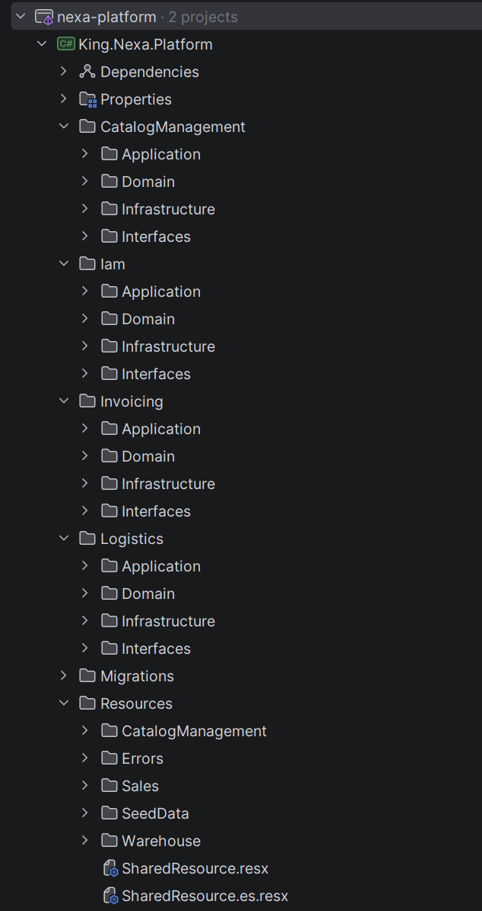

> *Nota*: La captura muestra la primera parte de la estructura final del backend `nexa-platform`, incluyendo bounded contexts y capas técnicas para el cierre TB2. Elaboración propia.

*Estructura backend final de nexa-platform — parte 2.*

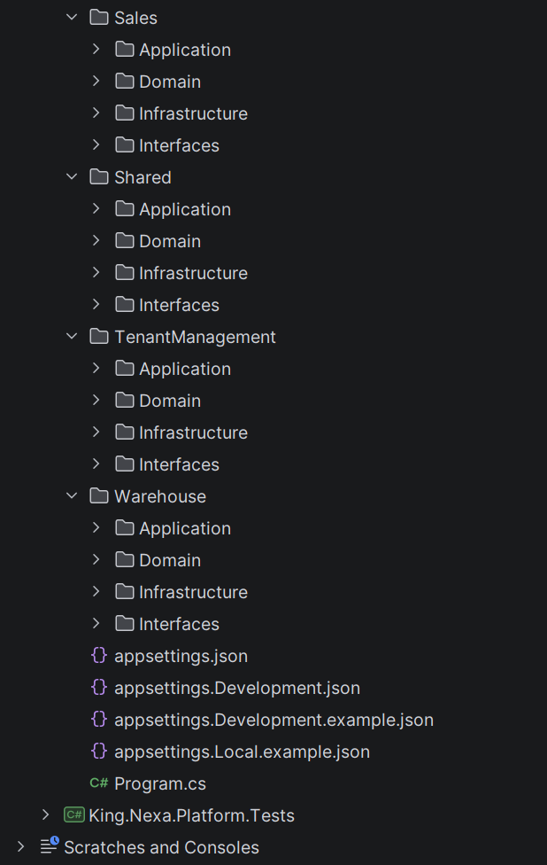

> *Nota*: La captura complementa la vista anterior y evidencia la presencia de `Shared Kernel`, `Tenant Management`, `Warehouse`, archivos de configuración y proyecto de pruebas dentro de la solución backend. Elaboración propia.

Estas capturas respaldan la evidencia de ejecución porque muestran que el backend final no se limita a endpoints aislados, sino que mantiene una organización técnica coherente con DDD, layered architecture, EF Core, PostgreSQL, Swagger/OpenAPI y los bounded contexts documentados para el cierre TB2. La evidencia se presenta como soporte de revisión académica y no acredita uso comercial.

*Evidencia de ejecución técnica del Sprint 4.*

| Evidencia | Fuente de soporte | Resultado documentado | Interpretación académica |
|---|---|---|---|
| Frontend build | final-frontend-build.log | Build Vite completado en 1.79 s. | Valida preparación del frontend para revisión. |
| Backend build | final-backend-build.log | Compilación correcta, 0 errores y 4 advertencias. | Valida build y hace visible la deuda de dependencia. |
| Backend tests | final-backend-tests.log | 51/51 superadas; 0 fallidas. | Evidencia de revisión automatizada del backend. |
| Runtime health | final-runtime-health.md | Health, Swagger, OpenAPI, login y catálogo autenticado con respuesta 200. | Evidencia de disponibilidad para revisión académica. |
| Website check | final-website-check.log | Website y ruta simulada de GitHub Pages revisados. | Evidencia del canal público. |
| Final flow | final-demo-path | Buyer, Sales y Logistics conectados por un recorrido funcional. | Evidencia visual de continuidad funcional. |
| Responsive/i18n/a11y | closeout reports | Matrices responsive, claves EN/ES y controles enfocados de accesibilidad revisados. | Evidencia de calidad sin certificación absoluta. |

> *Nota*: La tabla resume evidencias de ejecución sin afirmar operación comercial. Elaboración propia.

El resultado de 51/51 pruebas backend sustenta que los casos automatizados ejecutados finalizaron correctamente, pero no se interpreta como garantía absoluta sobre escenarios que no forman parte de esa suite. De forma complementaria, el recorrido Buyer → Sales → Logistics muestra una continuidad funcional revisable entre la creación de una solicitud y su avance hacia la gestión comercial y logística.

Las revisiones responsive, i18n y a11y amplían la lectura de calidad hacia distintas resoluciones, idiomas y criterios de interacción accesible. Estas evidencias documentan controles aplicados durante el cierre, sin atribuir una certificación formal ni sustituir futuras validaciones con usuarios.

*Solicitud creada visible en el Buyer Portal.*

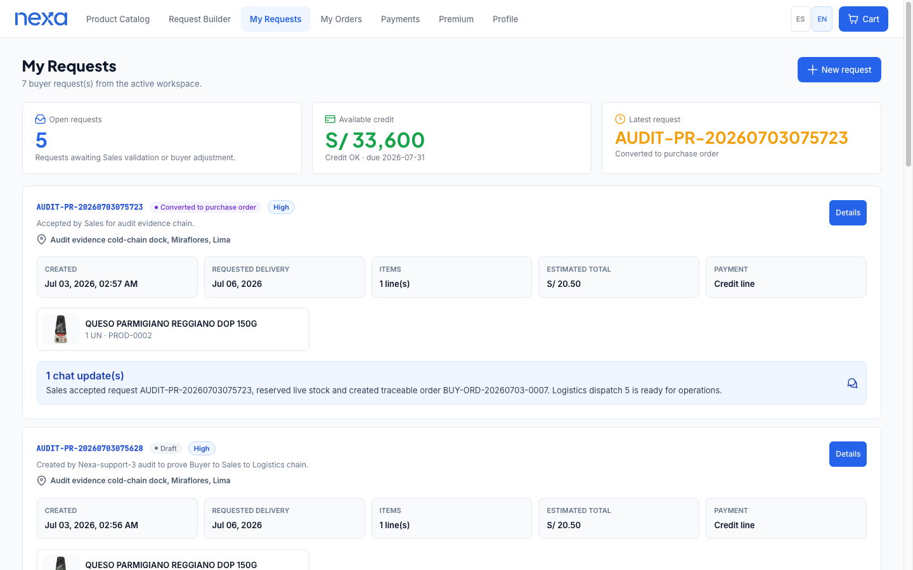

> *Nota*: La captura evidencia el estado posterior a la creación de una solicitud. Elaboración propia.

*Despacho creado visible para Logistics.*

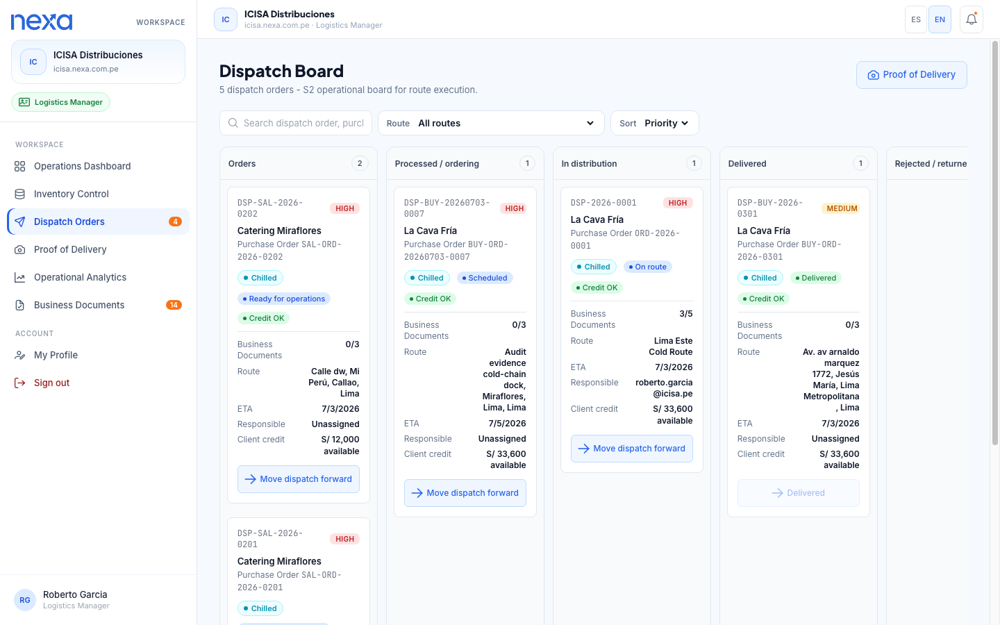

> *Nota*: La captura evidencia la continuidad del flujo hacia el tablero de despachos. Elaboración propia.

*Servicios externos verificados en el cierre TB2.*

| Servicio externo | Producto y ubicación | Implementación observada | Alcance defendible |
|---|---|---|---|
| Google Maps | `nexa-webapp`, Request Builder del Buyer Portal, creación manual de órdenes y detalle de orden | Construye URLs de ruta con origen y destino, muestra un `iframe` con título accesible y ofrece un enlace externo protegido con `rel="noopener noreferrer"`. | Vista previa y apertura de rutas de entrega. No representa tracking GPS en tiempo real. |
| YouTube | `nexa-website`, `pages/platform.html` y `pages/company.html` | Embebe los videos About-the-Product y About-the-Team mediante `iframe`, con título descriptivo y permiso de reproducción. | Reproducción audiovisual desde la Landing Page. No almacena ni procesa el video dentro de Nexa. |
| Stripe | `nexa-webapp` y `nexa-platform`, módulo Invoicing | La WebApp consume recursos REST bajo `/api/v1/payments/stripe`; la Platform API recibe configuración mediante variables de entorno y verifica firmas de webhook con HMAC-SHA256 y tolerancia temporal. | Base de preparación e ingreso seguro de webhooks. Checkout, PaymentIntent y actualización final del estado de pago permanecen explícitamente pendientes; no se declara una transacción real completada. |

> *Nota*: Google Maps constituye la integración externa funcional visible en los recorridos de entrega. YouTube soporta la evidencia audiovisual pública. Stripe se documenta como foundation técnica parcial y no como procesamiento de pagos terminado. Elaboración propia a partir de los repositorios `nexa-website`, `nexa-webapp` y `nexa-platform`.

*Internacionalización y accesibilidad verificadas.*

| Producto | Evidencia de internacionalización | Evidencia de accesibilidad |
|---|---|---|
| Website | Diccionario EN/ES en `assets/js/i18n.js`, inglés por defecto, persistencia en `localStorage`, actualización de `document.documentElement.lang` a `en` o `es-419` y traducción de texto, HTML y atributos ARIA. | Enlace para saltar al contenido, regiones semánticas, `aria-labelledby`, `aria-pressed`, textos alternativos, títulos de `iframe`, estilos `:focus-visible`, contenido `visually-hidden` y reducción de movimiento mediante `prefers-reduced-motion`. |
| WebApp | `vue-i18n` en modo Composition API, archivos `src/i18n/locales/en.json` y `es.json`, inglés como locale/fallback, persistencia de `nexa.lang` y sincronización del atributo `lang`. | Etiquetas ARIA en búsquedas y acciones, estados `aria-expanded`/`aria-pressed`, avisos `role="alert"` y `aria-live`, diálogos con `aria-modal`, textos alternativos de productos y títulos para mapas embebidos. |
| Platform API | `AddLocalization()` y recursos `.resx` EN/ES para mensajes compartidos, errores, catálogo, ventas y almacén; el middleware global usa `IStringLocalizer` para respuestas `ProblemDetails`. | No aplica una interfaz visual. La API aporta contratos HTTP y errores estructurados; la accesibilidad se evalúa en Website/WebApp y en la documentación Swagger consumida por personas desarrolladoras. |

Estas comprobaciones demuestran implementación concreta de i18n y controles a11y, pero no equivalen a una certificación WCAG ni sustituyen las pruebas con tecnologías de asistencia y usuarios reales.

#### 5.2.4.6. Services Documentation Evidence for Sprint Review

Swagger/OpenAPI funciona como documentación interactiva de Platform API. La revisión final prioriza rutas canónicas y no presenta patrones legacy como superficie principal: registra 165 paths, 281 operaciones, 0 deprecated y 0 operaciones visibles con patrones legacy.

En esta documentación, un endpoint HTTP representa una combinación concreta de ruta y método; un recurso REST expresa la entidad o capacidad expuesta mediante una URI canónica; y un grupo funcional reúne operaciones relacionadas por responsabilidad de negocio o soporte. Esta distinción permite interpretar el inventario técnico sin confundir el número de operaciones con el número de módulos del sistema.

El reporte no enumera individualmente las 281 operaciones porque su trazabilidad se presenta mediante grupos funcionales, métricas de la especificación y capturas representativas de Swagger. El criterio de cierre prioriza la superficie canónica RESTful; las rutas legacy retiradas o no visibles no se documentan como contrato principal de consumo.

El identificador visual `1.0` mostrado por Swagger corresponde a la versión declarada dentro de la definición publicada en la interfaz OpenAPI. Por ello, no contradice el versionado del artefacto en Git: el release de `nexa-platform` documentado para Sprint 4 es `v2.0.1`.

*Vista general de la documentación Swagger/OpenAPI de la Platform API.*

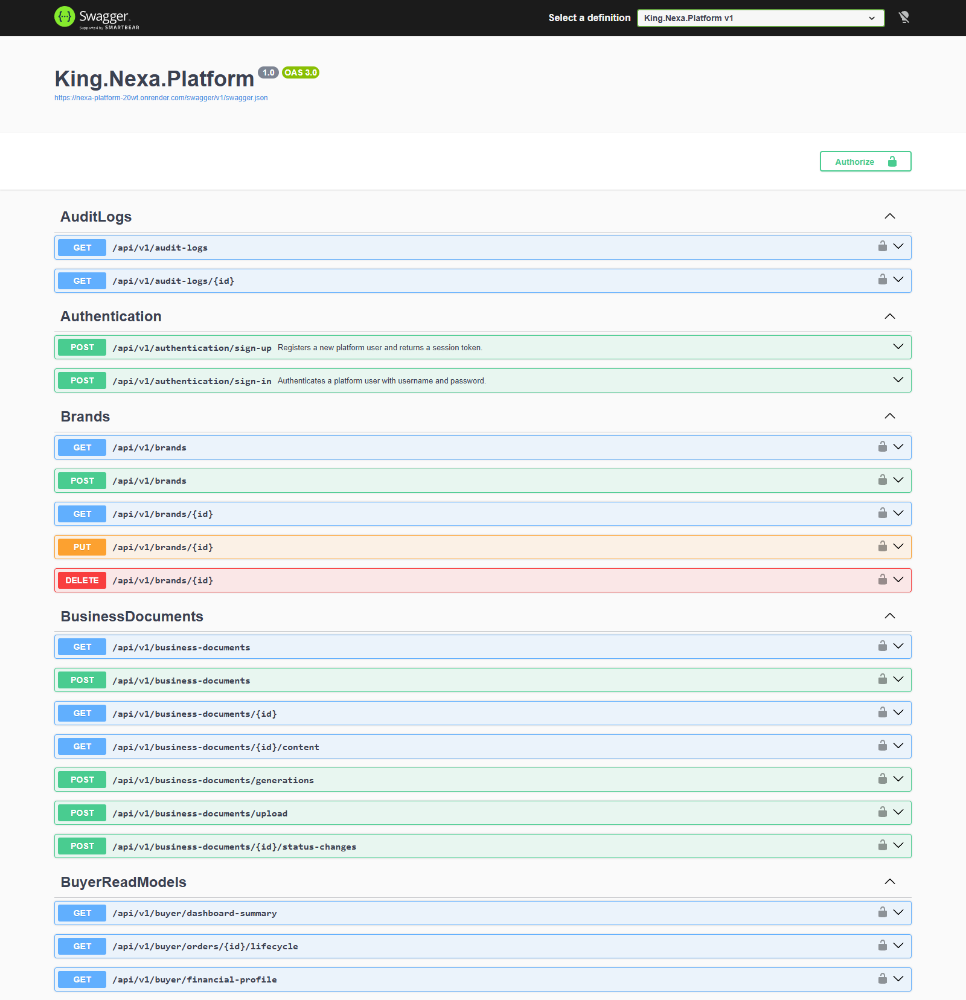

> *Nota*: La captura muestra OAS 3.0 y grupos funcionales principales. Elaboración propia.

*Endpoints canónicos de catálogo, ventas y clientes en Swagger/OpenAPI.*

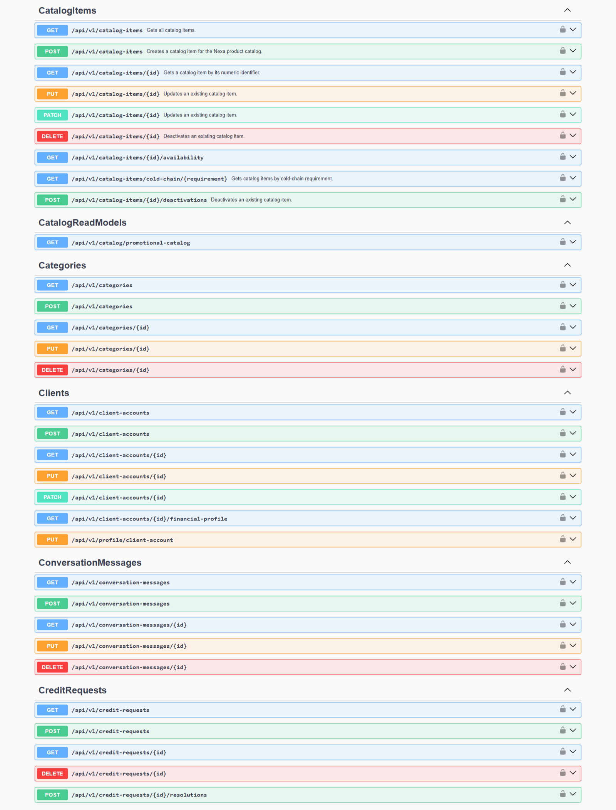

> *Nota*: La captura evidencia rutas de catálogo, clientes, conversaciones y solicitudes comerciales. Elaboración propia.

*Endpoints canónicos de logística, almacén e invoicing en Swagger/OpenAPI.*

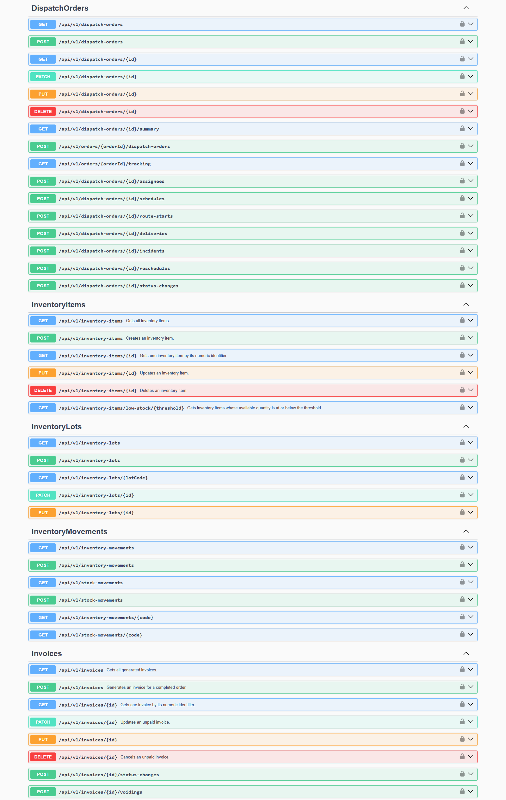

> *Nota*: La captura evidencia dispatch orders, inventory items, lots, movements e invoices. Elaboración propia.

*Schemas representativos del flujo comercial y logístico.*

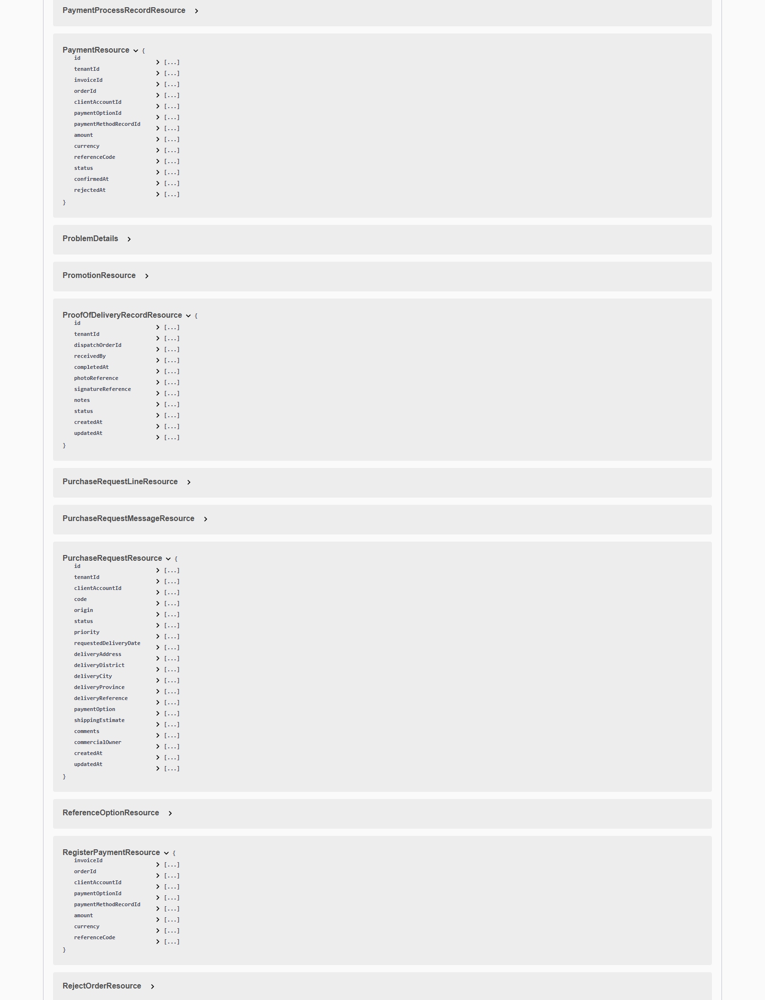

> *Nota*: La captura muestra recursos de solicitudes, pagos referenciales y prueba de entrega. Elaboración propia.

#### 5.2.4.7. Software Deployment Evidence for Sprint Review

El despliegue académico separa Website, WebApp, Platform API y PostgreSQL, sin publicar credenciales ni configuración interna sensible.

GitHub Pages hospeda el Website estático y permite revisar la propuesta pública y sus accesos hacia el producto. Render Static Site publica la WebApp compilada, mientras que Render Web Service ejecuta la Platform API y expone health checks y Swagger/OpenAPI. Render PostgreSQL proporciona la persistencia relacional utilizada por los servicios del backend, manteniendo su configuración sensible fuera del reporte.

*Evidencia de despliegue académico del Sprint 4.*

| Artefacto | Plataforma | Release asociado | URL visible | Evidencia |
|---|---|---|---|---|
| Landing Page nexa-website | GitHub Pages | v4.0.1 | https://upc-pre-202610-1asi0730-12242-king.github.io/nexa-website/ | Website público desplegado. |
| Web Application nexa-webapp | Render Static Site | v3.0.1 | https://nexa-webapp.onrender.com | WebApp para revisión académica. |
| Platform API nexa-platform | Render Web Service | v2.0.1 | https://nexa-platform-20wt.onrender.com | API con health y Swagger/OpenAPI. |
| PostgreSQL | Render PostgreSQL | No aplica | No se expone host interno. | Persistencia documentada sin secretos. |
| Swagger/OpenAPI | Platform API | v2.0.1 | https://nexa-platform-20wt.onrender.com/swagger/index.html | Documentación interactiva. |

> *Nota*: La tabla resume los artefactos de despliegue académico sin exponer datos sensibles. Elaboración propia.

La separación de artefactos facilita verificar cada responsabilidad sin confundir publicación frontend, ejecución de servicios y persistencia. Las variables protegidas se presentan con valores enmascarados: de esta forma, la captura respalda que existe configuración de entorno para la Platform API sin revelar secretos, credenciales ni cadenas de conexión.

Las evidencias visuales de Website y Render permiten contrastar las URLs documentadas con los servicios disponibles para revisión académica. Su alcance es demostrar el despliegue académico observado durante el cierre TB2 y no acreditar uso comercial.

*Health check de la Platform API.*

> *Nota*: La captura evidencia disponibilidad del servicio para revisión académica. Elaboración propia.

*Vista general del proyecto Nexa en Render.*

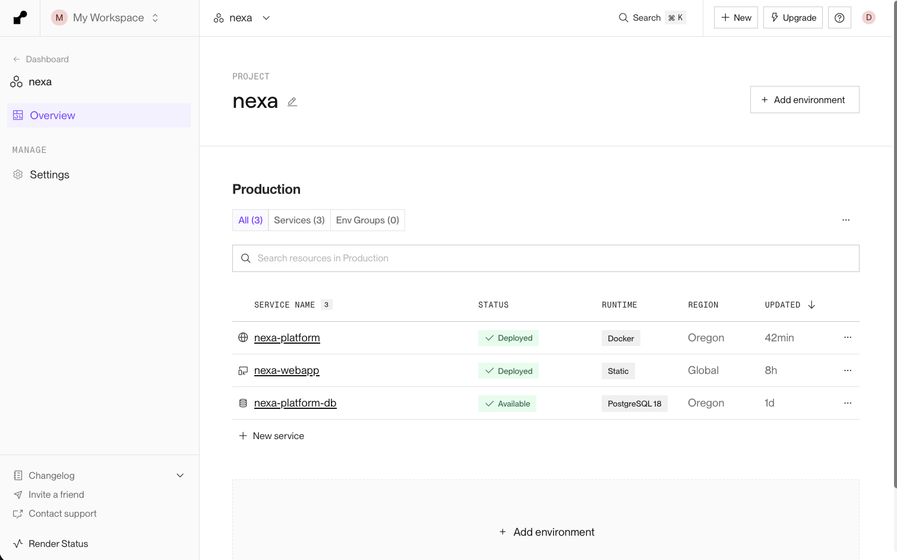

> *Nota*: La captura muestra el proyecto Nexa en Render con los servicios asociados al despliegue académico del cierre TB2. Elaboración propia.

*Landing Page de Nexa disponible para revisión.*

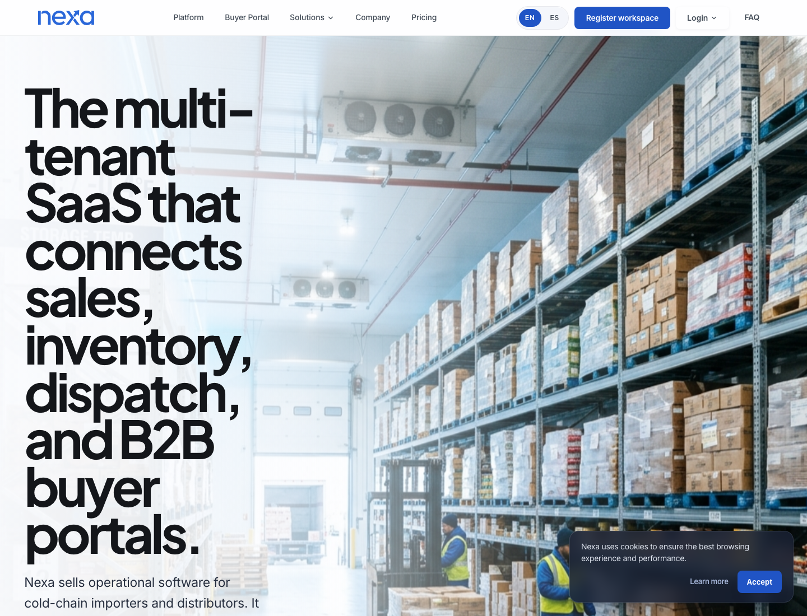

> *Nota*: La captura evidencia la Landing Page de Nexa disponible como canal público de revisión académica. Elaboración propia.

*Servicio Render de la Web Application.*

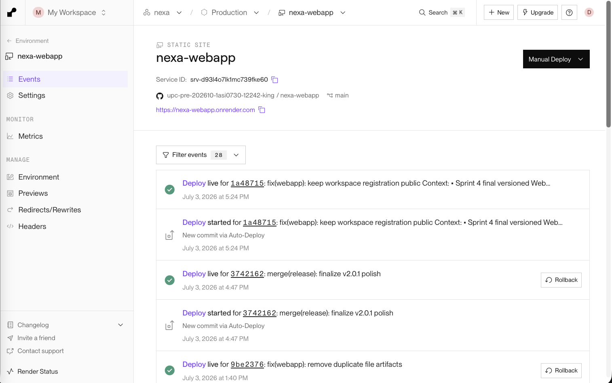

> *Nota*: La captura evidencia el servicio Render asociado a nexa-webapp durante el cierre técnico TB2. Elaboración propia.

*Servicio Render de la Platform API.*

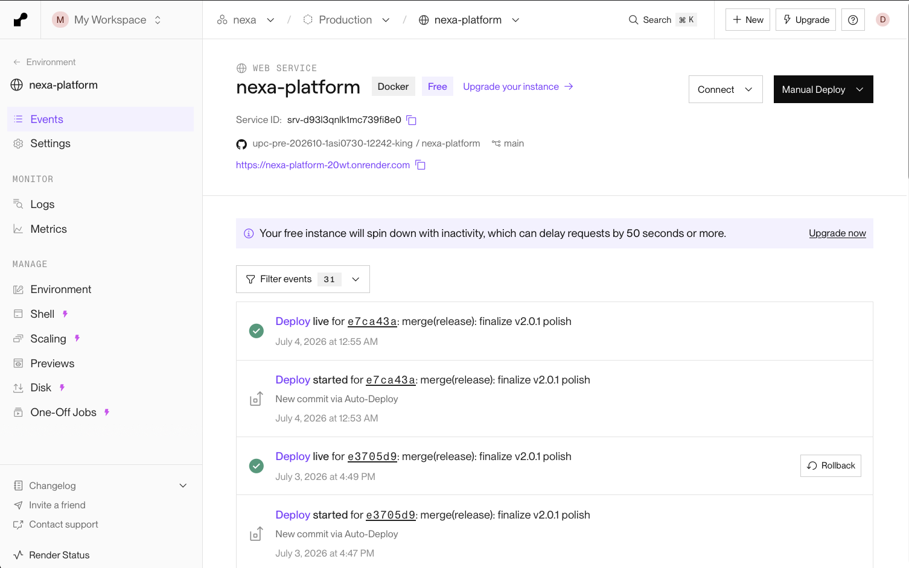

> *Nota*: La captura evidencia el servicio Render asociado a nexa-platform durante el cierre técnico TB2. Elaboración propia.

*Servicio PostgreSQL disponible en Render.*

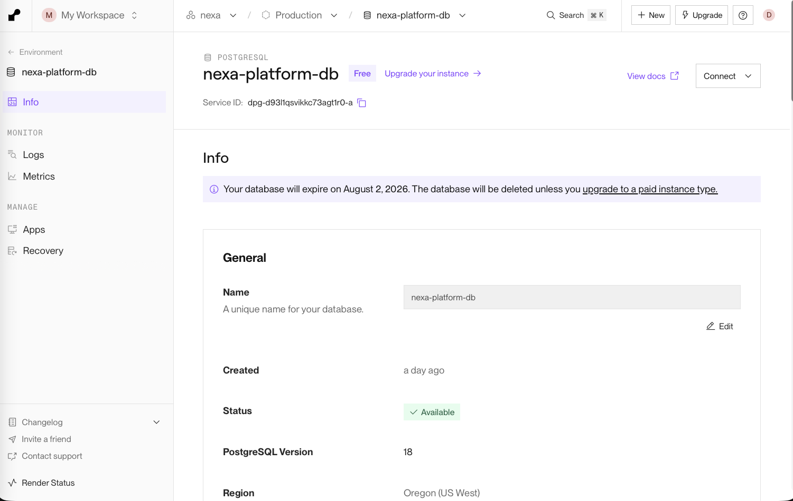

> *Nota*: La captura evidencia la disponibilidad del servicio PostgreSQL usado por la Platform API, sin exponer credenciales ni cadenas de conexión. Elaboración propia.

*Variables de entorno enmascaradas de la Platform API.*

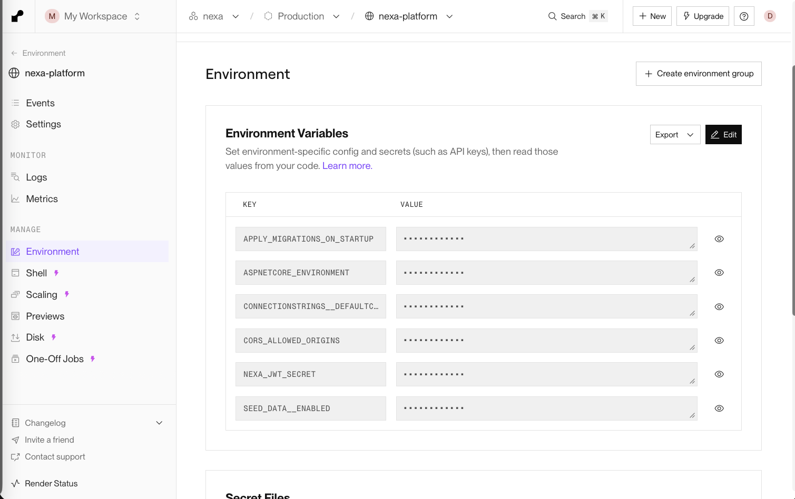

> *Nota*: La captura evidencia la configuración de variables de entorno en Render con valores ocultos, evitando exponer secretos o credenciales. Elaboración propia.

**GitHub Release `nexa-platform v2.0.1`**

La imagen documenta el release de cierre TB2 para la Platform API. Esta evidencia complementa el despliegue en Render al mostrar que el backend cuenta con tag, artefactos fuente y release notes asociados a la versión publicada.

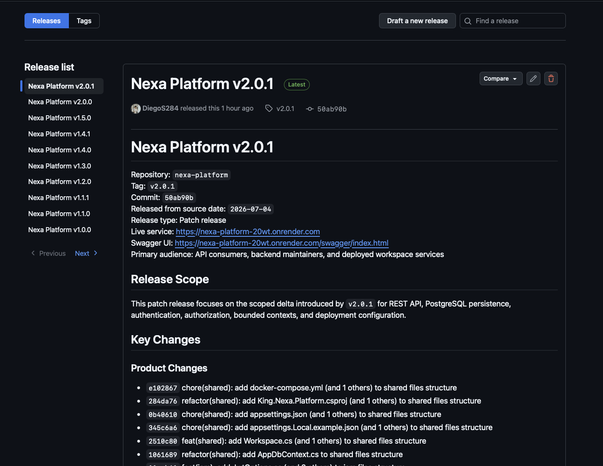

> *Nota*: La captura muestra el release `nexa-platform v2.0.1`, utilizado como evidencia de versionamiento del backend desplegado en Render. Elaboración propia.

**GitHub Release `nexa-webapp v3.0.1`**

La imagen documenta el release de cierre TB2 para la Web Application. Esta evidencia respalda que el frontend desplegado en Render está vinculado a una versión identificable y revisable desde GitHub.

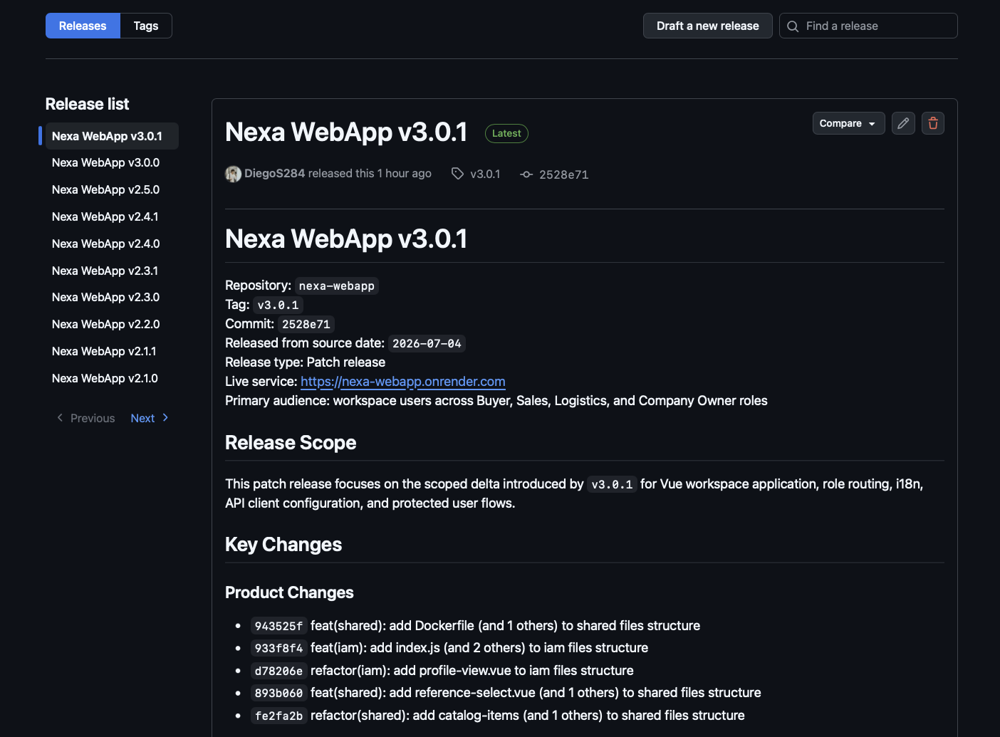

> *Nota*: La captura muestra el release `nexa-webapp v3.0.1`, utilizado como evidencia de versionamiento de la Web Application desplegada en Render. Elaboración propia.

**GitHub Release `nexa-website v4.0.1`**

La imagen documenta el release de cierre TB2 para la Landing Page. Esta evidencia sustenta que el sitio público cuenta con un tag de publicación y release notes asociados a la versión disponible para revisión académica.

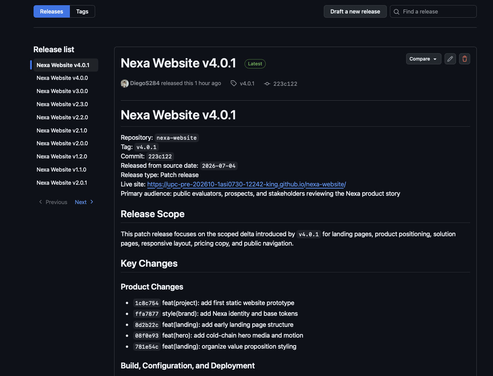

> *Nota*: La captura muestra el release `nexa-website v4.0.1`, utilizado como evidencia de versionamiento de la Landing Page publicada. Elaboración propia.

#### 5.2.4.8. Team Collaboration Insights during Sprint

La coordinación se organizó por bounded contexts y repositorios de producto. Los flujos observados incluyen `main`, `develop` donde fue detectada y `hotfix/v2.0.1-final-polish`; los releases resultantes son `v4.0.1`, `v3.0.1` y `v2.0.1`.

La separación por repositorios permitió que el cierre del Website, la WebApp y la Platform API conservara trazabilidad propia, a la vez que el equipo revisaba los puntos de integración entre navegación, contratos y persistencia. `main` representa la línea consolidada; `develop`, cuando aparece en la evidencia, reúne integración previa; y la rama de hotfix/polish identifica ajustes acotados realizados antes de los releases defendibles.

Los commits de `nexa-platform` se relacionan principalmente con contratos RESTful, persistencia y bounded contexts del backend; los de `nexa-webapp`, con los recorridos por rol y la calidad de interfaz; y los de `nexa-website`, con navegación pública, CTAs y despliegue. Esta correspondencia permite conectar la evidencia Git con los frentes de cierre y con la distribución de responsabilidades documentada para el sprint.

*Commits recientes de nexa-platform durante Sprint 4.*

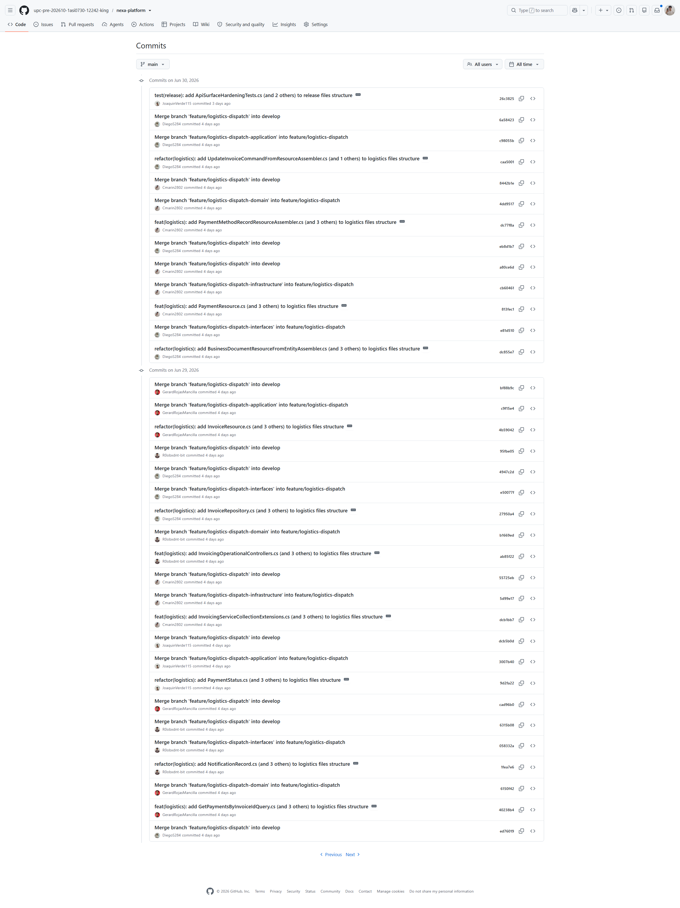

> *Nota*: La captura muestra commits recientes del repositorio `nexa-platform` usados como evidencia visual de colaboración y cierre técnico TB2. Elaboración propia.

*GitHub Insights de nexa-platform durante Sprint 4.*

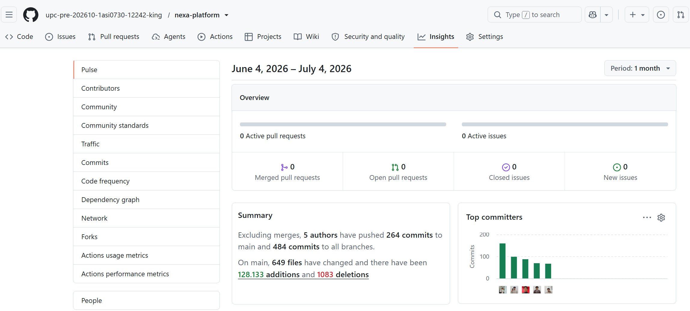

> *Nota*: La captura muestra el panel Pulse de GitHub Insights del repositorio `nexa-platform` para el periodo de cierre Sprint 4, evidenciando autores, commits y actividad del repositorio. Elaboración propia.

*Branches y tags de nexa-platform.*

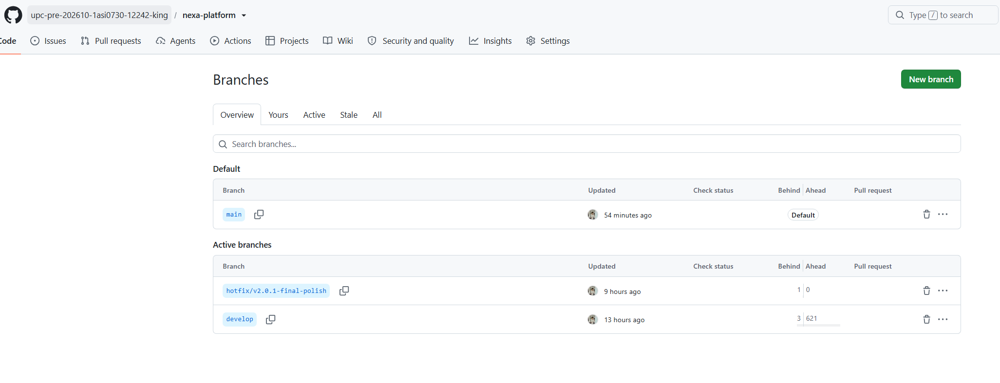

> *Nota*: La captura muestra ramas y tags del repositorio nexa-platform usados como evidencia de versionado del cierre TB2. Elaboración propia.

*Commits recientes de nexa-webapp durante Sprint 4.*

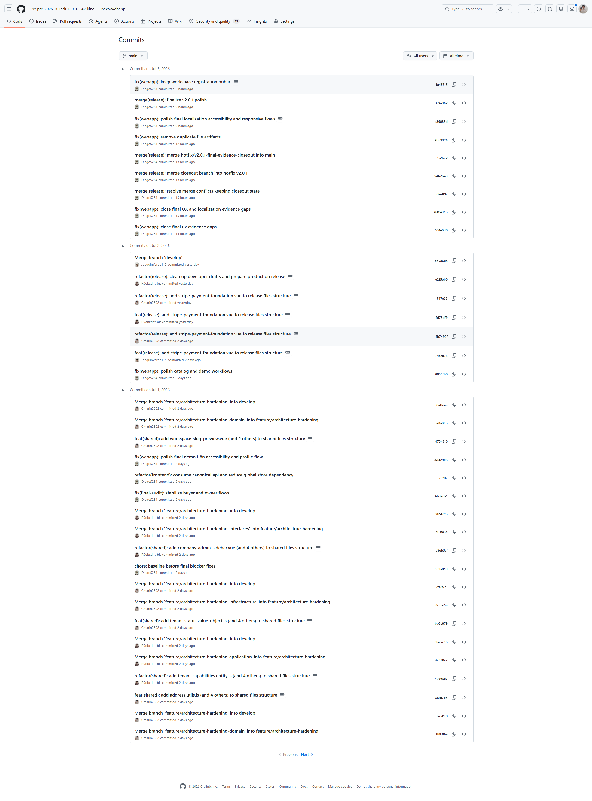

> *Nota*: La captura muestra commits recientes del repositorio `nexa-webapp` usados como evidencia visual de colaboración y cierre técnico TB2. Elaboración propia.

*GitHub Insights de nexa-webapp durante Sprint 4.*

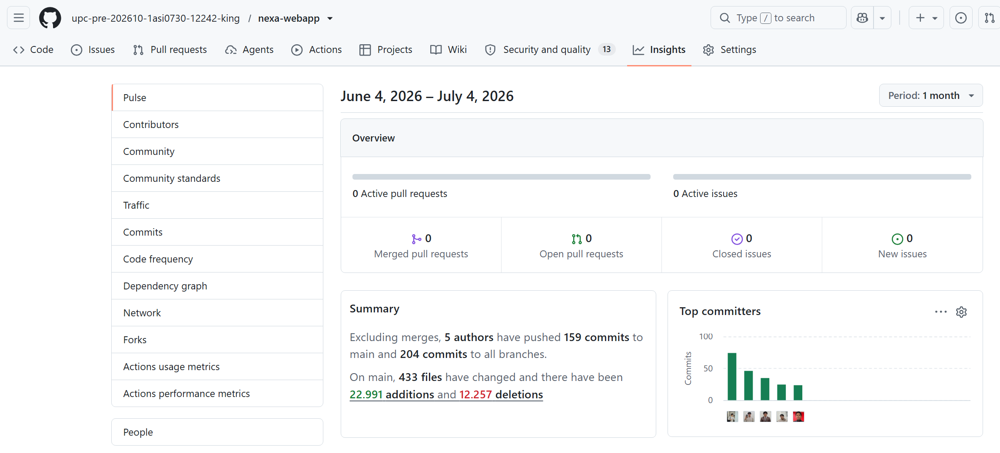

> *Nota*: La captura muestra el panel Pulse de GitHub Insights del repositorio `nexa-webapp` para el periodo de cierre Sprint 4, evidenciando autores, commits y actividad del repositorio. Elaboración propia.

*Branches y tags de nexa-webapp.*

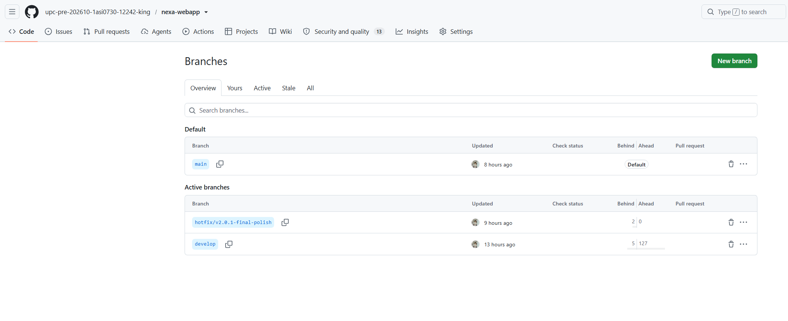

> *Nota*: La captura muestra ramas y tags del repositorio nexa-webapp usados como evidencia de versionado del cierre TB2. Elaboración propia.

*Commits recientes de nexa-website durante Sprint 4.*

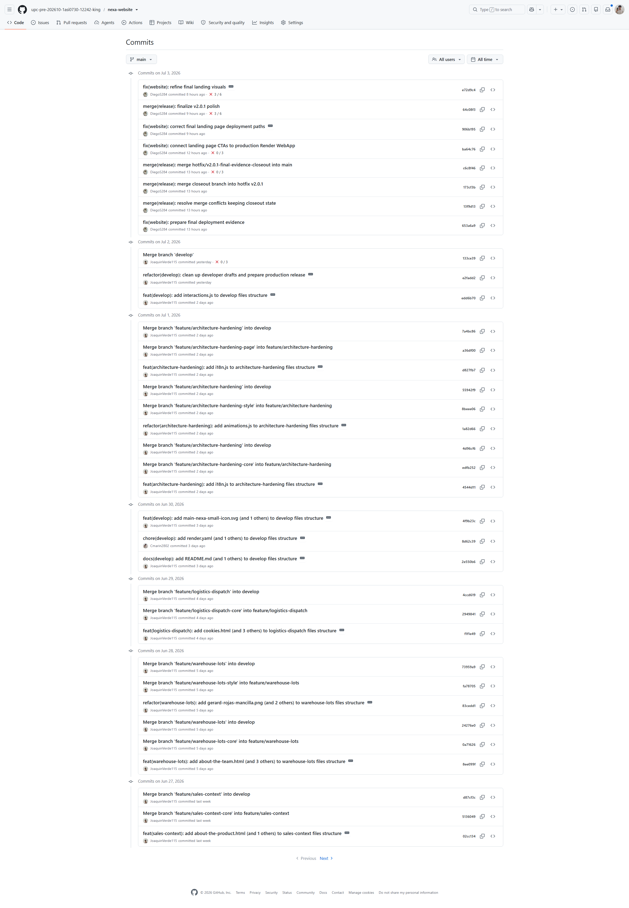

> *Nota*: La captura muestra commits recientes del repositorio `nexa-website` usados como evidencia visual de colaboración y cierre técnico TB2. Elaboración propia.

*GitHub Insights de nexa-website durante Sprint 4.*

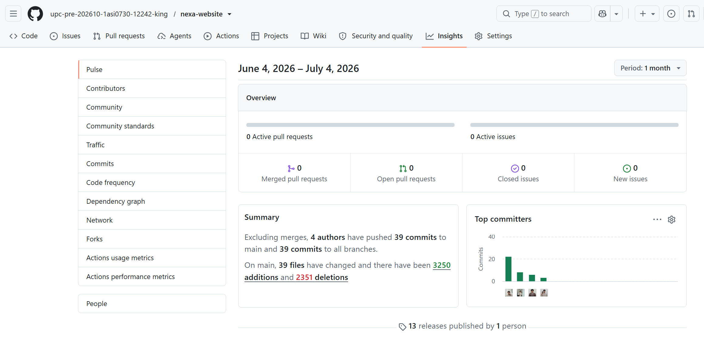

> *Nota*: La captura muestra el panel Pulse de GitHub Insights del repositorio `nexa-website` para el periodo de cierre Sprint 4, evidenciando autores, commits y actividad del repositorio. Elaboración propia.

*Branches y tags de nexa-website.*

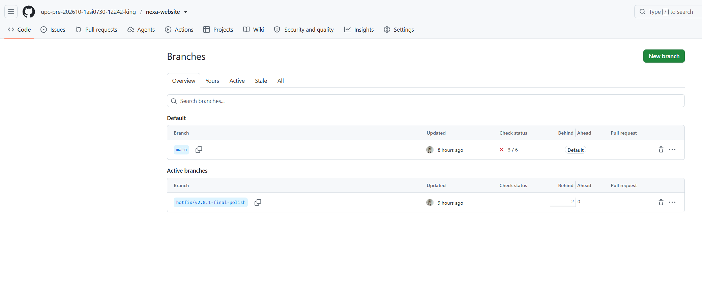

> *Nota*: La captura muestra ramas y tags del repositorio nexa-website usados como evidencia de versionado del cierre TB2. Elaboración propia.

Las capturas de commits, GitHub Insights, branches y tags consolidan la evidencia visual de colaboración durante Sprint 4. Las tablas de commits permanecen documentadas en la sección 5.2.4.4 y los releases finales se documentan en la sección 5.2.4.7, evitando duplicar información y manteniendo la trazabilidad por tipo de evidencia.
