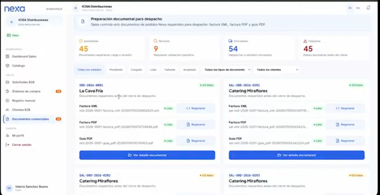
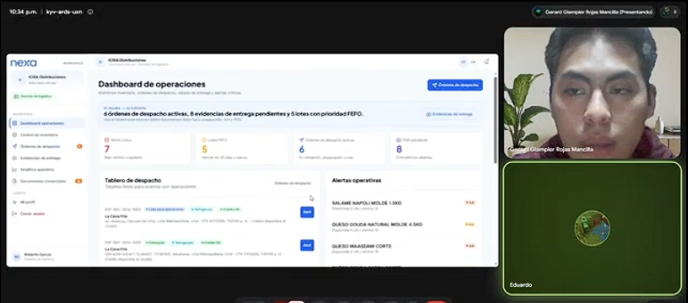
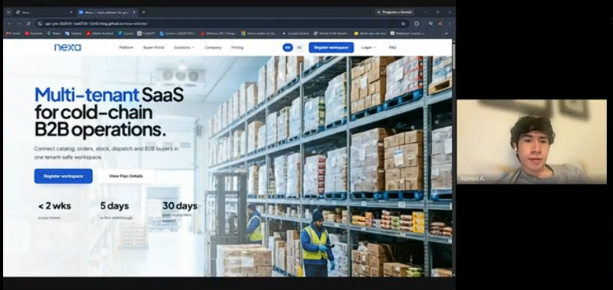
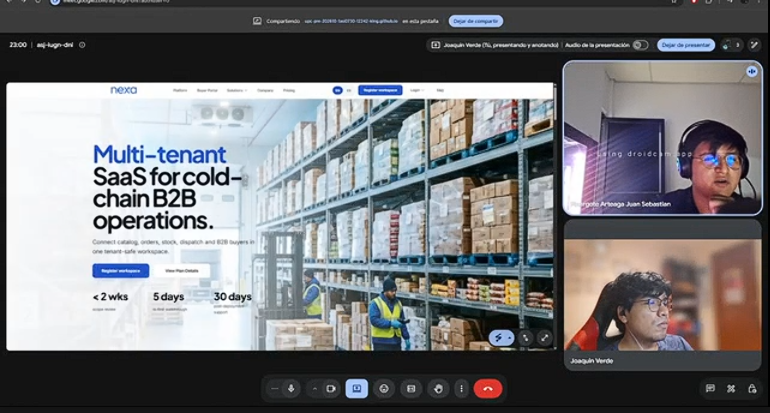
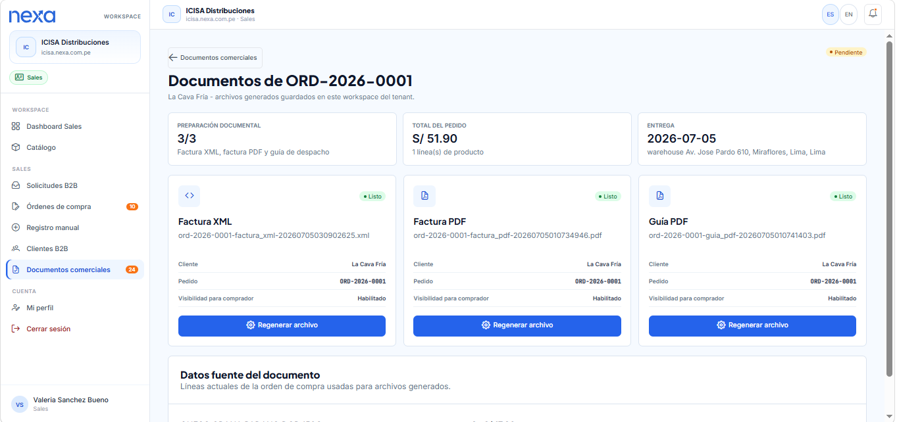
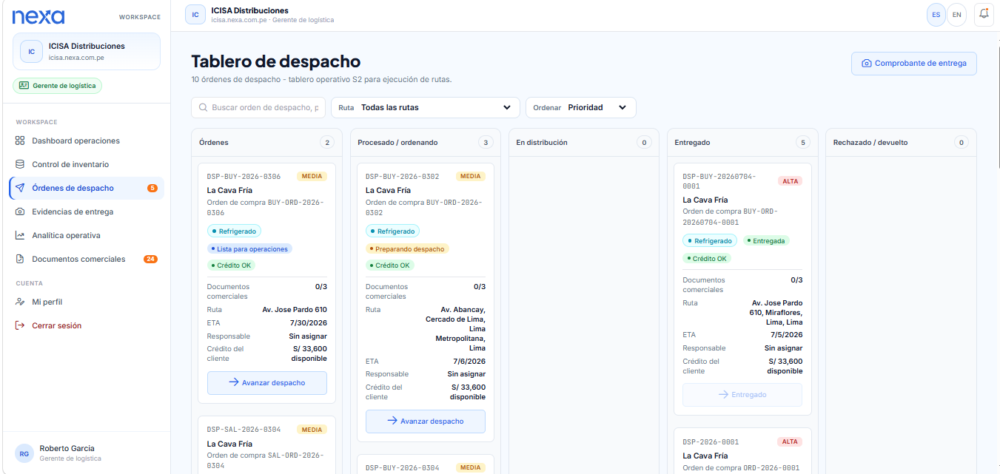
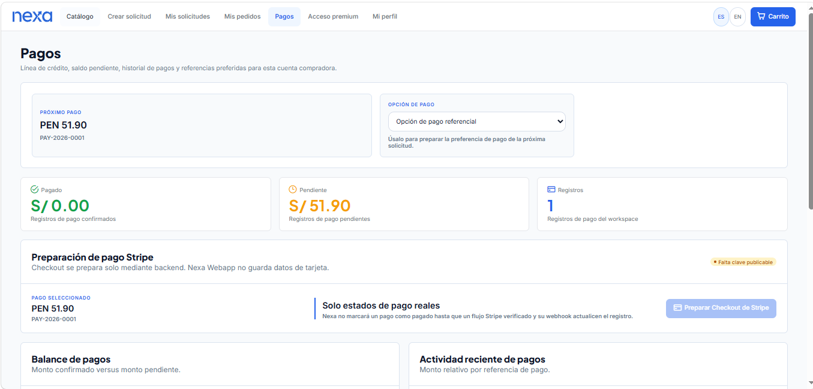
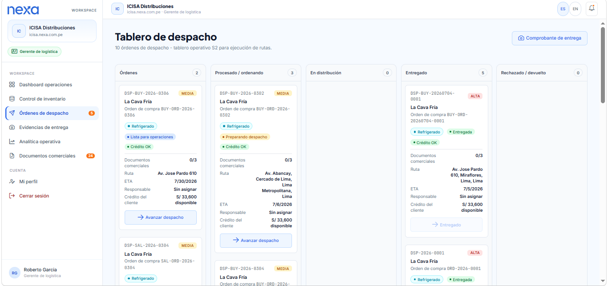

## 5.3. Validation Interviews

Las Validation Interviews de TB2 tienen como propósito comprobar si los participantes de los segmentos formales de Nexa comprenden la propuesta de valor, encuentran las funciones relevantes y pueden recorrer las tareas principales sin asistencia innecesaria. El diseño considera **Segmento 1 — Commercial Coordination**, **Segmento 2 — Operations / Account Owner** y **Segmento 3 — B2B Buyer Portal**.

Cada sesión combina la Landing Page con las vistas de WebApp pertinentes para el segmento. La observación se organiza desde tres dimensiones: **Usability**, **Information Architecture** e **Inclusive Design**.

Los resultados solo se incorporarán cuando exista evidencia real de la sesión: grabación, screenshot, timing, duración, conducta observada y resumen verificable. Las capacidades referenciales se explicarán con ese alcance. En particular, documentos, pagos, mapas, temperatura, POD y seguimiento por estados no se presentarán como integraciones externas o automatizaciones comprobadas cuando el equipo no haya validado previamente su funcionamiento extremo a extremo.

### 5.3.1. Diseño de Entrevistas

#### Protocolo general de sesión

1. **Presentación.** Presentar al equipo y explicar que se evalúa el producto, no el desempeño del participante.
2. **Consentimiento.** Solicitar autorización expresa para grabar pantalla, voz e imagen y para usar la evidencia con fines académicos.
3. **Datos del participante.** Registrar nombres y apellidos, edad, distrito, actividad relacionada y segmento 1, 2 o 3.
4. **Contexto neutral.** Describir Nexa brevemente sin indicar dónde están los controles ni adelantar la respuesta esperada.
5. **Pensar en voz alta.** Pedir al participante que verbalice qué espera, qué entiende, qué busca y qué le genera dudas.
6. **Ejecución de tareas.** Leer una tarea a la vez. Evitar guiar; si se brinda ayuda, registrar qué ayuda fue necesaria y en qué timing.
7. **Preguntas finales.** Conversar sobre utilidad percibida, mayor fricción, información faltante, confianza, claridad y accesibilidad.
8. **Cierre.** Agradecer, confirmar el uso de la evidencia y explicar que los comentarios se analizarán junto con las demás sesiones.

Antes de grabar, el equipo debe ensayar cada recorrido con credenciales y datos desechables. Un botón de edición, guardado, creación, desactivación o revisión de plan solo se utilizará como acción si el equipo confirmó previamente su persistencia. En caso contrario, se mostrará como opción visible y se preguntará por su comprensión o ubicación.

#### Marco heurístico de observación

| Dimensión | Qué debe observar el entrevistador |
|---|---|
| Usability | Comprensión del estado, facilidad para completar la tarea, prevención y recuperación de errores, control al retroceder y esfuerzo requerido. |
| Information Architecture | Claridad de nombres, jerarquía, agrupación, navegación entre Website y WebApp, encontrabilidad y relación entre solicitudes, órdenes, despachos y documentos. |
| Inclusive Design | Legibilidad, contraste, foco y navegación por teclado cuando corresponda, lenguaje comprensible, adaptación a distintos niveles de experiencia y ausencia de dependencia exclusiva del color. |

Las heurísticas de Nielsen complementan estas dimensiones:

| N.º | Heurística | Aplicación durante la entrevista |
|---:|---|---|
| 1 | Visibilidad del estado del sistema | Observar si el participante reconoce estados, pasos, confirmaciones y próximos eventos. |
| 2 | Correspondencia entre el sistema y el mundo real | Revisar si términos comerciales y operativos coinciden con su lenguaje cotidiano. |
| 3 | Control y libertad del usuario | Observar si puede volver, revisar o abandonar una acción sin temor a perder el avance. |
| 4 | Consistencia y estándares | Comparar nombres, botones, estados y patrones entre pantallas. |
| 5 | Prevención de errores | Revisar si la interfaz ayuda a evitar envíos o decisiones equivocadas. |
| 6 | Reconocimiento antes que recuerdo | Observar si los datos necesarios permanecen visibles durante la tarea. |
| 7 | Flexibilidad y eficiencia de uso | Evaluar si el recorrido sirve tanto a usuarios frecuentes como a personas nuevas. |
| 8 | Diseño estético y minimalista | Identificar sobrecarga, distracciones o falta de jerarquía. |
| 9 | Reconocer, diagnosticar y recuperarse de errores | Observar si los mensajes explican qué ocurrió y cómo continuar. |
| 10 | Ayuda y documentación | Identificar cuándo el participante necesita orientación adicional. |

#### Diseño de entrevista Segmento 1: Commercial Coordination

**Objetivo de la sesión.** Validar si una persona vinculada a coordinación comercial comprende la propuesta de Nexa y puede reconocer el recorrido desde una solicitud B2B hasta su revisión, formalización y consulta documental.

**Escenario para leer al participante.**

> Imagina que coordinas ventas B2B de productos refrigerados. Necesitas revisar solicitudes de clientes, comprobar la información comercial, registrar pedidos recibidos por otros canales y consultar las órdenes resultantes. Mientras navegas, cuéntanos qué entiendes, qué esperas encontrar y qué te genera dudas.

**Flujo de pantallas.**

| Pantalla o módulo | Qué se muestra | Qué debe decir el entrevistador | Tarea del participante | Pregunta sugerida | Heurística o dimensión observada | Alcance real / advertencia |
|---|---|---|---|---|---|---|
| Website / Landing Page | Propuesta de valor, soluciones, precios, FAQ, confianza y accesos. | “Revisa esta página como si estuvieras evaluando Nexa para tu equipo comercial.” | Explicar qué ofrece Nexa y localizar el acceso a la aplicación. | ¿Qué información te ayuda a decidir si continuar? | IA, correspondencia con el mundo real, reconocimiento. | El contacto abre el cliente de correo; no se presenta como envío a un CRM. |
| Login Sales | Workspace, correo y contraseña. | “Ingresa con la cuenta de prueba de Sales.” | Acceder al entorno comercial. | ¿Se entiende qué datos solicita el acceso? | Usability, prevención de errores. | Usar credenciales comprobadas antes de grabar. |
| Sales Dashboard | Resumen de solicitudes, órdenes y documentos pendientes. | “Esta pantalla resume la carga comercial: solicitudes, órdenes y documentos pendientes.” | Identificar qué elemento atendería primero. | ¿Qué indicador te ayuda a priorizar? | Visibilidad del estado, IA. | Mostrar solo datos disponibles en la cuenta de prueba. |
| Purchase Requests | Bandeja de solicitudes enviadas por compradores. | “Aquí Sales revisa solicitudes antes de convertirlas en órdenes.” | Encontrar una solicitud que requiera revisión. | ¿Qué filtros o datos usarías para elegirla? | Eficiencia, reconocimiento, IA. | No afirmar validaciones externas automáticas. |
| Quick View o detalle | Cliente, productos, crédito, disponibilidad, observaciones y acciones comerciales. | “Revisa la información disponible antes de tomar una decisión comercial.” | Explicar qué comprobaría y qué acción esperaría realizar. | ¿Qué dato te falta para aceptar, observar o rechazar? | Prevención de errores, correspondencia. | Ejecutar una transición solo si fue ensayada con datos desechables. |
| Purchase Orders | Listado, detalle y timeline registrado de órdenes. | “Aquí se consultan las órdenes generadas y sus estados registrados.” | Abrir una orden y ubicar su estado. | ¿Se distingue una solicitud de una orden? | Visibilidad, consistencia, IA. | Hablar de estados registrados, no de actualización continua externa. |
| Manual Order Entry — cliente | Selección de cuenta B2B. | “Este flujo registra una orden cuando el pedido no nace directamente en el portal.” | Seleccionar un cliente de prueba. | ¿Qué información necesitarías para confirmar que elegiste al cliente correcto? | Prevención de errores, reconocimiento. | No guardar si el flujo completo no fue probado. |
| Manual Order Entry — productos | Catálogo, cantidades y resumen parcial. | “Selecciona los productos solicitados por el cliente.” | Agregar productos y ajustar cantidades. | ¿Cómo comprobarías disponibilidad y presentación? | Control, eficiencia, consistencia. | La carga del catálogo debe validarse antes de incluir esta tarea. |
| Manual Order Entry — delivery | Datos de entrega, prioridad y observaciones. | “Registra la información necesaria para coordinar la entrega.” | Revisar qué datos serían obligatorios. | ¿Qué dato no debería faltar para evitar una coordinación posterior? | Prevención, lenguaje del negocio. | No prometer cálculo de ruta ni coordinación automática. |
| Manual Order Entry — revisión | Cliente, productos, entrega y confirmación. | “Revisa el pedido antes de confirmar.” | Detectar un posible error o confirmar que los datos son suficientes. | ¿Qué cambiarías en este resumen? | Prevención de errores, control. | Confirmar solo si se preparó un registro desechable. |
| B2B Clients | Cuentas, datos comerciales y perfil financiero. | “Esta vista reúne la información comercial de los clientes.” | Localizar un cliente y reconocer su estado. | ¿Qué dato usarías antes de aprobar una venta a crédito? | IA, correspondencia, reconocimiento. | No presentar el crédito como consulta a una entidad externa. |
| Promotions | Campañas, productos asociados, vigencia y estado. | “Aquí se preparan promociones visibles dentro de la operación comercial.” | Identificar cómo crearía o pausaría una promoción. | ¿Qué información necesitarías antes de activarla? | Prevención, visibilidad, IA. | Editar o activar solo si la acción fue probada manualmente. |
| Business Documents | Cola de documentos requeridos y estado de cada registro. | “Esta vista centraliza documentos comerciales requeridos por el proceso.” | Encontrar los documentos de una orden. | ¿Se entiende qué documento falta y qué acción sigue? | Visibilidad, IA, ayuda. | Son documentos comerciales o referenciales; no presentarlos como facturación tributaria oficial. |

**Tareas guiadas.**

1. Comprender la propuesta de valor y entrar a la WebApp.
2. Identificar una solicitud comercial que requiera atención.
3. Explicar qué información revisaría antes de formalizarla.
4. Abrir una orden y diferenciarla de la solicitud original.
5. Recorrer Manual Order Entry hasta la revisión, sin confirmar si el guardado no fue validado.
6. Localizar un cliente, una promoción y los documentos de una orden.

**Preguntas conversacionales.**

1. ¿Qué parte del flujo representa mejor tu trabajo comercial actual?
2. ¿Qué información necesitarías ver antes de aceptar una solicitud?
3. ¿Se entiende la diferencia entre solicitud y orden?
4. ¿Dónde esperarías registrar un pedido recibido por llamada o WhatsApp?
5. ¿Cómo comprobarías el estado de una orden o de sus documentos?
6. ¿Qué nombre, dato o navegación cambiarías para trabajar con menos errores?

**Qué debe observar el entrevistador.** Ruta elegida, prioridad asignada, dudas terminológicas, diferencia solicitud/orden, dependencia de ayuda, errores detectados en la revisión, encontrabilidad de clientes/documentos, foco y legibilidad.

**Riesgos de sobrepromesa.** No afirmar validación automática externa de RUC o crédito, envío integrado de correo, disponibilidad garantizada, documentos tributarios oficiales ni integraciones externas no comprobadas.

#### Diseño de entrevista Segmento 2: Operations / Account Owner

S2 es un único segmento formal. Para cubrir responsabilidades distintas, cada participante seguirá la variante más cercana a su experiencia: **S2-A — Account Owner / Tenant Management** o **S2-B — Logistics / Operations**. Las variantes no crean un cuarto segmento ni aumentan la meta de participantes: el total requerido sigue siendo de 3 a 5 entrevistas para S2.

**Objetivo de la sesión.** Validar si una persona responsable de la operación comprende la organización del workspace o puede reconocer inventario, lotes, despachos, evidencia y documentos necesarios para supervisar la operación.

**Escenario general para leer.**

> Imagina que eres responsable de la operación de una distribuidora. Dependiendo de tu experiencia, revisarás la configuración del workspace o el flujo de inventario y despacho. Cuéntanos qué información entiendes, qué buscarías primero y qué necesitarías para tomar una decisión.

##### Variante S2-A: Account Owner / Tenant Management

Estas pantallas se evalúan principalmente por comprensión, visibilidad y arquitectura de información. No se solicitará editar ni guardar Company Administration, Workspaces, Teammates, Rules, Custom Fields, Billing o Preferences salvo que el equipo haya probado manualmente la persistencia con datos desechables.

| Pantalla o módulo | Qué se muestra | Qué debe decir el entrevistador | Tarea del participante | Pregunta sugerida | Heurística o dimensión observada | Alcance real / advertencia |
|---|---|---|---|---|---|---|
| Website / Landing Page | Propuesta, operación, pricing, FAQ y registro. | “Revisa Nexa como responsable de una organización.” | Explicar el beneficio y localizar el registro o acceso. | ¿Qué necesitarías saber antes de registrar la empresa? | IA, confianza, correspondencia. | No afirmar que el contacto activa servicios automáticamente. |
| Registro de organización | Wizard de empresa, operación, ubicación, administrador y workspace. | “Este asistente reúne la información inicial de la organización.” | Recorrer los pasos y explicar qué dato espera en cada uno. | ¿El orden de los pasos coincide con cómo iniciarías la operación? | IA, prevención, carga cognitiva. | Enviar solo si se prepararon RUC, correo y slug desechables. |
| Login Company Owner | Acceso al workspace. | “Ingresa con la cuenta de prueba de Company Owner.” | Acceder al resumen administrativo. | ¿Se entiende la relación entre workspace y cuenta? | Usability, lenguaje. | Company Owner permanece dentro de S2. |
| Company Administration / Overview | Identidad del tenant, plan y conexión con áreas operativas. | “Esta pantalla resume la identidad del tenant, el plan y las áreas operativas.” | Explicar qué información supervisaría primero. | ¿Qué dato te permite saber si el workspace está listo? | Visibilidad, IA. | Mostrar en lectura; la carga completa debe verificarse antes. |
| Workspaces | Información y configuración principal del workspace. | “Aquí se visualiza el workspace asociado a la organización.” | Encontrar nombre, slug, estado o acceso. | ¿La diferencia entre organización y workspace es clara? | Correspondencia, IA. | Opción demostrativa; no pedir Create/Edit/Save. |
| Teammates | Usuarios, roles y acceso del equipo. | “Esta vista muestra roles y usuarios asociados al workspace.” | Identificar quién tiene un rol determinado. | ¿Qué información necesitarías antes de invitar o desactivar a alguien? | Reconocimiento, seguridad percibida. | No pedir Register company member, Add, Edit o Deactivate. |
| Company Rules | Reglas operativas visibles. | “Esta pantalla comunica reglas que afectan inventario, despacho y documentos.” | Encontrar una regla y explicar su efecto esperado. | ¿El nombre de la regla permite anticipar su impacto? | IA, correspondencia. | Solo visual; no guardar cambios. |
| Custom Fields | Campos configurables por recurso. | “Aquí se muestran campos que la organización podría usar en su operación.” | Identificar dónde aplicaría un campo. | ¿Se entiende a qué registro afectaría? | IA, reconocimiento. | Solo visual; no pedir Add custom field ni edición. |
| Billing | Plan, uso y opciones de revisión. | “Esta vista muestra la configuración referencial del plan.” | Identificar plan y consumo visible. | ¿Qué información esperarías antes de solicitar una revisión? | Visibilidad, confianza. | No representa suscripción ni cobro ejecutado; no usar Request plan review. |
| Preferences | Preferencias operativas visibles. | “Aquí se visualizan preferencias del workspace.” | Explicar qué opción esperaría encontrar. | ¿Cómo agruparías estas preferencias? | IA, consistencia. | Si hay Edit/Save, mostrarlo únicamente como opción. |

**Tareas guiadas S2-A.** Comprender la propuesta; recorrer el onboarding sin enviar cuando no esté preparado; acceder como Owner; localizar identidad/plan/workspace; encontrar dónde se consultan equipo, reglas, campos y preferencias; explicar qué esperaría poder administrar.

**Preguntas S2-A.** ¿Organización y workspace se distinguen? ¿Qué configuración revisarías primero? ¿Los nombres de las secciones coinciden con tu lenguaje? ¿Qué permisos esperarías ver antes de administrar miembros? ¿Qué información falta para confiar en Billing o Preferences?

**Observación S2-A.** Jerarquía Overview/Workspaces/Teammates, comprensión de tenant, expectativas de persistencia, señales de seguridad, legibilidad y dependencia de ayuda. Toda expectativa de edición debe anotarse sin ejecutar guardados no comprobados.

##### Variante S2-B: Logistics / Operations

| Pantalla o módulo | Qué se muestra | Qué debe decir el entrevistador | Tarea del participante | Pregunta sugerida | Heurística o dimensión observada | Alcance real / advertencia |
|---|---|---|---|---|---|---|
| Login Logistics Manager | Acceso al workspace operativo. | “Ingresa con la cuenta de prueba de Logistics.” | Acceder al panel operativo. | ¿Queda claro a qué workspace ingresas? | Usability, prevención. | Usar credenciales comprobadas. |
| Operations Dashboard | Carga operativa, despachos activos y evidencia pendiente. | “Esta pantalla resume carga operativa, despachos activos y pendientes de evidencia.” | Identificar la prioridad del turno. | ¿Qué atenderías primero y por qué? | Visibilidad, IA, reconocimiento. | Los indicadores derivan de registros disponibles. |
| Inventory Control — Overview | Stock, disponibilidad y alertas visibles. | “Aquí Logistics revisa stock y disponibilidad.” | Encontrar un producto con riesgo o baja disponibilidad. | ¿Qué dato usarías para decidir una acción? | Reconocimiento, prevención. | No afirmar actualización automática externa. |
| Inventory Control — By lot | Lotes, vencimiento y organización FEFO. | “Esta vista permite revisar lotes y riesgos FEFO.” | Elegir el lote que revisaría primero y explicar por qué. | ¿La prioridad por vencimiento se entiende? | Correspondencia, IA, prevención. | FEFO es criterio visible de lectura, no automatización total. |
| Dispatch Orders | Tablero de despachos por estado operativo. | “Este tablero organiza órdenes de despacho por estado.” | Encontrar un despacho pendiente y abrirlo. | ¿Las columnas permiten reconocer qué sigue? | Visibilidad, consistencia. | Cambiar estado solo si se ensayó con un despacho desechable. |
| Dispatch Order Detail | Productos, documentos, ruta referencial y estado. | “Esta vista concentra la información necesaria para coordinar el despacho.” | Identificar productos, entrega y próximo paso. | ¿Qué información faltaría antes de iniciar ruta? | IA, prevención, reconocimiento. | Hablar de estado registrado y ruta referencial. |
| Proof of Delivery | Datos del receptor y referencias de evidencia. | “Aquí se registra o consulta evidencia de entrega.” | Explicar qué evidencia exigiría para cerrar el despacho. | ¿Qué dato te daría confianza para marcar la entrega? | Prevención, correspondencia. | POD referencial; no afirmar firma biométrica ni archivo cargado sin prueba. |
| Operational Analytics | Indicadores derivados de registros operativos. | “Esta pantalla resume indicadores de los despachos disponibles.” | Identificar una métrica útil para supervisión. | ¿Qué decisión tomarías con este indicador? | IA, visibilidad. | No presentarlo como plataforma externa de BI. |
| Business Documents | Documentos necesarios para el cierre operativo. | “Aquí se revisan los documentos asociados a la operación.” | Encontrar el estado documental de una orden. | ¿Se entiende qué falta para cerrar el proceso? | Visibilidad, ayuda, IA. | Documentos referenciales; no afirmar validez tributaria externa. |

**Tareas guiadas S2-B.** Priorizar una alerta; revisar stock y un lote; abrir un despacho; reconocer su próximo estado; identificar evidencia requerida; localizar un indicador y documentos asociados.

**Preguntas S2-B.** ¿Stock, lote y FEFO son comprensibles? ¿Qué necesitas antes de despachar? ¿Las columnas del tablero representan tu proceso? ¿Qué diferencia percibes entre estado de entrega y evidencia POD? ¿Qué indicador o documento falta?

**Observación S2-B.** Comprensión de estados, selección FEFO, dependencia del color, lectura de tablas, control ante cambios, información faltante y expectativas sobre temperatura o ruta.

**Riesgos de sobrepromesa de S2.** No afirmar persistencia administrativa completa, suscripciones o cobros ejecutados, automatización FEFO total, telemetría automática, ubicación GPS, firma biométrica, carga real de evidencia ni documentos tributarios oficiales. Los registros de temperatura, incidencias y POD se presentan según lo visible y previamente probado.

#### Diseño de entrevista Segmento 3: B2B Buyer Portal

**Objetivo de la sesión.** Validar si un comprador comprende el catálogo, puede preparar una solicitud, distingue solicitud de orden y encuentra el seguimiento, documentos y datos administrativos disponibles.

**Escenario para leer al participante.**

> Imagina que compras productos refrigerados para tu negocio. Necesitas revisar productos, preparar una solicitud, conocer la respuesta comercial y organizar la recepción. Mientras navegas, cuéntanos qué entiendes y qué esperarías que ocurra después de cada acción.

| Pantalla o módulo | Qué se muestra | Qué debe decir el entrevistador | Tarea del participante | Pregunta sugerida | Heurística o dimensión observada | Alcance real / advertencia |
|---|---|---|---|---|---|---|
| Website / Buyer Portal page | Beneficios, alcance y CTA del portal. | “Revisa esta información como comprador de una empresa.” | Explicar el beneficio y localizar el acceso. | ¿Qué te daría confianza para entrar al portal? | IA, correspondencia, confianza. | Confirmar que el CTA apunte a la WebApp final. |
| Login B2B Buyer | Workspace y credenciales. | “Ingresa con la cuenta de comprador de prueba.” | Acceder al portal. | ¿Se entiende por qué se solicita el workspace? | Usability, prevención. | La cuenta debe estar vinculada a un Client Account. |
| Buyer Home | Solicitudes, órdenes, crédito disponible y próximos pasos. | “Esta pantalla resume la actividad y próximos pasos del comprador.” | Elegir por dónde iniciaría una compra. | ¿Qué tarjeta o acceso resulta más útil? | Visibilidad, IA. | Crédito y saldos son registros del sistema. |
| Product Catalog | Productos autorizados, filtros y disponibilidad visible. | “Aquí el comprador revisa productos disponibles para su cuenta.” | Buscar un producto adecuado. | ¿Los filtros y datos ayudan a decidir? | Eficiencia, reconocimiento. | Incluir solo si la carga del catálogo fue validada antes de grabar. |
| Product Detail | Precio referencial, stock, temperatura, almacén y características. | “Revisa la información del producto antes de agregarlo.” | Decidir si lo agregaría y explicar por qué. | ¿Qué dato falta para tomar la decisión? | Correspondencia, reconocimiento. | Precio y disponibilidad visibles no constituyen garantía comercial. |
| Request Builder — Buyer | Cuenta compradora y contexto de solicitud. | “Este flujo prepara una solicitud que luego revisará Sales.” | Verificar que la cuenta sea la correcta. | ¿Queda claro quién solicita y quién revisa? | Visibilidad, correspondencia. | No llamar pedido confirmado a una solicitud. |
| Request Builder — Products | Productos, cantidades y borrador. | “Ajusta los productos que deseas solicitar.” | Agregar o modificar cantidades. | ¿Cómo detectarías una cantidad equivocada? | Control, prevención. | El carrito usa borrador local; debe probarse su conservación. |
| Request Builder — Delivery | Dirección, fecha, observaciones, preferencia y mapa. | “Registra la entrega y revisa la vista referencial de ruta.” | Completar o revisar datos de entrega. | ¿Qué información necesitas para coordinar la recepción? | IA, prevención, Inclusive Design. | El mapa es una vista referencial; no representa seguimiento de ubicación. |
| Request Builder — Confirm | Productos, entrega, crédito y total antes de enviar. | “Revisa toda la solicitud antes de enviarla.” | Detectar un error y decidir si enviaría. | ¿El resumen evita errores antes del envío? | Prevención, reconocimiento. | Enviar solo con datos desechables y flujo ensayado. |
| Retorno al catálogo | Navegación desde el trámite hacia productos. | “Necesitas agregar otro producto antes de enviar.” | Volver al catálogo y comprobar si conserva el avance. | ¿Encontraste fácilmente cómo volver? | Control y libertad, IA. | Tarea obligatoria para revalidar el hallazgo de Alonso. |
| My Requests | Solicitudes enviadas y estado comercial. | “Aquí se consultan las solicitudes y su revisión comercial.” | Abrir una solicitud y explicar su estado. | ¿Qué diferencia hay entre enviada, observada y aceptada? | Visibilidad, lenguaje. | Estados registrados, no notificaciones externas garantizadas. |
| Request Detail | Productos, entrega, mensajes y observaciones. | “Revisa el detalle y cualquier observación comercial.” | Identificar si debe responder o esperar. | ¿Se entiende el próximo paso? | Ayuda, recuperación, IA. | Mensajería sujeta a datos y permisos de prueba. |
| My Orders | Órdenes históricas o confirmadas. | “Aquí se revisan las órdenes resultantes del proceso comercial.” | Encontrar una orden y abrirla. | ¿Se distingue de My Requests? | Consistencia, IA. | Usar una orden asociada al cliente de prueba. |
| Order Tracking / Detail | Timeline de estados, despacho y documentos visibles. | “Esta vista muestra el avance por estados y los registros disponibles.” | Explicar qué ocurrió y qué espera después. | ¿El seguimiento permite preparar la recepción? | Visibilidad, correspondencia. | Es seguimiento por estados; no ubicación GPS ni actualización continua garantizada. |
| Payments | Crédito, saldos, registros y métodos referenciales. | “Esta vista reúne información administrativa y métodos referenciales.” | Identificar saldo o método registrado. | ¿Qué dato necesitarías antes de coordinar un pago? | Confianza, IA, reconocimiento. | No ejecutar ni prometer una transacción monetaria. |
| Profile | Datos del comprador y su cuenta. | “Esta pantalla muestra los datos asociados a tu perfil.” | Localizar un dato y explicar qué esperaría editar. | ¿Qué información debería poder actualizarse? | IA, control, Inclusive Design. | Si aparece Edit/Save, solo mostrar la opción salvo persistencia probada. |

**Tareas guiadas.**

1. Comprender la propuesta y acceder al Buyer Portal.
2. Buscar un producto, revisar su detalle y agregarlo al borrador.
3. Revisar productos, delivery y confirmación de la solicitud.
4. Volver al catálogo para agregar otro producto y comprobar si el avance se conserva.
5. Enviar la solicitud únicamente si el equipo preparó datos desechables.
6. Consultar My Requests y diferenciar una solicitud de una orden.
7. Abrir una orden y explicar su seguimiento por estados.
8. Localizar información administrativa y de perfil sin guardar cambios no comprobados.

**Preguntas conversacionales.**

1. ¿Qué información del producto necesitas antes de agregarlo?
2. ¿El flujo deja claro que envías una solicitud para revisión comercial?
3. ¿Qué revisarías antes de confirmar?
4. ¿Cómo volverías a buscar otro producto sin perder el avance?
5. ¿Se entiende la diferencia entre My Requests y My Orders?
6. ¿El seguimiento por estados permite anticipar la recepción?
7. ¿Qué significan para ti crédito, saldo y método referencial en esta pantalla?
8. ¿Qué dato del perfil esperarías consultar o actualizar?

**Qué debe observar el entrevistador.** Encontrabilidad del catálogo, comprensión del precio y disponibilidad, ajuste de cantidades, lectura de pasos, retorno y conservación del borrador, diferencia solicitud/orden, interpretación del tracking, expectativas de pago, legibilidad y barreras de acceso.

**Riesgos de sobrepromesa.** No afirmar pago ejecutado, facturación tributaria oficial, ubicación GPS, tracking con actualización continua, notificaciones push, stock garantizado ni persistencia del perfil sin prueba previa.

### 5.3.2. Registro de Entrevistas

Para TB2 se deben realizar y documentar entre 3 y 5 entrevistas por cada segmento formal: Segmento 1, Segmento 2 y Segmento 3. Las variantes S2-A y S2-B se distribuyen dentro del total de S2 según el perfil de los participantes. No se crearán registros hasta contar con la sesión y su evidencia.

#### Antecedente de validación AV2 conservado

La entrevista de Alonso Alcántara se conserva como antecedente S3. No se contabiliza automáticamente como una entrevista TB2 nueva y su hallazgo debe revalidarse en la WebApp final.

| Código | Nombres y apellidos | Edad | Distrito | Segmento | Screenshot del video | URL Microsoft Stream | Timing de inicio | Duración | Fecha | Resumen verificable | Hallazgos vinculados |
|---|---|---:|---|---|---|---|---|---|---|---|---|
| VI-S3-01-AV2 | Alonso Alcántara Cerdán | 19 | San Isidro | 3 |  | https://cutt.ly/Lt5fHbn4 | 0:00 | 3:43 | No registrada en la evidencia actual | Se mostró la aplicación a un hijo de un importador en el distrito de San Isidro. | Dificultad para identificar un retorno directo al catálogo durante el trámite de solicitud sin perder el avance; antecedente a revalidar en TB2. |

> *Nota:* La captura y el enlace se mantienen como evidencia AV2. Antes del cierre TB2 debe verificarse que la URL continúe accesible y registrarse el timing exacto del hallazgo si puede recuperarse del video.

#### B. Registro de entrevistas (TB2)
Se realizaron entrevistas con usuarios de los segmentos definidos, documentando la evidencia de cada sesión. A continuación, se presentan los registros de las sesiones.

| Código | Nombres y apellidos | Edad | Distrito | Segmento | Screenshot del video| URL Microsoft Stream | Timing de inicio | Duración | Fecha | Resumen Verificable | Hallazgos Vinculados |
|:---|:---|:---:|:---|:---:|:---:|:---|:---:|:---:|:---:|:---|:---|
| VI-S1-01 | Enzo Pardo | 23 | Barranco | 1 |  | https://cutt.ly/2t6442k8 | 33:56 | 19:15 | 04/07/26 | Evaluación del dashboard de órdenes y herramientas administrativas con el Coordinador Comercial. | El sistema no permite generar ni descargar comprobantes (XML/PDF) y carece de filtros rápidos. |
| VI-S2-01 | Jessica Sandoval | 38 | San Isidro | 2 |  | https://cutt.ly/2t6442k8 | 0:00 | 21:59 | 03/07/26 | Evaluación de la gestión operativa de órdenes y facturación con la Jefa de Ventas y Logística. | Dificultad para gestionar eficientemente el listado de órdenes debido a la falta de herramientas de búsqueda. |
| VI-S2-02 | Jose Perez | 21 | Miraflores | 2 |  | https://cutt.ly/2t6442k8 | 1:09:41 | 24:19 | 05/07/26 | Sesión de validación del módulo de operaciones; flujo completado exitosamente. | Sesión de navegación exitosa; no se reportaron problemas críticos de usabilidad. |
| VI-S3-01 | Alonso Alcántara | 19 | San Isidro | 3 |  | https://cutt.ly/2t6442k8 | 21:59 | 11:37 | 05/07/26 | Validación del flujo de solicitud y navegación por el portal B2B para el comprador. | Las órdenes nuevas no cuentan con un distintivo visual ("New") que facilite su identificación rápida. |
| VI-S3-02 | Juan S. Artiaga | 20 | San Isidro | 3 |  | https://cutt.ly/2t6442k8 | 53:11 | 16:30 | 02/07/26 | Análisis del flujo de facturación y consulta de estados de cuenta con el usuario. | Falta de una vista informativa sobre el crédito disponible en la sección de facturación (billing). |

*Nota: Se han verificado los consentimientos de grabación para cada participante.*

### 5.3.3. Evaluaciones según heurísticas

# UX Heuristics & Principles Evaluation
**Usability – Inclusive Design – Information Architecture**

* **CARRERA:** Ingeniería de Software
* **CURSO:** Aplicaciones Web
* **SECCIÓN:** 12242
* **PROFESORES:** Angel Augusto Velasquez Nuñez
* **AUDITOR:** King
* **CLIENTE(S):** Juan Sebastian Artiaga, Jessica Sandoval, Enzo Pardo, Alonso Alcántara

---

## SITE o APP A EVALUAR:
**Nexa**

## TAREAS A EVALUAR:
El alcance de esta evaluación incluye la revisión de la usabilidad de las siguientes tareas, detectadas a través de entrevistas con los usuarios:

1. Generación y exportación de comprobantes.
2. Visualización y gestión del listado de órdenes.
3. Revisión del estado de cuenta y facturación.
4. Búsqueda y filtrado rápido de información (órdenes y documentos).
---

## TABLA RESUMEN:

| # | Problema | Escala de severidad | Heurística/Principio violada(o) |
|---|---|:---:|---|
| **1** | No es posible generar ni descargar documentos en formato XML o PDF para las guías y facturas. | 3 | Usabilidad: Relación entre el sistema y el mundo real |
| **2** | Las órdenes nuevas no cuentan con un distintivo visual ("New") en sus tarjetas (cards). | 2 | Usabilidad: Visibilidad del estado del sistema |
| **3** | No existe una vista que informe al usuario sobre su crédito disponible en la sección de facturación (billing). | 3 | Usabilidad: Reconocer antes que recordar |
| **4** | Ausencia de filtros rápidos en las secciones de órdenes de compra y generación de documentos. | 2 | Usabilidad: Flexibilidad y eficiencia en el uso |

---

## DESCRIPCIÓN DE PROBLEMAS:

### PROBLEMA #1: No es posible generar ni descargar documentos en formato XML o PDF para las guías y facturas
**Severidad:** 3

**Heurística violada:** Usabilidad - Relación entre el sistema y el mundo real

**Problema:**
Actualmente, el sistema no permite la generación ni exportación de documentos fundamentales para los usuarios, como las guías y facturas en formatos estándar (XML y PDF). Esto genera frustración y viola esta heurística, ya que la aplicación no está utilizando los conceptos y convenciones que resultan familiares para el usuario en su día a día administrativo y contable. 

**Recomendación:**
Implementar botones de acción claros en la vista de detalle de cada guía y factura que permitan generar y descargar automáticamente el documento en formato PDF (para visualización e impresión) y XML (para integración contable), respetando el orden lógico del mundo real.

### PROBLEMA #2: Las órdenes nuevas no cuentan con un distintivo visual ("New") en sus tarjetas (cards)
**Severidad:** 2

**Heurística violada:** Usabilidad - Visibilidad del estado del sistema

**Problema:**
Cuando se genera una orden nueva, la tarjeta (card) correspondiente que aparece en el listado no posee ningún anuncio o etiqueta que la destaque del resto. Al no informar al usuario sobre lo que está ocurriendo (el ingreso de un nuevo registro) de manera visible y rápida, se incrementa la carga cognitiva, obligándolo a leer fechas y detalles manualmente. 

**Recomendación:**
Incorporar un componente visual tipo "badge" o etiqueta con el texto "NEW" o "NUEVO" (utilizando un color de contraste que llame la atención) en la esquina de la tarjeta de las órdenes recién creadas para informar al usuario de inmediato.

### PROBLEMA #3: No existe una vista que informe al usuario sobre su crédito disponible en la sección de facturación (billing)
**Severidad:** 3

**Heurística violada:** Usabilidad - Reconocer antes que recordar / Visibilidad del estado del sistema

**Problema:**
Durante el análisis de las entrevistas a Juan Sebastian Artiaga y Jessica Sandoval, los usuarios indicaron que en la sección de facturación (billing) el sistema no les muestra cuánto crédito tienen. Esto obliga al usuario a tratar de recordar o calcular su saldo, sobrecargando su memoria y dificultando la toma de decisiones al momento de usar sus créditos. 

**Recomendación:**
Hacer visible esta información clave diseñando e integrando un panel o indicador dentro de la vista principal de billing que muestre de forma prominente el crédito total disponible del usuario, evitando que tenga que recordarlo.

### PROBLEMA #4: Ausencia de filtros rápidos en las secciones de órdenes de compra y generación de documentos
**Severidad:** 2

**Heurística violada:** Usabilidad - Flexibilidad y eficiencia en el uso

**Problema:**
De acuerdo con las entrevistas (como la de Enzo Pardo), el sistema carece de opciones de filtros rápidos en las vistas de órdenes de compra y generación de documentos. La falta de estos "atajos" obliga a los usuarios a navegar y buscar registros de manera manual y extensa, lo cual ralentiza su flujo de trabajo y hace que el uso de la aplicación sea ineficiente, especialmente para usuarios que manejan un alto volumen de información. 

**Recomendación:**
Implementar una barra de herramientas con filtros rápidos y avanzados (por ejemplo: búsqueda por fecha, estado de la orden, nombre del cliente, etc.) en la parte superior de los listados. Esto permitirá a los usuarios, tanto básicos como expertos, acceder a la información que necesitan de manera ágil y directa.

---

### 5.3.4. Hallazgos de validación incorporados en la versión final

El equipo King adoptó un enfoque de desarrollo ágil basado en la mejora continua. A partir de los hallazgos de usabilidad y de diseño recopilados durante las evaluaciones heurísticas y las entrevistas de validación con los usuarios finales, se implementaron ajustes directos en el código de la Web Application y en el comportamiento de la base de datos para la entrega final TB2.

A continuación, se documenta la matriz de hallazgos UX incorporados físicamente en el producto:

| Hallazgo de validación | Segmento | Severidad | Mejora aplicada | Evidencia en la solución | Estado |
| :--- | :---: | :---: | :--- | :--- | :--- |
| **Carrito no persistente al navegar:** El comprador perdía los productos seleccionados en el constructor al retornar al catálogo para buscar nuevos ítems. | S3 | 3 | Se implementó la persistencia del carrito de compras en el Local Storage a través de Pinia Store. | [cart.store.js](file:///Users/diegosandoval284/Documents/Universidad/12242-aplicaciones-web/repositories/nexa-webapp/src/app/application/stores/cart.store.js) | **Implementado en versión final** |
| **Falta de distintivo para órdenes nuevas:** Dificultad para identificar a primera vista las solicitudes recién recibidas en la bandeja operativa, obligando a leer fechas manualmente. | S2 | 2 | Se añadió una etiqueta visual destacada con el texto `NEW` de color verde en las tarjetas de órdenes entrantes. | [catalog-view.vue](file:///Users/diegosandoval284/Documents/Universidad/12242-aplicaciones-web/repositories/nexa-webapp/src/catalog-management/presentation/product-catalog/views/catalog-view.vue) | **Implementado en versión final** |
| **Ausencia de filtros de búsqueda:** Inexistencia de herramientas de búsqueda rápida en los listados extensos de órdenes, clientes y documentos comerciales. | S1 / S2 | 2 | Se agregaron filtros computados reactivos en Vue para filtrado inmediato por nombre de cliente, SKU y categoría. | [catalog-view.vue](file:///Users/diegosandoval284/Documents/Universidad/12242-aplicaciones-web/repositories/nexa-webapp/src/catalog-management/presentation/product-catalog/views/catalog-view.vue) | **Implementado en versión final** |
| **Crédito disponible invisible:** El comprador B2B no visualizaba con claridad su saldo de crédito disponible antes de armar su solicitud de compra. | S3 | 3 | Se diseñó e integró un visor dinámico con el saldo crediticio autorizado y método de pago referencial del cliente en la sección de Billing. | [data.store.js](file:///Users/diegosandoval284/Documents/Universidad/12242-aplicaciones-web/repositories/nexa-webapp/src/app/application/stores/data.store.js) | **Implementado en versión final** |
| **Descarga de XML/PDF inactiva:** Los usuarios no podían generar ni descargar archivos XML y PDF de sus comprobantes comerciales y guías logísticas. | S1 | 3 | Se habilitaron botones con triggers de descarga de representaciones impresas (PDF) y archivos de intercambio (XML) referenciales. | [BusinessDocumentsApi.js](file:///Users/diegosandoval284/Documents/Universidad/12242-aplicaciones-web/repositories/nexa-webapp/src/invoicing/infrastructure/business-documents/business-documents-api.js) | **Implementado en versión final** |

Esta matriz demuestra la transición real desde el UX Research de validación hacia la implementación física en la entrega TB2, sustentando el cumplimiento del criterio de Mejora Continua y Ciclo de Vida del producto.

