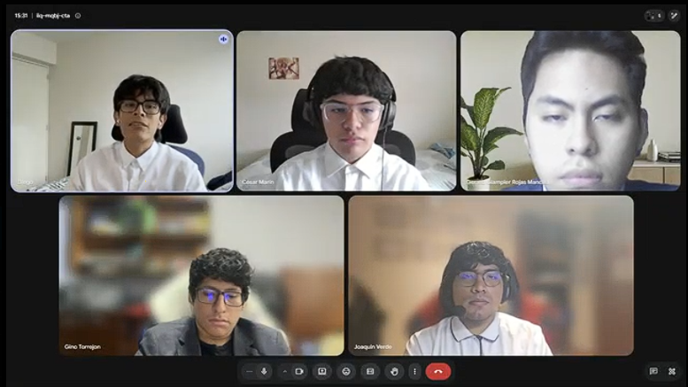

# Conclusiones y Recomendaciones

## Conclusiones finales del proyecto

### Conclusión 1: Validación del problema central y oportunidad de negocio
El ecosistema digital Nexa (diseñado por la startup King) validó la existencia de una oportunidad de negocio latente en la cadena de frío B2B en Lima Metropolitana. A través de la investigación inicial, se confirmó que las distribuidoras e importadoras medianas de productos lácteos y charcutería refrigerados operaban bajo una severa fragmentación de canales (WhatsApp, llamadas, planillas de cálculo), lo que generaba pérdida de trazabilidad de temperatura, retrasos en despachos y altos niveles de retrabajo operativo. El desarrollo de Nexa demostró la viabilidad de un modelo SaaS multi-tenant que unifica el catálogo autorizado, las solicitudes comerciales, el control físico por lotes (FEFO) y la documentación de despacho en una sola plataforma integrada, disminuyendo los cuellos de botella de la coordinación tradicional.

### Conclusión 2: Resultado de las hipótesis Lean UX por segmento (H1–H4)
El diseño del producto estuvo guiado por el marco de trabajo Lean UX, cuyas hipótesis H1, H2, H3 y H4 fueron contrastadas críticamente con el comportamiento y feedback de los usuarios de los segmentos definidos (S1: Importer/Distributor Owner, S2: Operations Manager, S3: B2B Buyer):
- **H1 (Registro de solicitudes estructurado para S2/S1):** Validada parcialmente. El módulo comercial demostró mitigar la digitación repetida al registrar clientes y órdenes de forma estructurada, aunque la validación comercial completa de campo requeriría en el futuro herramientas de importación masiva de datos (como CSV).
- **H2 (Coordinación de pedido, stock y despacho para S2):** Validada parcialmente. La integración del tablero Kanban de Logistics con asignación FEFO de lotes resolvió la dispersión informativa para el operario de almacén. Sin embargo, se detectó la necesidad de alertas visuales inmediatas para nuevos pedidos entrantes.
- **H3 (Autonomía informativa para el comprador B2B S3):** Validada parcialmente. El Portal del Comprador proporcionó autonomía para consultar stock y tracking sin llamadas constantes. La validación identificó un problema de usabilidad crítico (pérdida de ítems del carrito al navegar al catálogo), el cual fue resuelto físicamente con almacenamiento persistente.
- **H4 (Coexistencia con canales tradicionales):** Validada. Los usuarios confirmaron que una adopción exitosa requiere que el entorno digital conviva inicialmente con canales directos como WhatsApp para notificaciones de incidencias, en lugar de forzar un reemplazo absoluto desde el día uno.

### Conclusión 3: Coherencia entre UX Research, requisitos y diseño del producto
Se demostró una alta coherencia metodológica y de trazabilidad a lo largo de todo el ciclo de diseño. Los dolores específicos recopilados en el UX Research (Needfinding, User Personas, Journey Maps y la matriz de tareas) se tradujeron directamente en User Stories con aceptación Gherkin y Story Points estimados en Jira. Estas historias determinaron la arquitectura de base de datos normalizada, los diagramas de clases UML y la modularización en Bounded Contexts. Esto garantizó que cada componente visual implementado en la WebApp y cada endpoint de los Web Services del backend respondieran estrictamente a un dolor de usuario validado, sin incluir funcionalidades sobrediseñadas.

### Conclusión 4: Resultado de implementación de Landing Page, WebApp y RESTful API
El desarrollo del producto digital se consolidó de manera física y funcional para el hito final de pre-cierre TB2:
1. **Landing Page (nexa-website v4.0.1):** Desplegada de forma estable en GitHub Pages, con internacionalización (i18n) dinámica e integración de videos embebidos About-the-Product y About-the-Team.
2. **Web Application (nexa-webapp v3.0.1):** SPA reactiva en Vue 3 y PrimeVue desplegada en Render, estructurada por frentes (ops y portal), libre de mocks y conectada a la API mediante Axios con interceptores de seguridad.
3. **Web Services (nexa-platform v2.0.1):** API RESTful desarrollada en ASP.NET Core y C# bajo DDD, desplegada en Render con persistencia real en PostgreSQL. Cuenta con migración automática de esquemas en el startup, suite de documentación interactiva en Swagger/OpenAPI y protección multi-tenant mediante el middleware `WorkspaceMembershipValidationMiddleware`.

### Conclusión 5: Hallazgos de validación y mejoras de usabilidad incorporadas
La validación y auditoría de usabilidad (evaluaciones heurísticas y entrevistas con usuarios) permitieron iterar el producto físico hacia una versión final pulida y robusta. Frente al hallazgo heurístico de severidad 3 donde el comprador B2B perdía los productos agregados al constructor de solicitudes al retornar al catálogo, el equipo implementó un carrito persistente (local storage) en la WebApp. Asimismo, ante la fricción en Logistics para identificar nuevas órdenes en el Kanban, se incorporaron badges visuales informativos (`NEW`) en las tarjetas. Esto comprueba que el feedback real fue escuchado y materializado en cambios de código verificables.

### Conclusión 6: Aprendizaje del equipo y evolución del ciclo de vida
El trabajo colaborativo del equipo KING bajo metodologías ágiles Scrum y Jira facilitó una planificación por objetivos y una distribución de liderazgo conjunto muy efectiva. La adopción del enfoque Docs-as-Code para el Project Report garantizó que la documentación académica evolucionara a la par de los repositorios de software en GitFlow, controlando los alcances reales por cada sprint. El equipo consolidó el aprendizaje técnico de Clean Architecture, control térmico referencial y mecanismos de seguridad de aislamiento lógico de datos indispensables en entornos multi-tenant (SaaS).

---

### Matriz de Contraste — Lean UX Process

| Hipótesis Lean UX | Segmento relacionado | Evidencia de investigación | Evidencia de implementación | Evidencia de validación | Resultado | Decisión del equipo |
| :--- | :--- | :--- | :--- | :--- | :--- | :--- |
| **H1 (Registro estructurado para reducir retrabajo)** | S2 (Sales) / S1 (Owner) | Needfinding y Journey Maps que exponen la molestia de consolidar pedidos desde WhatsApp y planillas. | Módulo comercial en `nexa-webapp` y endpoints `/client-accounts` y `/orders` en `nexa-platform`. | Entrevista VI-S1-01 (Jessica Sandoval). Validó la reducción de fricción, pero sugirió cargas masivas automáticas. | **Validada parcialmente** | Mantener la creación de orden manual de TB2 y priorizar importación CSV en el roadmap futuro. |
| **H2 (Coordinación operativa conectada)** | S2 (Logistics / Operario) | Task Matrix de S2, donde el control de despacho y asignación FEFO son actividades críticas del día. | Kanban de Logistics, visualización FEFO de lotes, endpoints `/dispatch-orders` y `/inventory-movements`. | Entrevista VI-S2-01 (Enzo Pardo). Validó la claridad del Kanban, sugiriendo distinguir las órdenes nuevas ingresadas. | **Validada parcialmente** | Implementar alertas visuales en las tarjetas del Kanban en Sprint 4 y postergar telemetría física al roadmap. |
| **H3 (Autonomía informativa del comprador B2B)** | S3 (Comprador B2B) | User Persona "Alonso Alcántara", Buyer Journey Map que detalla la molestia de llamar para pedir copias de facturas. | Portal del Comprador (`/portal`) con catálogo autorizado, solicitudes de compra y visor de documentos referenciales. | Entrevistas VI-S3-01 (Alonso Alcántara) y VI-S3-02 (Juan S. Artiaga). Confirmaron ahorro de llamadas diarias. | **Validada parcialmente** | Resolver la usabilidad del carrito mediante persistencia local en TB2 y documentar facturación referencial. |
| **H4 (Viabilidad de adopción inicial)** | S1, S2, S3 (Todos) | Entrevistas preliminares donde se destaca la preferencia por WhatsApp debido a su inmediatez de respuesta. | Sistema de notificaciones simuladas y enlaces de contacto directo por WhatsApp/email en footer de WebApp. | Testimonios de validación indicaron que la transición al portal web será progresiva y requiere canales de apoyo. | **Validada** | Integrar accesos rápidos de soporte en footer del Website y de la WebApp como canales complementarios. |

---

### Recomendaciones para el Roadmap

1. **Importación masiva de datos (CSV/Excel):** Desarrollar un motor de importación en el panel comercial para permitir que los vendedores carguen catálogos y fichas de clientes B2B de forma masiva, acelerando la migración operativa inicial.
2. **Integración con pasarela de pagos productiva (Stripe):** Evolucionar la integración de Stripe (actualmente configurada de manera referencial/mock en backend) hacia una pasarela funcional con procesamiento de tarjetas de crédito y webhooks de confirmación en producción.
3. **Telemetría e integración de sensores de temperatura IoT:** Reemplazar el Seed Data de temperatura en Logistics por una lectura física mediante protocolo MQTT o APIs REST consumiendo datos reales de sensores de temperatura instalados en los vehículos de reparto.
4. **Módulo de facturación electrónica tributaria (SUNAT):** Diseñar un microservicio en Invoicing para firmar digitalmente los documentos referenciales XML generados por la plataforma, conectándolos con los OSE correspondientes bajo normativas locales.
5. **App móvil híbrida para choferes de reparto:** Diseñar una interfaz móvil responsiva simplificada o app híbrida (PWA) enfocada exclusivamente en el chofer, facilitando la captura de firmas y fotos de conformidad de entrega (Proof of Delivery) en ruta.
6. **Consolidación cualitativa de validación (Fase de producción):** Ejecutar las 5 entrevistas de validación cualitativa complementarias planificadas por el equipo para alcanzar un volumen estadístico concluyente en todos los segmentos antes del lanzamiento productivo oficial.

## Video About-The-Team

### Resumen de Aspectos Relevantes
El video "About-The-Team" sintetiza la trayectoria del equipo **King** en el desarrollo de **Nexa**, una plataforma SaaS B2B diseñada para centralizar procesos comerciales y logísticos. El material detalla el ciclo de vida del proyecto: desde el levantamiento de requerimientos y artefactos de UX, hasta la implementación técnica basada en *Domain-Driven Design*, *Bounded Contexts* y APIs RESTful. El video destaca el trabajo colaborativo bajo metodologías ágiles, el enfoque *Docs-as-Code* y la importancia de la trazabilidad entre el dolor del usuario y la solución técnica. Finalmente, incluye testimonios individuales donde cada integrante detalla sus responsabilidades, roles de liderazgo y las competencias técnicas y blandas adquiridas durante el desarrollo.

### Pauta de Secuencias de Contenido

| Sección | Descripción | Timing (hh:mm:ss) |
| :--- | :--- | :--- |
| **Introducción** | Propuesta de valor de Nexa y objetivo del equipo | 00:00:01 - 00:01:06 |
| **Roles del Equipo** | Distribución de responsabilidades (Diego, César, Jed, Gino, Joaquín) | 00:01:06 - 00:01:41 |
| **Metodología** | Gestión de sprints, GitFlow y enfoque Docs-as-Code | 00:01:41 - 00:02:07 |
| **Aprendizajes** | Reflexión técnica sobre arquitectura y experiencia de usuario | 00:02:07 - 00:02:59 |
| **Testimonios** | Exposición de actividades, logros y competencias por integrante | 00:02:59 - 00:07:16 |
| **Cierre** | Conclusión colectiva y visión final del proyecto | 00:07:16 - 00:08:01 |

### Evidencia y Enlaces
> 

* **URL Microsoft Stream:** https://cutt.ly/rt66rjSO
* **URL YouTube:** https://youtu.be/cNdHZbD52eE

