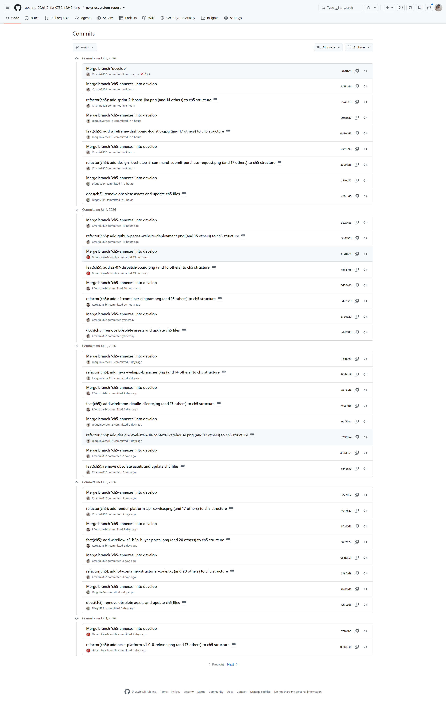
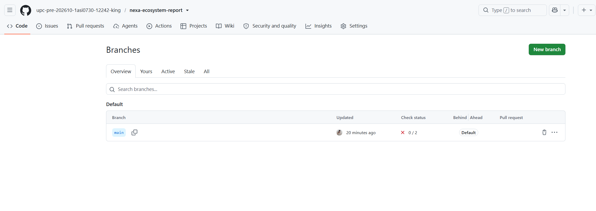
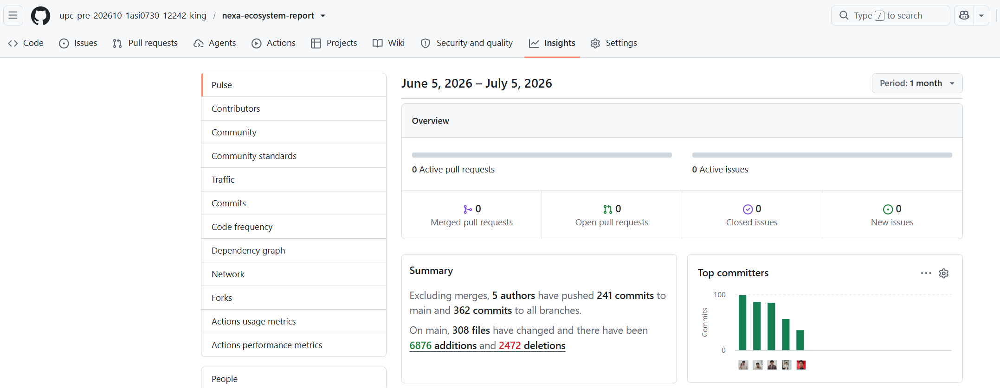
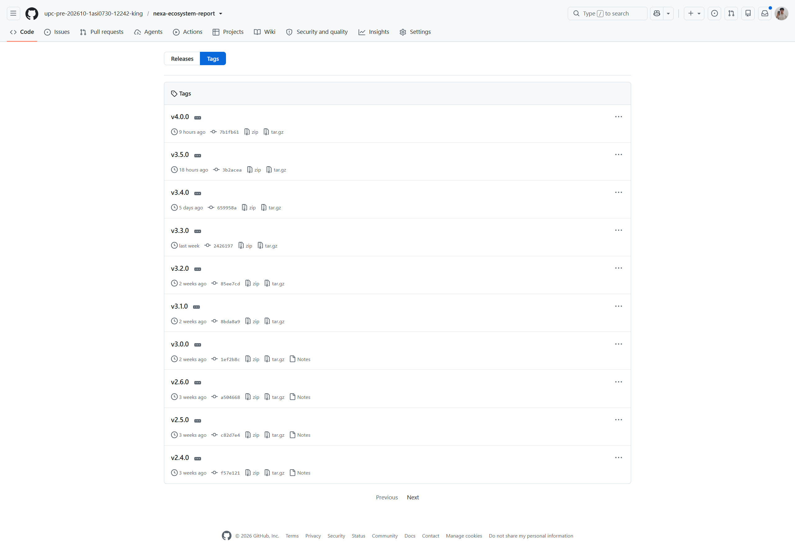
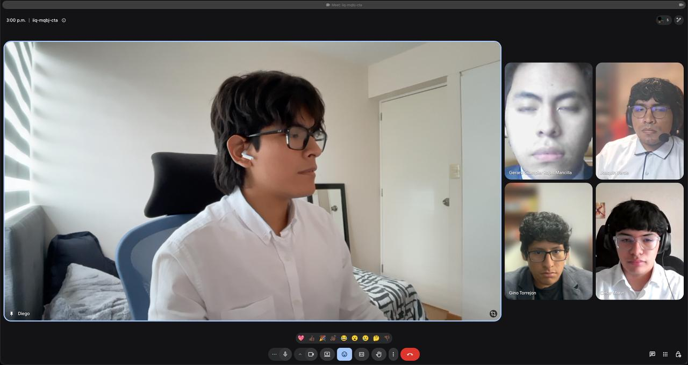

# Annex D: GitHub Repository Evidence

## D.1. Enlaces maestros de repositorios

| Herramienta / Artefacto | Enlace |
|---|---|
| Repositorio GitHub (Reporte) | **upc-pre-202610-1asi0730-12242-king/nexa-ecosystem-report:** https://cutt.ly/YyqqccYa |
| Repositorio GitHub (Website) | **upc-pre-202610-1asi0730-12242-king/nexa-website:** https://cutt.ly/byqqvhqJ |
| Repositorio GitHub (Web Application) | **upc-pre-202610-1asi0730-12242-king/nexa-webapp:** https://cutt.ly/HyqqviBz |
| Repositorio GitHub (Web Services / Backend) | **upc-pre-202610-1asi0730-12242-king/nexa-platform:** https://cutt.ly/TyqqcUn4 |

## D.2. Releases auditados para AV2

| Artefacto | Enlace |
|---|---|
| `nexa-website v3.0.0` | **https://cutt.ly/qyqqmAdC:**
| `nexa-webapp v2.0.0` | **https://cutt.ly/syqqmHo6:**
| `nexa-platform v1.0.0` | **https://cutt.ly/HyqqmL0k:**
| `nexa-ecosystem-report v3.0.0` | **https://cutt.ly/7yqqm7ym:** último release documental del reporte AV2. |

> *Nota*: `nexa-ecosystem-report v3.0.0` consolida el último release documental AV2 del informe académico. Los repositorios `nexa-website`, `nexa-platform` y `nexa-webapp` respaldan el ecosistema implementado. Elaboración propia.

## D.3. Evidencias GitHub AV2

| Evidencia AV2 | Referencia | Ruta |
|---|---|---|
| GitHub Release `nexa-ecosystem-report v3.0.0` | Último release documental AV2 del informe académico. |  |
| Commits recientes AV2 `nexa-ecosystem-report` | Evidencia de consolidación documental, formato académico, version history, anexos, Sprint 3 y preparación del PDF. |  |
| Branches `nexa-ecosystem-report` | Evidencia de ramas `main` y `develop` para GitFlow documental. |  |
| GitHub Insights AV2 `nexa-ecosystem-report` | Evidencia principal de colaboración del repositorio del informe. |  |
| GitHub Release `nexa-website v3.0.0` | Release de cierre AV2 disponible para revisión. |  |
| Branches `nexa-website` | Evidencia de ramas de Landing Page. |  |
| Commits recientes AV2 `nexa-website` | URL commits: https://cutt.ly/eyqqQb4L |  |
| Commits históricos de cierre AV2 `nexa-website` | URL commits: https://cutt.ly/ZyqqQLO9 |  |
| GitHub Insights AV2 `nexa-website` | Evidencia complementaria del ecosistema AV2. |  |
| GitHub Release `nexa-platform v1.0.0` | Release de cierre AV2 disponible para revisión. |  |
| Branches `nexa-platform` | Evidencia de ramas de Web Services. |  |
| Commits recientes AV2 `nexa-platform` | URL commits: https://cutt.ly/OyqqWrBC |  |
| Commits por bounded context `nexa-platform` | URL commits: https://cutt.ly/8yqqWxFA |  |
| GitHub Insights AV2 `nexa-platform` | Evidencia complementaria del ecosistema AV2. |  |
| GitHub Release `nexa-webapp v2.0.0` | Release de cierre AV2 disponible para revisión de Web Application. |  |
| Commits finales `nexa-webapp` | URL commits: https://cutt.ly/cyqqWHu2 |   |
| Branches `nexa-webapp` | Evidencia de ramas `main` y `develop` de Web Application. |  |
| Insights `nexa-webapp` | Evidencia complementaria del ecosistema AV2. |  |

## D.4. Releases finales auditados para TB2

| Artefacto | Enlace público | Evidencia |
|---|---|---|
| `nexa-website v4.0.1` | https://cutt.ly/CyqqEjm3 |  |
| `nexa-webapp v3.0.1` | https://cutt.ly/HyqqEm6M |  |
| `nexa-platform v2.0.1` | https://cutt.ly/pyqqEUHh |  |
| `nexa-ecosystem-report v4.0.1` | https://cutt.ly/KyqqEBOb | Release documental final del reporte oficial, sincronizado desde la versión final validada, con release notes por tag y limpieza de archivos auxiliares. |

> *Nota*: Los releases TB2 identifican de forma independiente la versión final del Website, la Web Application, la Platform API y el Project Report oficial. Las notas y artefactos fuente quedan asociados a sus tags SemVer correspondientes. Elaboración propia.

## D.5. Evidencia GitHub TB2 del Project Report

Durante TB2, el repositorio `nexa-ecosystem-report` registró actividad documental asociada al cierre del informe académico, la actualización de evidencias, anexos, validaciones y conclusiones, junto con la preparación del cierre TB2.

*Evidencia GitHub del Project Report durante TB2.*

| Evidencia TB2 del Project Report | Referencia | Ruta |
|---|---|---|
| Commits recientes TB2 del Project Report | Actividad documental asociada a la consolidación del informe académico durante TB2. |  |
| Branches del Project Report durante TB2 | Evidencia de las ramas utilizadas para organizar y consolidar el trabajo documental. |  |
| GitHub Insights/Pulse del Project Report durante TB2 | Evidencia de actividad y colaboración documental registrada por GitHub durante TB2. |  |
| Tags documentales del Project Report durante TB2 | Referencia de versionado documental que incluye el release final `v4.0.1`. |  |

El tag `v4.0.1` se registra como release documental final TB2 y cuenta con evidencia visual real del GitHub Release publicado.

> *Nota*: La evidencia GitHub TB2 del Project Report respalda la trazabilidad documental del informe. El tag `v4.0.1` se presenta como release formal final del Project Report y queda respaldado por captura específica de GitHub Release. Elaboración propia.

## D.6. Evidencia de coordinación grupal

Este anexo respalda las secciones de colaboración del informe. A continuación, se registran pruebas de coordinación síncrona y asíncrona del equipo, incluyendo capturas de reuniones, revisiones de diseño, acuerdos de trabajo y preparación de entregas.

### Sprint 1

*Colaboración del equipo durante Sprint 1.*

> *Nota*: Trabajo colaborativo del equipo KING durante Sprint 1. Elaboración propia.

*Reunión de coordinación del equipo durante Sprint 1.*

> *Nota*: Reunión de coordinación del equipo KING durante Sprint 1. Elaboración propia.

*Práctica de exposición AV1.*

> *Nota*: Práctica de exposición del equipo KING para la sustentación AV1. Elaboración propia.

### Sprint 2

*Reunión de coordinación del equipo durante Sprint 2.*

> *Nota*: Reunión de coordinación del equipo KING durante Sprint 2. Elaboración propia.

*Práctica de exposición TB1.*

> *Nota*: Exposición del equipo KING para la sustentación TB1. Elaboración propia.

### Sprint 3

*Reunión de coordinación del equipo durante Sprint 3.*

> *Nota*: Trabajo colaborativo del equipo KING durante Sprint 3. Elaboración propia.

*Colaboración del equipo durante Sprint 3.*

> *Nota*: Trabajo colaborativo del equipo KING durante Sprint 3. Elaboración propia.

*Práctica de exposición AV2.*

> *Nota*: Práctica de exposición y preparación de la sustentación AV2 del equipo KING. Elaboración propia.

### Sprint 4

*Práctica de exposición TB2.*

> *Nota*: Práctica de exposición y preparación de la sustentación TB2 del equipo KING. Elaboración propia.

