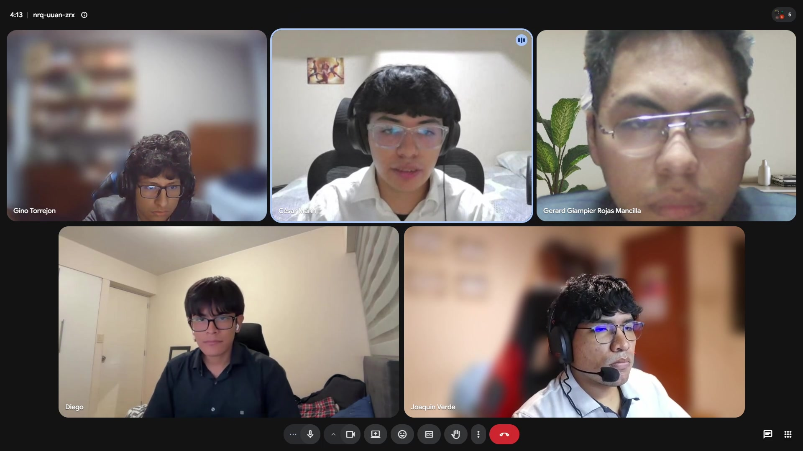

# Annex F: AV2 Controlled Evidence

Este anexo centraliza las evidencias AV2 ya disponibles y los límites que deben mantenerse explícitos en el cierre documental. No se registran enlaces, capturas, entrevistas, resultados ni publicaciones que no existan.

| Evidencia AV2 | Referencia | Ruta |
|---|---|---|
| Validation Interviews AV2 | Entrevistas de validación con usuarios y registro de hallazgos asociados. | <a href="../50-chapter-5-implementation-validation-deployment/5-3-validation-interviews.md">5.3. Validation Interviews</a> |
| Evaluaciones heurísticas AV2 y referencia metodológica posterior | Matriz de evaluación según heurísticas conservada como antecedente AV2; el archivo 5.3 también contiene la actualización TB2 posterior. | <a href="../50-chapter-5-implementation-validation-deployment/5-3-validation-interviews.md">5.3. Validation Interviews</a> |
| Video About-the-Product AV2 — Microsoft Stream URL | Video en formato `.mp4`, duración `2:14`, enfocado en propuesta de valor, problema, solución y recorrido principal. | https://cutt.ly/3yqqhR2Y |
| Video About-the-Product AV2 — YouTube URL | Enlace público complementario del video del producto. | https://youtu.be/ypedAqjH19c |
| Captura Video About-the-Product AV2 | Captura o evidencia visual del video publicado. | <a href="../assets/images/chapter-5/video-about-the-product">Video About the product</a> |
| Testimonio positivo incluido en Video About-the-Product | Registro textual o audiovisual de un testimonio positivo validado por usuario. | <a href="../50-chapter-5-implementation-validation-deployment/5-4-video-about-the-product.md">5.4. Video About-the-Product</a> |
| Video About-the-Team AV2 — Microsoft Stream URL | Video en formato `.mp4`, con testimonios de integrantes y resumen del proceso colaborativo. | https://cutt.ly/1yqqhM4x |
| Captura Video About-the-Team AV2 | Captura o evidencia visual del video publicado. |  |
| Exposición AV2 | Archivo audiovisual en formato `.mp4`, correspondiente a la exposición de AV2. | https://cutt.ly/5yqqjfml |
| Coordinación Sprint 3 / AV2 | Captura real de coordinación Sprint 3 / AV2 incorporada al reporte. |  |
| Revisión de evidencias AV2 | Captura real de revisión de evidencias AV2 incorporada al reporte. |  |

> *Nota*: El corte AV2 documenta evidencias disponibles para revisión académica. Esto no declara operación productiva definitiva ni validación estadísticamente concluyente del producto. Elaboración propia.
